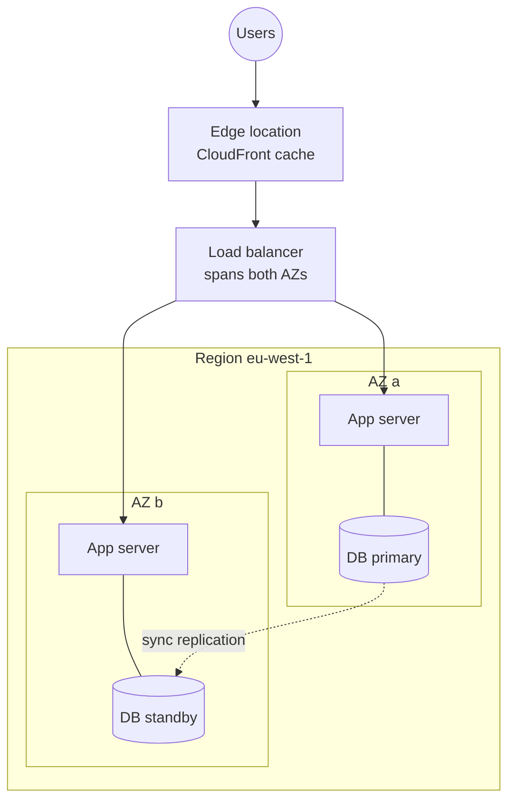
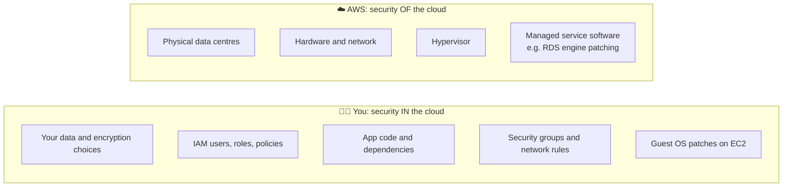
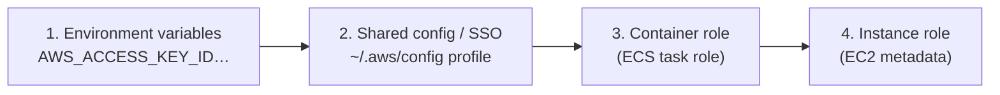

## The big idea

Before the cloud, running an app meant **buying a building**: servers, power, cooling, network cables, and people to fix disks at 3 a.m. AWS turns all of that into **renting rooms in a huge, well-run hotel chain**. You book what you need by the second, check out when you're done, and the hotel handles the plumbing.

You still decide *who has a key* (IAM), *which doors are locked* (networking), and *what you leave in the room* (your data). That split is called the **shared responsibility model**.


## Why teams use the cloud

| Benefit | What it means in practice |
| --- | --- |
| **Elasticity** | Add 50 servers for Black Friday, remove them on Monday |
| **Pay as you go** | No upfront hardware; pay per second, request or GB |
| **Speed** | A database in 10 minutes instead of a 6-week purchase order |
| **High availability** | Spread across several data centres with a few clicks |
| **Global reach** | Serve users from a Region near them |
| **Managed services** | AWS patches the database engine, you focus on the app |

### IaaS, PaaS, SaaS

| Model | You manage | AWS manages | Example |
| --- | --- | --- | --- |
| **IaaS** (infrastructure) | OS, runtime, app, data | Hardware, network, virtualisation | EC2 |
| **PaaS** (platform) | App and data | Everything below | Elastic Beanstalk, ECS Fargate, Lambda |
| **SaaS** (software) | Your data and settings | The whole application | Amazon WorkMail, Chime |

## Global infrastructure

| Piece | What it is | Why you care |
| --- | --- | --- |
| **Region** | A geographic area (`us-east-1`, `eu-west-1`) with several data centres | Data stays in the Region you choose; prices and services vary by Region |
| **Availability Zone (AZ)** | One or more isolated data centres in a Region, with separate power and networking | Run in **2+ AZs** so one data-centre failure doesn't take you down |
| **Edge location** | A small site in a major city used by CloudFront and Route 53 | Caches content close to users (low latency) |
| **Local Zone / Wavelength** | AWS compute in specific metros or 5G networks | Single-digit-millisecond latency needs |



> 💡 **Choosing a Region:** closest to your users, required by law (data residency), has the services you need, and the price. `us-east-1` gets new features first and is required for some global things (CloudFront certificates, billing metrics), but don't put everything there by default.

## The shared responsibility model



The line **moves** with the service: on EC2 you patch the OS; on Lambda or RDS, AWS does. But **data, access and configuration are always yours.** Most cloud breaches are misconfigured permissions or public buckets, not AWS failures.

## The service map for a typical web app


| Job | Service | Lesson |
| --- | --- | --- |
| Who can do what | **IAM**, IAM Identity Center | IAM |
| Private network | **VPC**, subnets, security groups | VPC |
| Virtual machines | **EC2**, EBS, Auto Scaling | EC2 |
| Traffic distribution, DNS | **ELB**, **Route 53**, ACM | Load balancing |
| Files and objects | **S3** | S3 |
| CDN, static sites | **CloudFront**, WAF | CloudFront |
| Containers | **ECR**, **ECS** (Fargate), EKS | Containers |
| SQL / NoSQL | **RDS**, Aurora, **DynamoDB**, ElastiCache | Databases |
| Functions and APIs | **Lambda**, **API Gateway** | Serverless |
| Queues and events | **SQS**, **SNS**, EventBridge, Kinesis | Messaging |
| Login, secrets, keys | **Cognito**, **Secrets Manager**, **KMS** | Security |
| Logs, metrics, audit | **CloudWatch**, X-Ray, CloudTrail | Observability |
| Build and deploy | CodeBuild, CodePipeline, CloudFormation, CDK, Terraform | CI/CD and IaC |

A common request path: **browser → Route 53 → CloudFront → load balancer / API Gateway → ECS or Lambda → RDS / DynamoDB**, with secrets from Secrets Manager and logs in CloudWatch.

## Accounts done right

- **Protect the root user.** Turn on MFA, delete root access keys, and use it only for the few tasks that require it (closing the account, some billing settings).
- **Use AWS Organizations** with separate accounts for `dev`, `staging` and `prod`. An account is the strongest isolation boundary AWS has: a mistake in dev can't delete prod.
- **People sign in through IAM Identity Center** (single sign-on with temporary credentials), not long-lived IAM users with access keys.
- **Set a budget alarm on day one** (AWS Budgets → email at 50%, 80%, 100%).
- **Turn on CloudTrail** in every account so every API call is recorded.

## CLI and SDK: getting credentials safely

```bash
# Install AWS CLI v2, then sign in with SSO (Identity Center) — no stored keys
aws configure sso                       # one-time: start URL, Region, account, role
aws sso login --profile dev
aws sts get-caller-identity --profile dev   # "who am I?" — run this whenever confused

export AWS_PROFILE=dev                   # PowerShell: $env:AWS_PROFILE = "dev"
aws s3 ls
```

The SDKs find credentials using the **default credential provider chain**, in order:



That's why the same code works on your laptop (SSO profile) and on AWS (IAM role) **without any keys in the code**.

```js
// Node.js — AWS SDK v3: modular clients, credentials found automatically
import { S3Client, ListBucketsCommand } from "@aws-sdk/client-s3";

const s3 = new S3Client({ region: "eu-west-1" });
const { Buckets } = await s3.send(new ListBucketsCommand({}));
console.log(Buckets?.map((b) => b.Name));
```

```go
// Go — AWS SDK v2
cfg, err := config.LoadDefaultConfig(ctx, config.WithRegion("eu-west-1"))
if err != nil { log.Fatal(err) }
client := s3.NewFromConfig(cfg)
out, err := client.ListBuckets(ctx, &s3.ListBucketsInput{})
```

> ⚠️ **Never commit access keys.** Bots scan public GitHub for AWS keys within minutes and start crypto-miners on your bill. Use SSO locally, roles on AWS, and OIDC in CI.

## How AWS pricing works

| You pay for | Examples |
| --- | --- |
| **Compute time** | EC2 per second, Lambda per ms + requests, Fargate per vCPU/GB-second |
| **Storage** | S3 per GB-month, EBS per provisioned GB-month |
| **Requests** | S3 GET/PUT, API Gateway calls, DynamoDB on-demand reads/writes |
| **Data transfer out** | Data leaving AWS to the internet (inbound is free); cross-AZ traffic is also charged |
| **Managed hours** | RDS instance hours, NAT Gateway hours + GB processed, load balancer hours |

Classic surprise bills: a forgotten NAT Gateway, a large RDS instance left running, public data transfer, or verbose CloudWatch logs with no retention. Tag everything (`project`, `env`, `owner`) and use **Cost Explorer**.

## The Well-Architected Framework in one table

| Pillar | Question it asks |
| --- | --- |
| Operational excellence | Can we deploy, observe and improve safely? |
| Security | Least privilege, encryption, traceability? |
| Reliability | Do we survive an AZ failure and recover automatically? |
| Performance efficiency | Right service and size for the workload? |
| Cost optimisation | Are we paying only for what delivers value? |
| Sustainability | Are we minimising wasted resources? |

## Console shortcuts

Always check the **Region selector** before deciding a resource doesn't exist.
[IAM Identity Center](https://us-east-1.console.aws.amazon.com/singlesignon/home?region=us-east-1) · [IAM](https://console.aws.amazon.com/iam/home) · [EC2](https://us-east-1.console.aws.amazon.com/ec2/home?region=us-east-1) · [VPC](https://us-east-1.console.aws.amazon.com/vpc/home?region=us-east-1) · [S3](https://us-east-1.console.aws.amazon.com/s3/home?region=us-east-1) · [CloudFront](https://console.aws.amazon.com/cloudfront/v4/home) · [ECS](https://us-east-1.console.aws.amazon.com/ecs/v2/home?region=us-east-1) · [ECR](https://us-east-1.console.aws.amazon.com/ecr/home?region=us-east-1) · [RDS](https://us-east-1.console.aws.amazon.com/rds/home?region=us-east-1) · [DynamoDB](https://us-east-1.console.aws.amazon.com/dynamodbv2/home?region=us-east-1) · [Lambda](https://us-east-1.console.aws.amazon.com/lambda/home?region=us-east-1) · [API Gateway](https://us-east-1.console.aws.amazon.com/apigateway/home?region=us-east-1) · [Secrets Manager](https://us-east-1.console.aws.amazon.com/secretsmanager/home?region=us-east-1) · [CloudWatch](https://us-east-1.console.aws.amazon.com/cloudwatch/home?region=us-east-1) · [Billing](https://console.aws.amazon.com/billing/home)

## Key takeaways

- A **Region** has several isolated **Availability Zones**; run production in at least two AZs.
- **Shared responsibility:** AWS secures the infrastructure; you secure data, identities and configuration.
- Separate accounts per environment, MFA on root, people sign in via **Identity Center**, budget alarm on day one.
- Code gets credentials from the **provider chain**: SSO locally, IAM roles on AWS, never hard-coded keys.
- You pay for compute time, storage, requests and **data transfer out**; tag resources and watch Cost Explorer.
