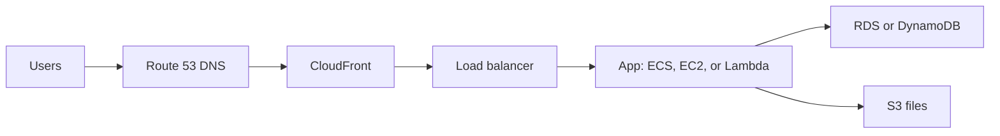

## The short version

AWS lets you rent computing building blocks instead of buying and operating your own servers. You pay for the services you use.

Think of it as a huge online hardware shop: you can rent a server, database, file storage, network, or message queue in minutes.

## Where AWS runs your app

| Word | Simple meaning |
| --- | --- |
| **Region** | A geographic area, such as `ap-southeast-1` (Singapore) |
| **Availability Zone (AZ)** | A separate data centre area inside one Region |
| **Account** | Your security and billing boundary |

For a reliable app, run copies in more than one AZ. Choose a Region near your users and one that supports the services you need.

## A beginner service map



| Need | AWS service to learn first |
| --- | --- |
| Store files | S3 |
| Run a server | EC2 |
| Run a container | ECS with Fargate |
| Run small event code | Lambda |
| SQL database | RDS |
| Login | Cognito |
| Logs and alarms | CloudWatch |

## Security and cost, from day one

Never use the root account for normal work. Turn on MFA, create separate development and production accounts when possible, and use IAM Identity Center or roles for temporary access.

Costs depend on use: running time, storage, data transfer, and requests. Add a budget alert before experimenting. Stop or delete test resources when finished.

## First commands

```bash
aws configure sso
aws sts get-caller-identity
aws configure list
```

The identity command tells you which account and role your terminal will affect. Run it before a change.

## Remember this

- AWS is rented infrastructure, not one product.
- An account is a security and billing boundary.
- A Region contains multiple AZs.
- Start with managed services when they fit; they remove operational work.
