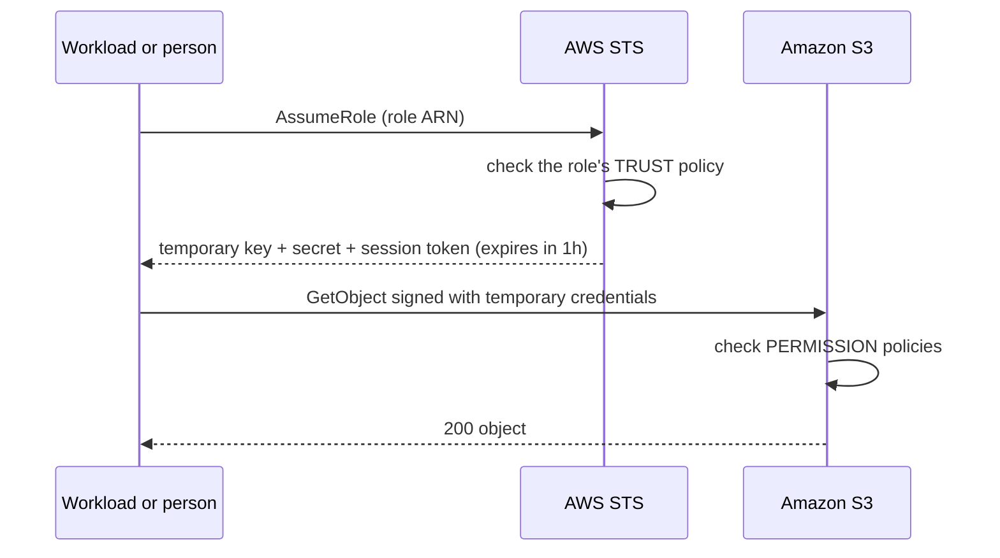
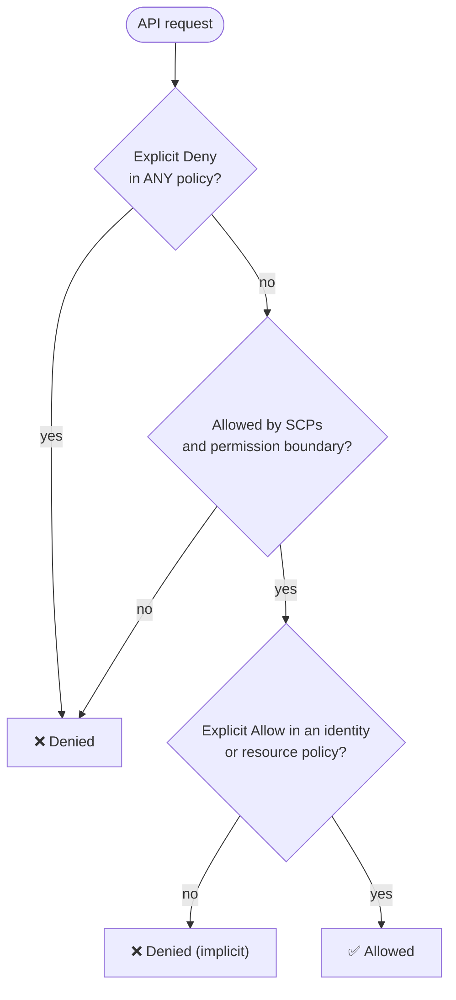

## The big idea

IAM is the **key-card system of an office building**.

- A **principal** is whoever swipes the card: a person, an application, or an AWS service.
- A **policy** is the list printed on the card: *which doors* (resources), *which actions* (open, lock), and *under which conditions* (only on weekdays, only from the office network).
- A **role** is a **visitor badge** you pick up at reception: it grants a set of permissions for a limited time, then expires. No one takes it home.

Every single AWS API call, from the console, CLI, SDK or another service, goes through IAM. **By default, everything is denied.**


## The building blocks

| Concept | What it is | Use it for |
| --- | --- | --- |
| **Root user** | The account's owner, unlimited power | Almost nothing: lock it with MFA |
| **IAM Identity Center user** | A person signing in via SSO | All human access (console + CLI) |
| **Permission set** | A template of policies assigned to a user/group in an account | "Developer in dev", "ReadOnly in prod" |
| **IAM user** | Long-lived identity with a password/access keys | Legacy or rare break-glass cases only |
| **IAM group** | A collection of IAM users sharing policies | Managing IAM users (if you must have them) |
| **IAM role** | An identity with **no permanent credentials**, assumed temporarily | EC2, ECS tasks, Lambda, CI, cross-account access |
| **Policy** | A JSON document of permissions | Attached to identities or resources |
| **STS** | Security Token Service: issues temporary credentials | Behind every role assumption |



A role has **two** policies:

1. **Trust policy**: *who* may assume the role (`ecs-tasks.amazonaws.com`, another account, a GitHub repo via OIDC).
2. **Permission policies**: *what* the role may do once assumed.

```json
{
  "Version": "2012-10-17",
  "Statement": [{
    "Effect": "Allow",
    "Principal": { "Service": "ecs-tasks.amazonaws.com" },
    "Action": "sts:AssumeRole"
  }]
}
```

## Anatomy of a policy

```json
{
  "Version": "2012-10-17",
  "Statement": [
    {
      "Sid": "ListOnlyOurBucket",
      "Effect": "Allow",
      "Action": "s3:ListBucket",
      "Resource": "arn:aws:s3:::my-project-dev-assets",
      "Condition": { "StringLike": { "s3:prefix": ["uploads/*"] } }
    },
    {
      "Sid": "ReadWriteObjects",
      "Effect": "Allow",
      "Action": ["s3:GetObject", "s3:PutObject"],
      "Resource": "arn:aws:s3:::my-project-dev-assets/uploads/*"
    }
  ]
}
```

| Element | Meaning |
| --- | --- |
| `Effect` | `Allow` or `Deny` |
| `Action` | API operations: `service:Operation`, wildcards allowed (`s3:Get*`) |
| `Resource` | ARNs the actions apply to |
| `Condition` | Extra rules: source IP, tags, MFA, time, VPC endpoint, encryption… |
| `Principal` | Only in **resource-based** policies and trust policies: *who* |

> ⚠️ **Bucket ARN ≠ object ARN.** `ListBucket` works on `arn:aws:s3:::bucket`; `GetObject`/`PutObject` work on `arn:aws:s3:::bucket/*`. Mixing them up is the #1 "Access Denied" puzzle.

### ARNs

`arn:partition:service:region:account-id:resource`, for example:

- `arn:aws:ecs:us-east-1:123456789012:service/my-cluster/my-api`
- `arn:aws:secretsmanager:us-east-1:123456789012:secret:my-api/dev/database-AbC123`
- `arn:aws:s3:::my-bucket` (S3 bucket ARNs have no Region or account)

## Types of policies

| Type | Attached to | Notes |
| --- | --- | --- |
| **AWS managed** | Identities | Maintained by AWS (`ReadOnlyAccess`); often broader than you need |
| **Customer managed** | Identities | Your reusable, versioned policies. **Preferred for teams** |
| **Inline** | One identity | Deleted with it; use only for a clear one-off exception with an owner |
| **Resource-based** | A resource (S3 bucket, SQS queue, KMS key, Lambda) | Has a `Principal`; enables cross-account access |
| **Permission boundary** | A user/role | The **maximum** permissions it can ever have |
| **SCP** (Service Control Policy) | An account / OU in Organizations | Guardrails for whole accounts, e.g. "no one may leave these Regions" |
| **Session policy** | A single assumed-role session | Narrows permissions further for that session |

## How AWS evaluates a request ⭐



1. **Default deny**: nothing is allowed unless something allows it.
2. An **explicit `Deny` always wins**, no matter how many Allows exist.
3. SCPs, boundaries and session policies only **limit**; they never grant.
4. Within one account, an Allow in *either* the identity policy *or* the resource policy is enough. Across accounts, **both sides** must allow.

## Humans: IAM Identity Center

People get **temporary** access through permission sets. A developer might have:

| Account | Permission set | Can do |
| --- | --- | --- |
| dev | `DeveloperAccess` | Deploy their services, read logs, manage dev data |
| staging | `DeployerAccess` | Update services, read logs |
| prod | `ReadOnlyAccess` | Read dashboards and logs; changes go through CI |

A developer's console permissions **never automatically grant workload access**. The ECS task, EC2 instance or CodeBuild project each have their own role.

## Workloads: roles everywhere

| Workload | Role name | Assumed by |
| --- | --- | --- |
| EC2 instance | Instance profile role | `ec2.amazonaws.com` (via instance metadata, IMDSv2) |
| ECS task | **Task role** (app) + **execution role** (agent) | `ecs-tasks.amazonaws.com` |
| Lambda | Execution role | `lambda.amazonaws.com` |
| CodeBuild | Service role | `codebuild.amazonaws.com` |
| GitHub Actions | OIDC role | `token.actions.githubusercontent.com` (scoped to a repo/branch) |

## `iam:PassRole`: the hidden escalation risk

To create an ECS service or Lambda that runs *as* a role, you must be allowed to **pass** that role. If a developer can pass *any* role, they can launch a task with an admin role and do anything. Always scope it:

```json
{
  "Effect": "Allow",
  "Action": "iam:PassRole",
  "Resource": "arn:aws:iam::123456789012:role/my-api-dev-task-role",
  "Condition": { "StringEquals": { "iam:PassedToService": "ecs-tasks.amazonaws.com" } }
}
```

## A real least-privilege policy: deploy one ECS service

```json
{
  "Version": "2012-10-17",
  "Statement": [
    {
      "Sid": "DeployOneService",
      "Effect": "Allow",
      "Action": ["ecs:UpdateService", "ecs:DescribeServices"],
      "Resource": "arn:aws:ecs:us-east-1:123456789012:service/dev-cluster/my-api"
    },
    {
      "Sid": "TaskDefinitionsHaveNoResourceScoping",
      "Effect": "Allow",
      "Action": ["ecs:RegisterTaskDefinition", "ecs:DescribeTaskDefinition"],
      "Resource": "*"
    },
    {
      "Sid": "PushImage",
      "Effect": "Allow",
      "Action": ["ecr:BatchCheckLayerAvailability", "ecr:PutImage", "ecr:InitiateLayerUpload", "ecr:UploadLayerPart", "ecr:CompleteLayerUpload"],
      "Resource": "arn:aws:ecr:us-east-1:123456789012:repository/my-api"
    },
    { "Sid": "EcrLogin", "Effect": "Allow", "Action": "ecr:GetAuthorizationToken", "Resource": "*" },
    {
      "Sid": "PassOnlyOurRoles",
      "Effect": "Allow",
      "Action": "iam:PassRole",
      "Resource": [
        "arn:aws:iam::123456789012:role/my-api-dev-task-role",
        "arn:aws:iam::123456789012:role/my-api-dev-execution-role"
      ],
      "Condition": { "StringEquals": { "iam:PassedToService": "ecs-tasks.amazonaws.com" } }
    }
  ]
}
```

Some actions (`ecr:GetAuthorizationToken`, many `List*`/`Describe*`) **don't support resource-level permissions**, so they need `"Resource": "*"`. Check the *Service Authorization Reference* for each action.

### Attribute-based access control (ABAC)

Instead of listing every ARN, match **tags**:

```json
{
  "Effect": "Allow",
  "Action": ["ec2:StartInstances", "ec2:StopInstances"],
  "Resource": "*",
  "Condition": { "StringEquals": { "aws:ResourceTag/team": "${aws:PrincipalTag/team}" } }
}
```

## Writing and testing policies safely

1. Start from **what the code actually calls** (CloudTrail shows the exact actions).
2. Scope **Action + Resource + Condition**.
3. Validate with **IAM Access Analyzer** (policy checks, and "generate policy from CloudTrail activity").
4. Test with the **real role** in a dev account (`aws sts assume-role`, or the IAM Policy Simulator).
5. Review regularly: Access Analyzer's **unused access** findings show permissions nobody uses.

**Never** grant `iam:*`, unrestricted `iam:PassRole`, `"Action": "*"` or `AdministratorAccess` just to unblock a deployment.

## Debugging "Access Denied"

| Check | How |
| --- | --- |
| Who am I really? | `aws sts get-caller-identity` |
| Which action was denied? | The error message, or CloudTrail event `errorCode: AccessDenied` |
| Right ARN type? | Bucket vs object, service ARN format, Region, account ID |
| An explicit Deny somewhere? | SCPs, permission boundary, bucket policy, KMS key policy |
| Encrypted with KMS? | The caller also needs `kms:Decrypt` on the key |
| Cross-account? | Both the identity policy **and** the resource policy must allow |

## Key takeaways

- Everything is **denied by default**; an **explicit Deny always wins**; SCPs and boundaries only limit.
- People use **Identity Center** permission sets; workloads use **roles** with temporary STS credentials. No long-lived keys.
- A role has a **trust policy** (who can assume it) and **permission policies** (what it can do).
- Scope Action, Resource and Condition; watch bucket vs object ARNs; treat **`iam:PassRole`** as high risk.
- Validate with Access Analyzer and test with the real role before production.
