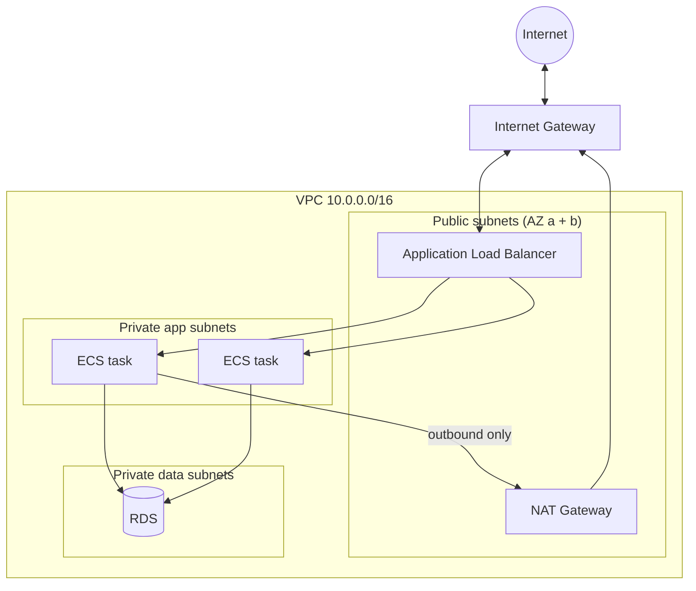
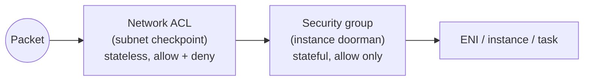
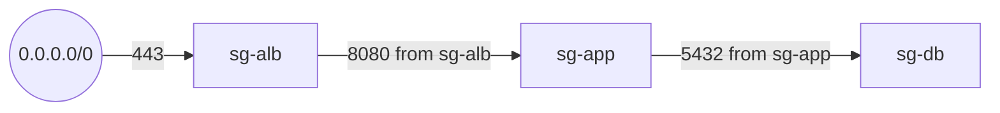

## The big idea

A **VPC (Virtual Private Cloud)** is your own **gated neighbourhood** inside AWS.

- The neighbourhood has an **address range** (CIDR block, like `10.0.0.0/16`).
- It's divided into **streets** (subnets), each in one Availability Zone.
- **Public streets** have a road to the highway (internet gateway). **Private streets** don't; residents can only go out through a **guarded exit** (NAT gateway) and nobody from outside can drive in.
- Every house has its own **doorman** (security group) who checks each visitor, and each street can have a **checkpoint** (network ACL).


## CIDR in 60 seconds

A CIDR block is a base address plus how many leading bits are fixed.

| CIDR | Addresses | Typical use |
| --- | --- | --- |
| `10.0.0.0/16` | 65,536 | Whole VPC |
| `10.0.1.0/24` | 256 (251 usable) | One subnet |
| `10.0.1.0/28` | 16 (11 usable) | Smallest allowed subnet |

AWS reserves **5 addresses** in every subnet (network, router, DNS, future use, broadcast). Plan ranges that **don't overlap** with other VPCs or your office network, or you can't connect them later.

## Subnets: public vs private

A subnet is **public** only because its route table sends `0.0.0.0/0` to an **internet gateway**. Nothing else makes it public.

| Subnet | Route for `0.0.0.0/0` | What lives here |
| --- | --- | --- |
| **Public** | Internet gateway (IGW) | Load balancers, NAT gateways, bastion (if any) |
| **Private (app)** | NAT gateway | ECS tasks, EC2 app servers, Lambda in VPC |
| **Private (data)** | None (or NAT) | RDS, ElastiCache, internal-only services |



## Route tables

Each subnet is associated with **one** route table. The most specific matching route wins.

| Destination | Target | Meaning |
| --- | --- | --- |
| `10.0.0.0/16` | `local` | Anything inside the VPC (always present) |
| `0.0.0.0/0` | `igw-…` | Everything else → internet (public subnet) |
| `0.0.0.0/0` | `nat-…` | Everything else → NAT (private subnet) |
| `pl-… (S3)` | `vpce-…` | S3 traffic → gateway endpoint (stays private, free) |
| `10.1.0.0/16` | `pcx-…` / `tgw-…` | Another VPC via peering or Transit Gateway |

## Internet gateway vs NAT gateway

| | Internet gateway | NAT gateway |
| --- | --- | --- |
| Direction | Inbound **and** outbound | **Outbound only** (replies allowed back) |
| Used by | Resources with public IPs in public subnets | Resources in private subnets |
| Cost | Free | Per hour + per GB processed (can be significant) |
| High availability | Built in | One per AZ for resilience (it lives in one AZ) |

> 💡 **NAT costs add up.** Pulling container images and calling AWS APIs through NAT is billed per GB. Use **VPC endpoints** for S3, ECR, DynamoDB, Secrets Manager and CloudWatch to keep that traffic private and cheaper.

## Security groups vs network ACLs ⭐



| | Security group | Network ACL |
| --- | --- | --- |
| Applies to | Network interfaces (EC2, task, RDS, ALB) | Whole subnet |
| Rules | **Allow only** | Allow **and** Deny, numbered order |
| State | **Stateful**: replies are automatically allowed | **Stateless**: must allow return traffic (ephemeral ports 1024–65535) |
| Default | Deny all inbound, allow all outbound | Default NACL allows everything |
| Typical use | Your main firewall | Coarse subnet-level blocks (e.g. block an IP range) |

### Reference security groups, not IP addresses



| Security group | Inbound rule |
| --- | --- |
| `sg-alb` | TCP 443 from `0.0.0.0/0` (and `::/0`) |
| `sg-app` | TCP 8080 from **`sg-alb`** |
| `sg-db` | TCP 5432 from **`sg-app`** |

Tasks come and go with new IPs; a group reference keeps working automatically. The database is reachable **only** from the app, and the app **only** from the load balancer.

## VPC endpoints: private access to AWS services

| Type | Services | How it works | Cost |
| --- | --- | --- | --- |
| **Gateway endpoint** | S3, DynamoDB | A route in your route table | Free |
| **Interface endpoint** (PrivateLink) | Most others: ECR, Secrets Manager, SQS, CloudWatch Logs, STS… | A private ENI with an IP in your subnet; private DNS | Per hour per AZ + per GB |

A bucket policy can then require traffic to come through your endpoint:

```json
{
  "Effect": "Deny",
  "Principal": "*",
  "Action": "s3:*",
  "Resource": ["arn:aws:s3:::my-private-data", "arn:aws:s3:::my-private-data/*"],
  "Condition": { "StringNotEquals": { "aws:SourceVpce": "vpce-0abc123def456" } }
}
```

## Connecting networks

| Option | Connects | Notes |
| --- | --- | --- |
| **VPC peering** | Two VPCs (same or different account/Region) | Simple, **not transitive**: A↔B and B↔C doesn't give A↔C. CIDRs must not overlap |
| **Transit Gateway** | Many VPCs and on-prem networks | A hub-and-spoke router; transitive; scales to thousands |
| **Site-to-Site VPN** | Office/data centre ↔ VPC | Encrypted over the internet; quick to set up |
| **Direct Connect** | Data centre ↔ AWS | Dedicated private line; consistent latency, higher cost |
| **PrivateLink** | Expose *one service* to other VPCs | Consumers see an endpoint, not your whole network |

## Reaching private servers without SSH keys

Skip the bastion host. Use **AWS Systems Manager Session Manager**: no open port 22, access controlled by IAM, every session logged.

```bash
aws ssm start-session --target i-0123456789abcdef0
# Port-forward to a private RDS for local debugging:
aws ssm start-session --target i-0123456789abcdef0 \
  --document-name AWS-StartPortForwardingSessionToRemoteHost \
  --parameters host=mydb.xxxx.eu-west-1.rds.amazonaws.com,portNumber=5432,localPortNumber=5432
```

## Debugging with VPC Flow Logs

Flow logs record accepted and rejected connections per network interface to CloudWatch Logs or S3.

```text
2 123456789012 eni-0a1b 10.0.1.25 10.0.3.12 49152 5432 6 10 840 1700000000 1700000060 REJECT OK
#                       source    dest      sport dport proto          action
```

A `REJECT` from app → db on port 5432 means a **security group or NACL** problem, not an application bug.

## Checklist for a production VPC

- [ ] `/16` VPC with non-overlapping CIDR, subnets in **at least two AZs**
- [ ] Public subnets only for load balancers and NAT gateways
- [ ] Apps and databases in **private** subnets; RDS not publicly accessible
- [ ] Security groups reference each other; no `0.0.0.0/0` except on the public load balancer
- [ ] NAT gateway per AZ (prod) or one shared (dev, to save cost)
- [ ] Gateway endpoints for S3/DynamoDB, interface endpoints for ECR, Secrets Manager, Logs
- [ ] Session Manager instead of SSH; flow logs enabled

## Key takeaways

- A VPC is your private network; subnets live in one AZ; a subnet is **public only if it routes to an internet gateway**.
- Private workloads reach the internet outbound through a **NAT gateway**; inbound traffic arrives via a load balancer.
- **Security groups** (stateful, allow-only) are the main firewall: chain them ALB → app → DB by reference.
- **VPC endpoints** keep AWS traffic private and cut NAT costs.
- Peering is not transitive; Transit Gateway is the hub for many VPCs; use Session Manager instead of SSH.
