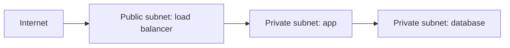

## The picture

A **VPC** is your private network in AWS. A **subnet** is a smaller section of that network, placed in one Availability Zone.



“Public” does not mean a subnet is unsafe. It means its route table can reach an internet gateway. Whether traffic is allowed still depends on security groups.

## The four pieces to understand

| Piece | Job |
| --- | --- |
| **CIDR** | The IP address range for a network, e.g. `10.0.0.0/16` |
| **Subnet** | A smaller IP range in one AZ |
| **Route table** | Tells traffic where to go next |
| **Security group** | Stateful firewall rules attached to AWS resources |

## A safe default layout

- Put the load balancer in public subnets.
- Put app containers or servers in private subnets.
- Put databases in private subnets with no public address.
- Allow the app security group to reach the database port; do not open the database to the internet.

For private apps to download updates, a NAT gateway can provide outbound internet access. It does not let unsolicited internet traffic enter.

## Security groups: allow only needed paths

```text
Internet → ALB: allow HTTPS 443
ALB → App: allow app port, source = ALB security group
App → Database: allow 5432, source = App security group
```

Using a security group as the source is safer than allowing a broad IP range.

## Remember this

- VPC = private network; subnet = a piece of it in one AZ.
- Route tables decide direction; security groups decide permission.
- Keep app and database private; expose only the load balancer.
- Debug network problems hop by hop: DNS → route → security group → app port.
