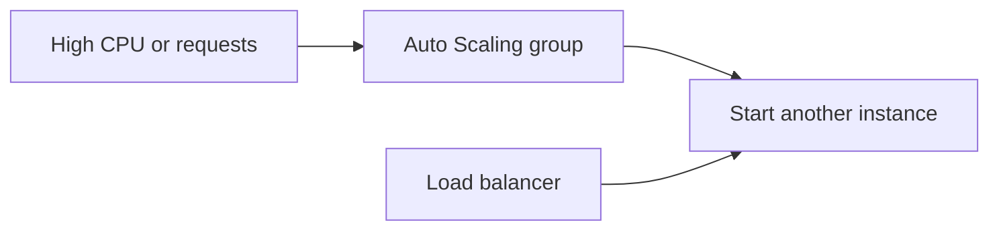

## EC2 in one sentence

An **EC2 instance** is a virtual server you manage: operating system, updates, application, and capacity are your responsibility.

Use EC2 when you need server control. For a simple container app, ECS Fargate often needs less maintenance.

## Important EC2 words

| Word | Meaning |
| --- | --- |
| **Instance type** | CPU, memory, network, and price shape of a server |
| **AMI** | Starting machine image for a server |
| **User data** | Startup script that runs when the server launches |
| **Instance role** | Temporary AWS permissions for the server |
| **EBS** | Durable block disk attached to a server |

Do not store important data only on the instance filesystem. Use EBS, RDS, S3, or another durable service.

## Pricing choice

| Option | Best simple use |
| --- | --- |
| On-Demand | Short-term, unknown usage |
| Savings Plans | Predictable long-running usage |
| Spot | Interruptible batch or flexible workers |

## Auto Scaling

An Auto Scaling group keeps a chosen number of server copies running. It can replace unhealthy servers and add copies when a metric rises.

Create a launch template first: AMI, instance type, security group, role, and startup instructions. Then let the Auto Scaling group create matching instances in multiple AZs.

## Remember this

- EC2 is a server you operate.
- EBS is a durable disk; instance-local data can disappear.
- Use an instance role instead of access keys.
- Auto Scaling groups keep the requested server capacity healthy.
