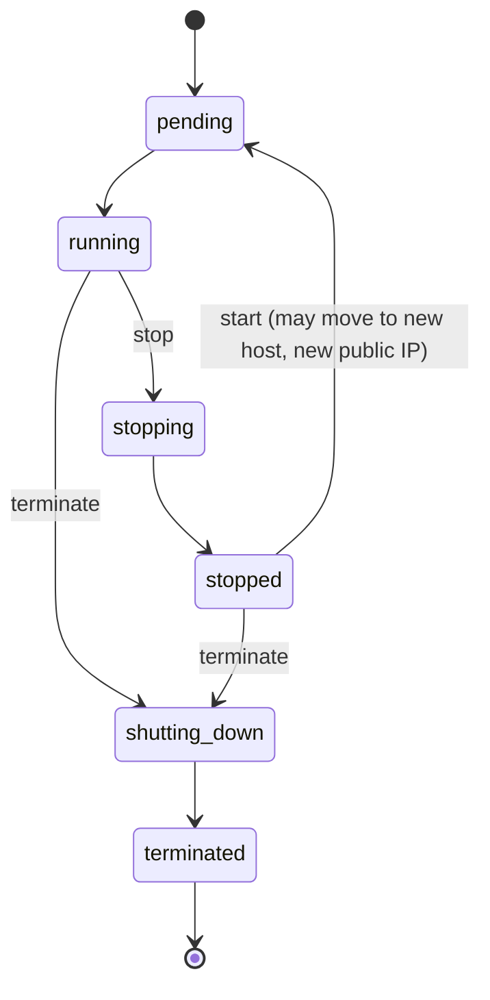
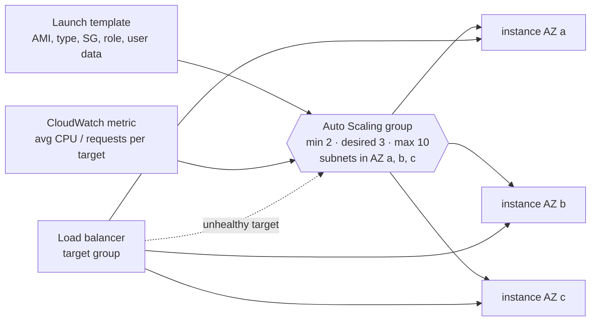

## The big idea

**EC2 (Elastic Compute Cloud)** rents you a computer by the second. You choose its size, operating system and network, then use it like any server.

Think of a **car rental company**:

- The **instance type** is the car model (small hatchback or a lorry).
- The **AMI** is the car's factory setup (which OS and software come pre-installed).
- **EBS** is a detachable **boot/trunk** you can move to another car, snapshot and keep.
- **Auto Scaling** is the fleet manager who adds cars when queues grow and returns them when it's quiet, and replaces any car that breaks down.


## When to choose EC2

| Choose EC2 when… | Prefer instead |
| --- | --- |
| You need OS-level control, custom kernels, GPUs, licensed software | — |
| Long-running, steady workloads you want to tune | — |
| You just want to run a container | **ECS on Fargate** (no servers to patch) |
| Short event-driven functions | **Lambda** |
| A managed database | **RDS / Aurora** instead of self-hosting on EC2 |

## Instance types

A name like `m7g.large` reads as **family** `m`, **generation** `7`, **attributes** `g` (Graviton/ARM), **size** `large`.

| Family | Optimised for | Examples |
| --- | --- | --- |
| **t** (burstable) | Low average CPU with occasional bursts (CPU credits) | Dev servers, small sites |
| **m** (general purpose) | Balanced CPU/memory | Web apps, app servers |
| **c** (compute) | High CPU | Batch, encoding, high-traffic APIs |
| **r / x** (memory) | Lots of RAM | Caches, in-memory analytics |
| **i / d** (storage) | Fast local NVMe | Databases, search indexes |
| **g / p / inf / trn** (accelerated) | GPUs / ML chips | ML training and inference, graphics |

Sizes double each step: `large` → `xlarge` → `2xlarge`… **Graviton** (`g` suffix, ARM) usually gives ~20–40% better price/performance if your software runs on ARM.

## Launching an instance

```bash
aws ec2 run-instances \
  --image-id resolve:ssm:/aws/service/ami-amazon-linux-latest/al2023-ami-kernel-default-arm64 \
  --instance-type t4g.small \
  --subnet-id subnet-0abc --security-group-ids sg-0app \
  --iam-instance-profile Name=web-app-profile \
  --metadata-options HttpTokens=required \
  --user-data file://bootstrap.sh \
  --tag-specifications 'ResourceType=instance,Tags=[{Key=Name,Value=web-1},{Key=env,Value=dev}]'
```

| Piece | What it is |
| --- | --- |
| **AMI** (Amazon Machine Image) | Template: OS + preinstalled software + block device mapping. Regional; copy it to use elsewhere |
| **User data** | A script run **once at first boot** (install packages, fetch config) |
| **Instance profile** | Wraps an IAM role so code on the instance gets temporary credentials |
| **Key pair** | SSH key; prefer **Session Manager** and don't open port 22 |
| **Security group** | Firewall for the instance |

```bash
#!/bin/bash
# bootstrap.sh — user data
dnf install -y nginx
systemctl enable --now nginx
```

### Instance metadata and IMDSv2

Code on the instance reads its role credentials and details from `http://169.254.169.254`. **Require IMDSv2** (`HttpTokens=required`): it needs a session token obtained with a PUT, which blocks SSRF attacks that trick your app into fetching credentials.

```bash
TOKEN=$(curl -sX PUT "http://169.254.169.254/latest/api/token" -H "X-aws-ec2-metadata-token-ttl-seconds: 300")
curl -s -H "X-aws-ec2-metadata-token: $TOKEN" http://169.254.169.254/latest/meta-data/instance-id
```

## Instance lifecycle



| Action | Compute billed? | EBS kept? | Instance store kept? | Public IP |
| --- | --- | --- | --- | --- |
| **Reboot** | Yes | Yes | Yes | Same |
| **Stop** | No (EBS still billed) | Yes | **Lost** | Changes (unless Elastic IP) |
| **Hibernate** | No | Yes, RAM saved to EBS | Lost | Changes |
| **Terminate** | No | Root deleted by default | Lost | Released |

**Elastic IP**: a static public IPv4 you own and can move between instances. Note that AWS charges for **all** public IPv4 addresses, in use or not.

## Pricing options ⭐

| Option | Discount vs On-Demand | Commitment | Best for |
| --- | --- | --- | --- |
| **On-Demand** | — | None | Spiky, short, unpredictable |
| **Savings Plans** | Up to ~72% | $/hour for 1 or 3 years (flexible across instance types; Compute SP also covers Fargate and Lambda) | Steady baseline usage |
| **Reserved Instances** | Up to ~72% | Specific instance type/Region for 1 or 3 years | Legacy option; Savings Plans are usually easier |
| **Spot** | Up to ~90% | None, but AWS can reclaim with a **2-minute warning** | Fault-tolerant, stateless: batch, CI, workers |
| **Dedicated Host / Instance** | Premium | — | Licensing or compliance needing physical isolation |

> 💡 A common mix: Savings Plan for the always-on baseline, On-Demand for normal peaks, Spot for batch and extra capacity.

## Storage: EBS vs instance store vs EFS

| | **EBS** | **Instance store** | **EFS** |
| --- | --- | --- | --- |
| What | Network block volume | Disks physically on the host | Managed NFS file system |
| Survives stop? | ✅ | ❌ (ephemeral) | ✅ |
| Attach to | One instance (in one AZ); io2 supports multi-attach | That instance only | Thousands of instances across AZs |
| Use for | Boot disks, databases, app data | Caches, scratch, buffers | Shared files, content, home directories |

### EBS volume types

| Type | Kind | Performance | Use |
| --- | --- | --- | --- |
| **gp3** | SSD | 3,000 IOPS / 125 MB/s baseline, both adjustable independently | **Default** for almost everything |
| **io2 Block Express** | SSD | Up to 256,000 IOPS, 99.999% durability | Critical, I/O-heavy databases |
| **st1** | HDD | Throughput-optimised | Big sequential data, logs, data warehouses |
| **sc1** | HDD | Cold, lowest cost | Rarely accessed data |

- **Snapshots** are incremental backups stored in S3 (managed by AWS). Automate with **Data Lifecycle Manager** or **AWS Backup**; copy to another Region for disaster recovery.
- You can **grow** a volume and change its type live, but you **can't shrink** it (create a smaller one and copy the data).
- **Encrypt** volumes with KMS; enable "EBS encryption by default" for the account.

## Placement groups

| Strategy | Places instances | Use |
| --- | --- | --- |
| **Cluster** | Close together in one AZ | Low-latency HPC networking |
| **Spread** | On distinct hardware (max 7 per AZ) | A few critical instances that must not fail together |
| **Partition** | In separate racks per partition | Large distributed systems (Kafka, HDFS, Cassandra) |

## Auto Scaling groups

An **Auto Scaling group (ASG)** keeps the right number of healthy instances running, across AZs, from a **launch template**.



| Setting | Meaning |
| --- | --- |
| **Min / desired / max** | Floor, current target, ceiling |
| **Health checks** | EC2 status and, when attached, **ELB health checks**: failed instances are replaced |
| **Instance refresh** | Roll out a new launch template version gradually |
| **Lifecycle hooks** | Run code before an instance goes in service or is terminated (drain, register) |
| **Mixed instances policy** | Combine On-Demand and Spot, several instance types |

### Scaling policies

| Policy | How it works | Example |
| --- | --- | --- |
| **Target tracking** ⭐ | Keeps a metric at a target, like a thermostat | Average CPU at 50%, or 1,000 requests per target |
| **Step scaling** | Adds/removes amounts based on alarm size | +2 at CPU > 70%, +4 at > 90% |
| **Scheduled** | At set times | Scale to 10 at 08:00 on weekdays |
| **Predictive** | ML forecast from history | Daily traffic patterns |

```bash
aws autoscaling put-scaling-policy \
  --auto-scaling-group-name web-asg --policy-name cpu50 \
  --policy-type TargetTrackingScaling \
  --target-tracking-configuration '{"PredefinedMetricSpecification":{"PredefinedMetricType":"ASGAverageCPUUtilization"},"TargetValue":50}'
```

**Design instances to be disposable**: no data only on local disk, config from Parameter Store/Secrets Manager, logs shipped to CloudWatch, sessions in Redis/DynamoDB. Then scaling in, Spot interruptions and replacements are harmless.

## Troubleshooting

| Symptom | Likely cause |
| --- | --- |
| Can't connect | Security group, NACL, route table, no public IP, wrong subnet |
| Instance fails **system** status check | AWS hardware/network: stop and start (moves host) |
| Fails **instance** status check | Your OS: bad config, full disk, kernel panic; check the system log |
| `InsufficientInstanceCapacity` | Try another AZ or instance type |
| Public IP changed after stop/start | Normal; use an Elastic IP, a load balancer or DNS |

## Key takeaways

- Instance type = family + generation + attributes + size; try **Graviton** for better price/performance.
- Use **IAM roles** (instance profiles) with **IMDSv2 required**; manage access with Session Manager, not SSH keys.
- Savings Plans for steady load, On-Demand for peaks, **Spot** (up to 90% off) for interruptible work.
- **EBS** persists (gp3 by default, snapshots for backup); **instance store** is fast but ephemeral; **EFS** is shared.
- **Auto Scaling groups** + launch templates + target tracking keep healthy, right-sized fleets across AZs. Make instances disposable.
