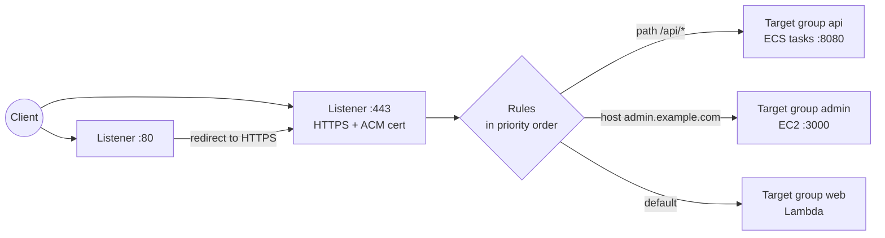
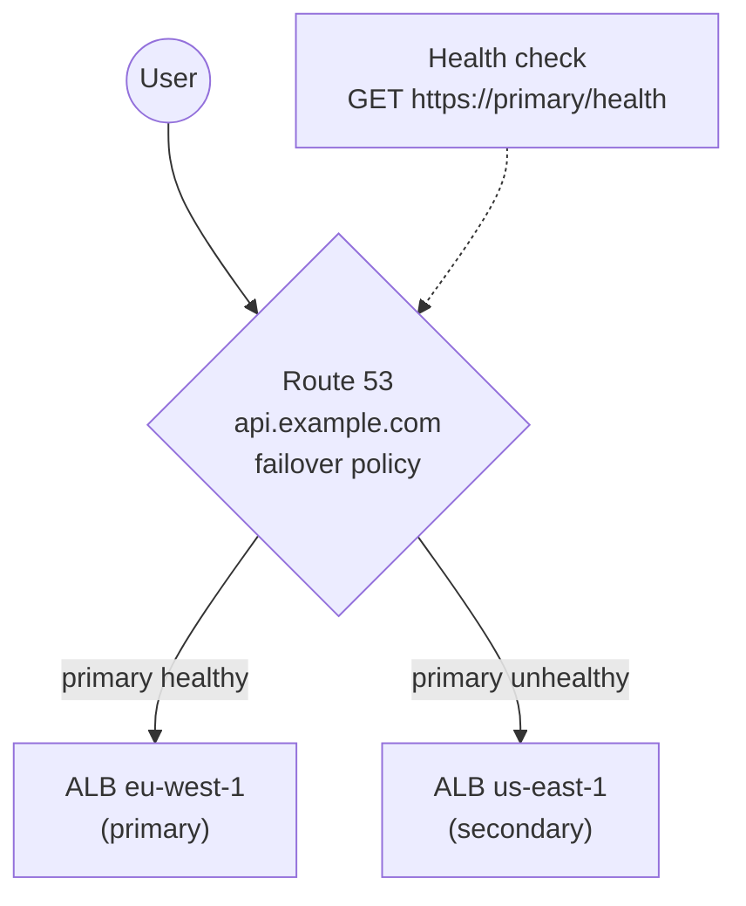

## The big idea

When a customer calls a busy company, they don't dial a specific employee. They dial **one phone number** (DNS), reach a **receptionist** (load balancer) who knows which staff are available and healthy, and gets connected to one of them.

- **Route 53** turns `api.example.com` into the address of the receptionist.
- The **load balancer** spreads requests over healthy servers in several AZs and stops sending calls to anyone who's sick.
- **ACM** gives the receptionist a **verified ID badge** (TLS certificate) so callers know they reached the real company.


## Choosing a load balancer

| | **Application LB (ALB)** | **Network LB (NLB)** | **Gateway LB (GWLB)** |
| --- | --- | --- | --- |
| OSI layer | 7 (HTTP/HTTPS, gRPC, WebSocket) | 4 (TCP, UDP, TLS) | 3 (IP packets) |
| Routes by | Host, path, headers, query, method | Port and protocol | — (sends to appliances) |
| Performance | Very high | Extreme, ultra-low latency, millions of req/s | — |
| Static IP | ❌ (use DNS name) | ✅ one per AZ, Elastic IPs possible | — |
| Extra features | Redirects, fixed responses, Cognito/OIDC auth, WAF | Preserves client IP, PrivateLink | Firewalls, IDS inline |
| Typical use | **Web apps, REST APIs, microservices** | Games, IoT, non-HTTP, static IP needs | Third-party security appliances |

The old **Classic Load Balancer** is legacy; don't use it for new work.

## How an ALB is put together



| Part | What it does |
| --- | --- |
| **Listener** | Port + protocol the LB accepts (`HTTPS:443`) |
| **Rule** | Condition (host, path, header, method, source IP) → action (forward, redirect, fixed response, authenticate) |
| **Target group** | A set of targets (instances, IPs, Lambda) + a health check. ECS on Fargate uses **IP** targets |
| **Health check** | e.g. `GET /health` every 15s, healthy after 2 successes, unhealthy after 3 failures |

### Health checks that actually help

```js
// A health endpoint: cheap, no auth, checks what the app needs to serve traffic
app.get("/health", async (_req, res) => {
  try {
    await db.query("SELECT 1");
    res.status(200).json({ ok: true });
  } catch {
    res.status(503).json({ ok: false });
  }
});
```

> ⚠️ Don't make the health check depend on **every** downstream service. If a third-party API is down and all your targets report unhealthy, the load balancer has nothing to send traffic to, and a partial outage becomes a total one.

### Behaviour you need to know

| Setting | What it does | Default / tip |
| --- | --- | --- |
| **Cross-zone load balancing** | Spread evenly across all targets in all AZs | On for ALB; off by default for NLB |
| **Deregistration delay** (connection draining) | Lets in-flight requests finish before a target is removed | 300s; lower it (30–60s) for fast deploys |
| **Slow start** | Ramp traffic to new targets gradually | Useful for JVM warm-up |
| **Stickiness** | Pins a client to one target with a cookie | Avoid if possible: keep sessions in Redis/DynamoDB |
| **Idle timeout** | Closes idle connections | 60s; raise for long polling/WebSocket |
| **Client IP** | ALB sends it in `X-Forwarded-For` | NLB preserves the source IP |

## TLS with AWS Certificate Manager (ACM)

- Public certificates from ACM are **free** and **auto-renew**.
- Validate ownership with a **DNS record** (one click if the zone is in Route 53). Email validation doesn't auto-renew as reliably.
- Attach them to ALB, NLB, CloudFront and API Gateway. You **can't export** the private key of an ACM public certificate for use on your own servers.
- **CloudFront requires the certificate in `us-east-1`**, whatever Region your app is in.

```bash
aws acm request-certificate --domain-name example.com \
  --subject-alternative-names "*.example.com" --validation-method DNS --region us-east-1
```

TLS terminates at the load balancer. Traffic to targets can be plain HTTP inside the VPC, or HTTPS again if your compliance rules require end-to-end encryption.

## Route 53: DNS

### Record types

| Record | Points a name to | Example |
| --- | --- | --- |
| **A / AAAA** | IPv4 / IPv6 address | `web.example.com → 203.0.113.10` |
| **CNAME** | Another name (not allowed at the zone apex) | `www.example.com → example.com` |
| **Alias** (AWS-specific) | An AWS resource: ALB, CloudFront, S3 website, API Gateway | Works at the **apex** (`example.com`), free queries, follows IP changes |
| **MX** | Mail servers | `10 mail.example.com` |
| **TXT** | Text: verification, SPF, DKIM | `"v=spf1 include:amazonses.com ~all"` |
| **NS / SOA** | The zone's name servers and authority | Created with the hosted zone |
| **CAA** | Which CAs may issue certs | `0 issue "amazon.com"` |

**Hosted zones:** a **public** zone answers the internet; a **private** zone answers only inside the VPCs you attach it to (e.g. `db.internal`).

**TTL** is how long resolvers cache an answer. Lower it (60s) **before** a migration, raise it afterwards.

### Routing policies ⭐

| Policy | Answers with | Use |
| --- | --- | --- |
| **Simple** | One record (can hold several IPs) | A single resource |
| **Weighted** | Records in proportion to weights | Canary: 90% old stack, 10% new |
| **Latency-based** | The Region with lowest latency for this user | Multi-Region apps |
| **Failover** | Primary, or secondary when the primary's **health check** fails | Active-passive disaster recovery |
| **Geolocation** | By user's country/continent | Legal content rules, languages |
| **Geoproximity** | By distance, with a bias to shift traffic | Fine-grained geographic balancing |
| **Multivalue answer** | Up to 8 healthy records at random | Simple client-side balancing |
| **IP-based** | By client CIDR | Route specific ISPs/networks |



## Putting it together with Terraform

```hcl
resource "aws_lb" "api" {
  name               = "api"
  load_balancer_type = "application"
  subnets            = var.public_subnet_ids
  security_groups    = [aws_security_group.alb.id]
}

resource "aws_lb_target_group" "api" {
  name        = "api"
  port        = 8080
  protocol    = "HTTP"
  vpc_id      = var.vpc_id
  target_type = "ip"                      # Fargate tasks
  deregistration_delay = 30
  health_check {
    path                = "/health"
    healthy_threshold   = 2
    unhealthy_threshold = 3
    interval            = 15
  }
}

resource "aws_lb_listener" "https" {
  load_balancer_arn = aws_lb.api.arn
  port              = 443
  protocol          = "HTTPS"
  ssl_policy        = "ELBSecurityPolicy-TLS13-1-2-2021-06"
  certificate_arn   = aws_acm_certificate.api.arn
  default_action {
    type             = "forward"
    target_group_arn = aws_lb_target_group.api.arn
  }
}

resource "aws_route53_record" "api" {
  zone_id = var.zone_id
  name    = "api.example.com"
  type    = "A"
  alias {
    name                   = aws_lb.api.dns_name
    zone_id                = aws_lb.api.zone_id
    evaluate_target_health = true
  }
}
```

## Troubleshooting

| Symptom | Likely cause |
| --- | --- |
| **502 Bad Gateway** | Target closed the connection or sent an invalid response; app crashed; keep-alive timeout shorter than the ALB's |
| **503 Service Unavailable** | No healthy targets registered |
| **504 Gateway Timeout** | Target too slow, or security group blocks ALB → target |
| Targets stay **unhealthy** | Wrong health path/port, SG doesn't allow the ALB, app listening on `127.0.0.1` instead of `0.0.0.0` |
| DNS still points to old IP | TTL caching; wait, or lower TTL next time |

## Key takeaways

- **ALB** for HTTP(S) with host/path routing; **NLB** for TCP/UDP, static IPs and extreme performance.
- Listener → rules → target groups; health checks decide who gets traffic; tune deregistration delay for deploys.
- **ACM** certificates are free and auto-renew; CloudFront needs them in **us-east-1**.
- Use **alias records** for AWS resources (they work at the apex); pick routing policies for canaries, latency and failover.
- 502 = bad target response, 503 = no healthy targets, 504 = target too slow or blocked.
