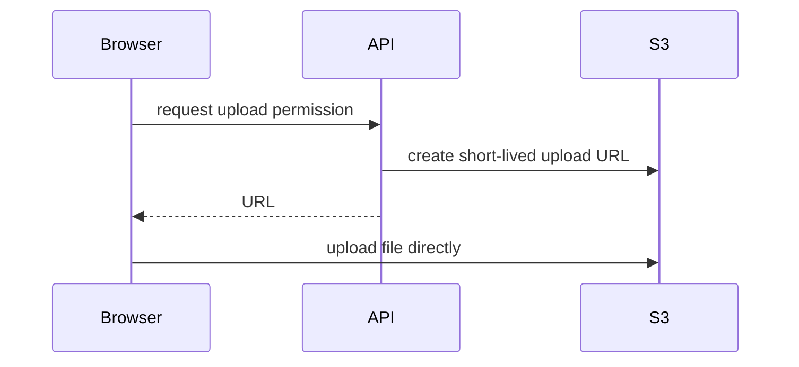

## What S3 is

S3 stores **objects**: files plus a key (their name/path). A bucket is the top-level container.

```text
bucket: shop-uploads
key: users/42/avatar.png
object: the image bytes and metadata
```

S3 is excellent for uploads, backups, images, exports, and static website assets. It is not a normal mounted server filesystem or a database.

## Keep buckets private by default

Leave Block Public Access on. Let your app access the bucket using its IAM role. Give only the paths and actions it needs.

```json
{
  "Effect": "Allow",
  "Action": ["s3:GetObject", "s3:PutObject"],
  "Resource": "arn:aws:s3:::shop-uploads/users/*"
}
```

Enable encryption and versioning for important data. Versioning makes accidental overwrites and deletes easier to recover from.

## Browser uploads: presigned URLs

Do not send a large file through your API server just to upload it. Your backend can create a short-lived **presigned URL**; the browser uploads directly to S3. Validate file size, type, and intended key before creating the URL.



## Cost control

Use lifecycle rules: move old files to a cheaper storage class or delete temporary files after a known period. Do not delete valuable data until you understand the rule and recovery policy.

## Remember this

- Bucket holds objects; object key is its name/path.
- Keep buckets private and use IAM roles.
- Use presigned URLs for direct, temporary browser uploads.
- Use versioning and lifecycle rules deliberately.
