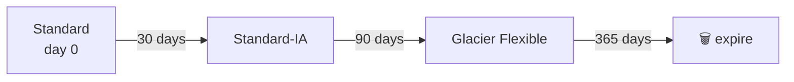
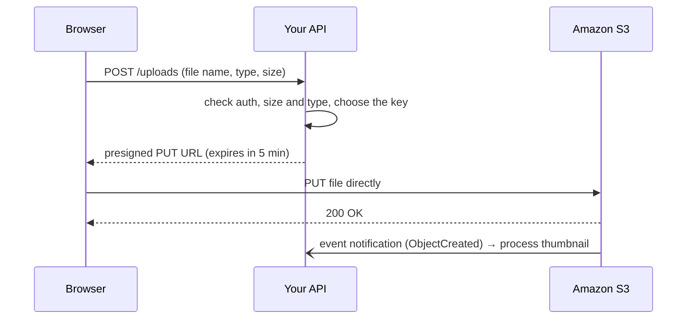

## The big idea

**S3 (Simple Storage Service)** is a **giant, infinitely large warehouse of labelled boxes**.

- A **bucket** is a named warehouse (globally unique name, lives in one Region).
- An **object** is a box: the file's bytes plus **metadata**, up to **5 TB**.
- The **key** is the label on the box: `invoices/2026/09/inv-123.pdf`. There are no real folders; the `/` is just part of the name.

It's designed for **11 nines of durability** (99.999999999%): data is stored across at least three AZs. You pay per GB stored, per request and for data transferred out.


## What S3 is (and isn't) for

| ✅ Great for | ❌ Not for |
| --- | --- |
| User uploads, images, video | A database (no queries, no transactions) |
| Static website assets (with CloudFront) | A file system for an OS (use EBS/EFS) |
| Backups, logs, data lake files (Parquet, CSV) | Frequent small in-place edits (objects are replaced whole) |
| Build artefacts, ML datasets | |

S3 has **strong read-after-write consistency**: after a successful PUT, every GET and LIST sees the new object.

## Working with objects

```bash
aws s3 mb s3://my-app-uploads-dev-123456789012             # make a bucket
aws s3 cp ./logo.png s3://my-app-uploads-dev-123456789012/images/logo.png
aws s3 ls s3://my-app-uploads-dev-123456789012/images/
aws s3 sync ./dist s3://my-site-bucket --delete           # mirror a folder
aws s3 presign s3://my-app-uploads-dev-123456789012/images/logo.png --expires-in 300
```

```js
import { S3Client, PutObjectCommand, GetObjectCommand } from "@aws-sdk/client-s3";

const s3 = new S3Client({});

await s3.send(new PutObjectCommand({
  Bucket: "my-app-uploads-dev-123456789012",
  Key: `avatars/${userId}.png`,
  Body: buffer,
  ContentType: "image/png",
  Metadata: { uploadedBy: userId },
}));

const obj = await s3.send(new GetObjectCommand({ Bucket: "my-app-uploads-dev-123456789012", Key: `avatars/${userId}.png` }));
const bytes = await obj.Body.transformToByteArray();
```

## Storage classes

| Class | Retrieval | Min duration | Use for |
| --- | --- | --- | --- |
| **Standard** | Instant | — | Frequently accessed data |
| **Intelligent-Tiering** | Instant (archive tiers optional) | — | Unknown or changing patterns: AWS moves objects for you |
| **Standard-IA** | Instant, retrieval fee | 30 days | Infrequent, but needed fast (backups) |
| **One Zone-IA** | Instant, one AZ only | 30 days | Re-creatable infrequent data |
| **Glacier Instant Retrieval** | Milliseconds | 90 days | Archives read about once a quarter |
| **Glacier Flexible Retrieval** | Minutes to hours | 90 days | Archives, rare restores |
| **Glacier Deep Archive** | Up to 12–48 hours | 180 days | Compliance archives kept for years |
| **Express One Zone** | Single-digit ms | — | Very high-performance, same-AZ workloads |

### Lifecycle rules

```json
{
  "Rules": [{
    "ID": "logs-tiering",
    "Filter": { "Prefix": "logs/" },
    "Status": "Enabled",
    "Transitions": [
      { "Days": 30, "StorageClass": "STANDARD_IA" },
      { "Days": 90, "StorageClass": "GLACIER" }
    ],
    "Expiration": { "Days": 365 },
    "NoncurrentVersionExpiration": { "NoncurrentDays": 30 },
    "AbortIncompleteMultipartUpload": { "DaysAfterInitiation": 7 }
  }]
}
```



## Versioning, Object Lock and replication

- **Versioning** keeps every version of an object. A DELETE adds a *delete marker*; you can restore the previous version. Essential against accidental deletes and ransomware. Once enabled it can only be **suspended**, not turned off.
- **MFA Delete** requires MFA to permanently delete versions.
- **Object Lock** (WORM): objects can't be deleted or overwritten for a retention period. *Compliance mode* can't be shortened by anyone, including root.
- **Replication**: **CRR** (cross-Region) for disaster recovery and latency; **SRR** (same-Region) for log aggregation or copying to another account. Needs versioning on both buckets. Existing objects need **Batch Replication**.

## Security ⭐

### Block Public Access

Four account- and bucket-level switches that override any policy or ACL making data public. **Keep them all on** unless a bucket truly must be public (and even then, prefer CloudFront with a private bucket).

**Object ownership:** set *Bucket owner enforced*. It disables ACLs entirely, so access is controlled only by policies.

### Bucket policy vs IAM policy

| | IAM policy | Bucket policy |
| --- | --- | --- |
| Attached to | A user/role | The bucket |
| Answers | "What can this identity do?" | "Who can do what to this bucket?" |
| Cross-account | Needs the bucket policy too | ✅ grants other accounts |
| Good for | Your own app roles | Enforcing rules for everyone: HTTPS only, encryption, VPC endpoint only |

```json
{
  "Version": "2012-10-17",
  "Statement": [{
    "Sid": "DenyInsecureTransport",
    "Effect": "Deny",
    "Principal": "*",
    "Action": "s3:*",
    "Resource": ["arn:aws:s3:::my-app-uploads", "arn:aws:s3:::my-app-uploads/*"],
    "Condition": { "Bool": { "aws:SecureTransport": "false" } }
  }]
}
```

### Encryption

| Option | Keys managed by | Notes |
| --- | --- | --- |
| **SSE-S3** | S3 | **On by default** for all new objects |
| **SSE-KMS** | KMS (AWS or your customer-managed key) | Audit in CloudTrail, key policies, separate permission to decrypt. Enable **S3 Bucket Keys** to cut KMS request costs |
| **DSSE-KMS** | KMS, two layers | Compliance needing dual-layer encryption |
| **SSE-C** | You send the key with each request | S3 never stores it |
| **Client-side** | You encrypt before uploading | S3 only sees ciphertext |

## Presigned URLs: direct browser uploads ⭐

Don't stream large uploads through your API servers. Your backend signs a short-lived URL; the browser uploads **straight to S3**.



```js
import { getSignedUrl } from "@aws-sdk/s3-request-presigner";
import { PutObjectCommand, GetObjectCommand } from "@aws-sdk/client-s3";

app.post("/uploads", requireAuth, async (req, res) => {
  const { contentType } = req.body;
  if (!["image/png", "image/jpeg"].includes(contentType)) return res.status(400).end();

  const key = `uploads/${req.user.id}/${crypto.randomUUID()}`; // never trust the client's filename
  const url = await getSignedUrl(
    s3,
    new PutObjectCommand({ Bucket: process.env.UPLOAD_BUCKET, Key: key, ContentType: contentType }),
    { expiresIn: 300 },
  );
  res.json({ url, key });
});

// A temporary download link for a private file
const downloadUrl = await getSignedUrl(s3, new GetObjectCommand({ Bucket, Key }), { expiresIn: 60 });
```

A presigned URL carries the **signer's permissions**, so the signing role needs `s3:PutObject` on that prefix. The bucket needs a **CORS** rule allowing `PUT` from your site's origin. To enforce a maximum size, use a **presigned POST** with a `content-length-range` condition.

## Multipart uploads and performance

- Use **multipart upload** for objects over ~100 MB (required above 5 GB): parts upload in parallel and retry individually. The SDK's `@aws-sdk/lib-storage` `Upload` class does it for you.
- S3 scales to at least **3,500 writes and 5,500 reads per second per prefix**; spread hot data across prefixes for more.
- **Transfer Acceleration** routes uploads via edge locations for distant users.
- **Byte-range GETs** download parts of large files in parallel.
- **S3 Select / Athena** query CSV/JSON/Parquet in place without downloading everything.

## Event notifications

S3 can react when objects are created or deleted:

| Destination | Use |
| --- | --- |
| **Lambda** | Resize images, scan files, extract metadata |
| **SQS** | Buffer work for a worker fleet |
| **SNS** | Fan out to several subscribers |
| **EventBridge** | Advanced filtering, many targets, archive and replay |

> ⚠️ If a Lambda triggered by `uploads/` writes its output back to `uploads/`, it triggers itself forever. Write results to a **different prefix or bucket**.

## Static website hosting

S3 can serve a static site directly (`index.html`, error document), but it's **HTTP-only** and needs a public bucket. The production pattern is a **private bucket behind CloudFront** (next lesson).

## Key takeaways

- Buckets hold objects addressed by **keys**; 11 nines of durability; strong read-after-write consistency.
- Choose **storage classes** by access pattern and automate with **lifecycle rules** (Intelligent-Tiering if unsure).
- Keep **Block Public Access** on, disable ACLs, encrypt (default SSE-S3, KMS for audit/control), deny non-HTTPS.
- Enable **versioning** for important data; replication for DR; Object Lock for compliance.
- Use **presigned URLs** for direct browser uploads/downloads and **event notifications** to process files asynchronously.
