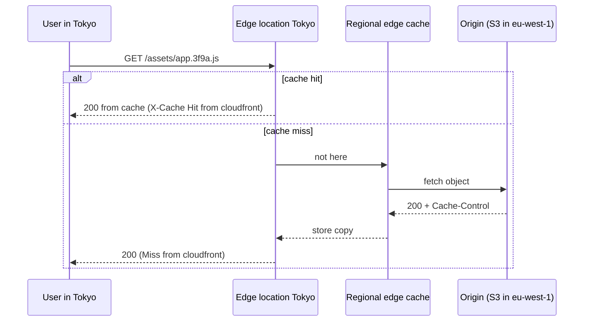
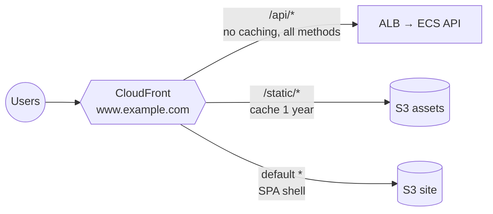

## The big idea

Imagine a popular bakery in Paris. Customers in Tokyo would wait days for a croissant. Instead, the bakery opens **small shops in every big city** that keep fresh copies of the most popular items. Most customers are served by the shop next door; only unusual orders go back to Paris.

**CloudFront** is that network of shops: 600+ **edge locations** that cache your content near users. The bakery in Paris is your **origin** (an S3 bucket, a load balancer, API Gateway, or any HTTP server).


## Why put CloudFront in front

| Benefit | How |
| --- | --- |
| **Lower latency** | Content served from a nearby edge; TLS handshakes end close to the user |
| **Less load on origin** | Cache hits never reach your servers |
| **Security** | Private S3 origin, AWS Shield Standard (DDoS) included, WAF, geo-blocking |
| **Lower cost** | Data transfer from CloudFront is often cheaper than from EC2/S3 directly |
| **HTTPS + HTTP/2/3** | Free ACM certificates, modern protocols, compression |

## Cache hit vs miss



## Distributions, origins and behaviors

| Part | What it is |
| --- | --- |
| **Distribution** | Your CDN config with a domain like `d111111abcdef8.cloudfront.net` plus your aliases (`www.example.com`) |
| **Origin** | Where content comes from: S3 bucket, ALB, API Gateway, custom HTTP server, or an origin group for failover |
| **Behavior** | A path pattern (`/api/*`, `/static/*`, default `*`) → origin + cache policy + allowed methods + functions |



## Caching done right ⭐

**The cache key** decides whether two requests are "the same". By default it's just the URL path. Every header, cookie or query string you add to the key **splits the cache** and lowers the hit rate.

| Policy | Controls |
| --- | --- |
| **Cache policy** | What's in the cache key (headers/cookies/query strings) and the TTLs |
| **Origin request policy** | What's forwarded to the origin *without* being part of the key |
| **Response headers policy** | Adds headers: CORS, HSTS, CSP, X-Frame-Options |

Useful managed policies: `CachingOptimized` for static files, `CachingDisabled` for APIs, and `AllViewerExceptHostHeader` as the origin request policy for API origins.

### TTLs and Cache-Control

The origin's `Cache-Control` header sets how long objects stay cached (within the policy's min/max TTL).

| Content | Header | Why |
| --- | --- | --- |
| Hashed assets `app.3f9a.js` | `public, max-age=31536000, immutable` | The name changes when content changes |
| `index.html` | `no-cache` (or `max-age=60`) | Must pick up new asset names quickly |
| API responses | `no-store` / `private` | Personalised; don't cache at the edge |

### Invalidations

```bash
aws cloudfront create-invalidation --distribution-id E123ABC --paths "/index.html"
```

The first 1,000 invalidation paths per month are free. Don't rely on `/*` invalidations for every deploy; **version your file names** instead, and only invalidate `index.html`.

## Private S3 origin with Origin Access Control (OAC) ⭐

Keep the bucket **private** (Block Public Access on). CloudFront signs its requests to S3; the bucket policy allows **only your distribution**:

```json
{
  "Version": "2012-10-17",
  "Statement": [{
    "Sid": "AllowCloudFrontOnly",
    "Effect": "Allow",
    "Principal": { "Service": "cloudfront.amazonaws.com" },
    "Action": "s3:GetObject",
    "Resource": "arn:aws:s3:::my-site-bucket/*",
    "Condition": {
      "StringEquals": { "AWS:SourceArn": "arn:aws:cloudfront::123456789012:distribution/E123ABC" }
    }
  }]
}
```

OAC replaces the older **Origin Access Identity (OAI)** and supports SSE-KMS buckets. This read permission is separate from your backend's upload role (`s3:PutObject`).

## Hosting a single-page app (React, Vue, Angular)

1. Build: `npm run build` → `dist/`.
2. Upload with correct cache headers:

   ```bash
   aws s3 sync dist/ s3://my-site-bucket --delete \
     --exclude index.html --cache-control "public,max-age=31536000,immutable"
   aws s3 cp dist/index.html s3://my-site-bucket/index.html --cache-control "no-cache"
   aws cloudfront create-invalidation --distribution-id E123ABC --paths "/index.html"
   ```

3. Distribution: private S3 origin with OAC, default root object `index.html`, **HTTPS redirect**, ACM cert (in **us-east-1**) for `www.example.com`.
4. **Client-side routing**: a deep link like `/orders/42` doesn't exist in S3, so S3 returns 403. Map **403 and 404 → `/index.html` with status 200** in *Custom error responses*, or rewrite with a CloudFront Function.
5. Route 53 **alias** record `www.example.com` → the distribution.

## Private content: signed URLs and cookies

For paid videos or downloads, require a **CloudFront signed URL** (one file) or **signed cookies** (many files). Your backend signs with a private key whose public key is in a **key group** trusted by the behavior.

```js
import { getSignedUrl } from "@aws-sdk/cloudfront-signer";

const url = getSignedUrl({
  url: "https://media.example.com/videos/lesson-1.mp4",
  keyPairId: process.env.CF_KEY_ID,
  privateKey: process.env.CF_PRIVATE_KEY,
  dateLessThan: new Date(Date.now() + 10 * 60_000).toISOString(),
});
```

| | CloudFront signed URL | S3 presigned URL |
| --- | --- | --- |
| Served from | Edge cache (fast, cheap) | S3 directly |
| Scope | Path patterns, IP ranges, time window | One object, one operation |
| Use | Media delivery at scale | Uploads, one-off private downloads |

## Code at the edge

| | **CloudFront Functions** | **Lambda@Edge** |
| --- | --- | --- |
| Runtime | Lightweight JavaScript | Node.js / Python |
| Runs at | All edge locations | Regional edge caches |
| Latency / limits | Sub-millisecond, no network calls | Up to seconds, network access |
| Triggers | Viewer request/response | Viewer + origin request/response |
| Use | URL rewrites, redirects, header tweaks, simple auth checks | Auth with external calls, dynamic origin selection, image transforms |

```js
// CloudFront Function: add security headers and send /docs → /docs/index.html
function handler(event) {
  var request = event.request;
  if (request.uri.endsWith("/")) request.uri += "index.html";
  return request;
}
```

## AWS WAF and Shield

- **Shield Standard**: automatic protection against common network/transport-layer DDoS, free with CloudFront, ALB and Route 53. **Shield Advanced** adds 24/7 response team and cost protection.
- **AWS WAF**: a web application firewall attached to CloudFront, ALB, API Gateway or AppSync.

| WAF rule | Blocks |
| --- | --- |
| **AWS managed rule groups** (Core rule set, Known bad inputs, SQL injection) | Common OWASP attacks |
| **Rate-based rule** | IPs making more than N requests per 5 minutes (e.g. login brute force) |
| **Geo match** | Countries you don't serve |
| **IP set** | Known bad or allow-listed IPs |
| **Bot Control** | Scrapers and bad bots |

Start rules in **Count** mode, check the logs, then switch to **Block**.

## Key takeaways

- CloudFront caches content at edge locations; **behaviors** route path patterns to origins with their own cache policies.
- Keep the **cache key** small; cache hashed assets for a year, `index.html` briefly, APIs not at all.
- Serve S3 through CloudFront with **OAC** and a private bucket; certificates must be in **us-east-1**.
- For SPAs, map 403/404 to `/index.html`; version asset names and invalidate only `index.html`.
- Use signed URLs/cookies for private content, CloudFront Functions for light edge logic, and **WAF** + Shield for protection.
