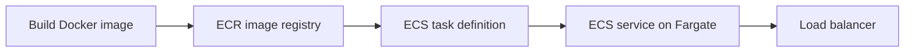

## The simple path

**ECR** stores container images. **ECS** runs them. **Fargate** is the ECS mode where AWS manages the servers underneath.

## Four ECS words

| Word | Meaning |
| --- | --- |
| **Cluster** | A logical home for ECS work |
| **Task definition** | The recipe: image, CPU, memory, ports, settings |
| **Task** | One running copy of that recipe |
| **Service** | Keeps the requested number of tasks running |

## Two roles that confuse beginners

- **Execution role:** lets ECS pull the image and send logs while starting the task.
- **Task role:** permissions used by your running application, for example reading one S3 bucket.

Your app needs the task role. Do not put AWS keys inside the image.

## A safe first deployment

1. Push an image with a real version tag, such as `1.2.0`, not only `latest`.
2. Create a task definition with CPU, memory, log configuration, and a task role.
3. Create an ECS service in private subnets.
4. Put an ALB in front of it and configure a health check.
5. Update the task definition image tag; ECS gradually replaces old tasks.

## Remember this

- ECR stores images; ECS runs them; Fargate removes server management.
- A service keeps task copies alive.
- Execution role starts the task; task role is for your app’s AWS access.
- Use explicit image versions and health checks.
