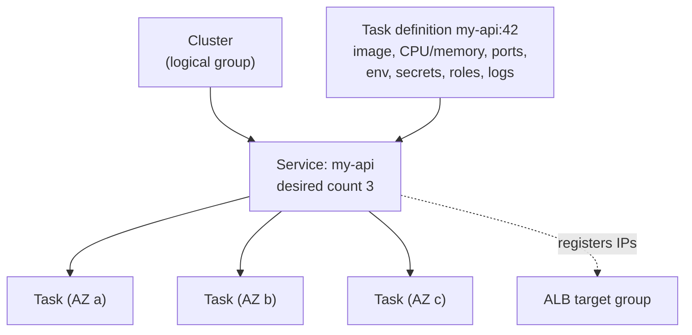
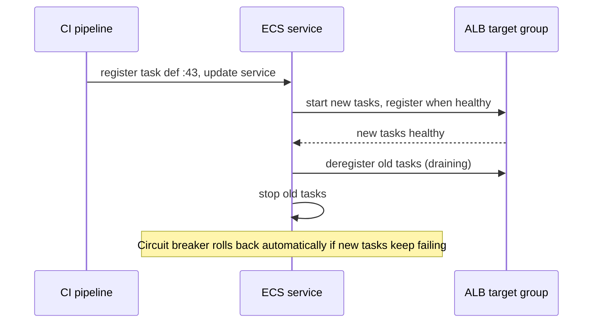

## The big idea

A **container image** is a sealed **shipping container** with your app and everything it needs. Wherever it's unloaded, it runs the same.

- **ECR** (Elastic Container Registry) is the **port warehouse** where your containers are stored.
- **ECS** (Elastic Container Service) is the **harbour master**: it decides where each container runs, restarts it if it sinks, and keeps the right number running.
- **Fargate** means you don't even own the ships: AWS provides the compute for each container.


## Choosing where to run containers

| Option | You manage | Best for |
| --- | --- | --- |
| **ECS on Fargate** ⭐ | Task definition only | Most web APIs and workers; no servers to patch |
| **ECS on EC2** | The EC2 fleet (via capacity providers) | GPUs, special instance types, max cost tuning at scale |
| **EKS** (Kubernetes) | Kubernetes manifests, add-ons, upgrades | Teams already standardised on Kubernetes, multi-cloud portability |
| **App Runner** | Almost nothing | Simple web apps from an image or repo, minimal config |
| **Lambda (container image)** | Function code | Event-driven, short tasks up to 15 minutes |

## Step 1: a small, safe image

```dockerfile
# syntax=docker/dockerfile:1
FROM node:22-alpine AS build
WORKDIR /app
COPY package*.json ./
RUN npm ci
COPY . .
RUN npm run build && npm prune --omit=dev

FROM node:22-alpine
WORKDIR /app
ENV NODE_ENV=production
COPY --from=build /app/node_modules ./node_modules
COPY --from=build /app/dist ./dist
# Don't run as root
USER node
EXPOSE 8080
CMD ["node", "dist/server.js"]
```

The same idea in Go gives a tiny image: build a static binary (`CGO_ENABLED=0 go build`), then copy it into `gcr.io/distroless/static` or `scratch`.

## Step 2: push to ECR

```bash
ACCOUNT=123456789012; REGION=us-east-1; REPO=my-api
aws ecr create-repository --repository-name $REPO \
  --image-tag-mutability IMMUTABLE --image-scanning-configuration scanOnPush=true

aws ecr get-login-password --region $REGION \
  | docker login --username AWS --password-stdin $ACCOUNT.dkr.ecr.$REGION.amazonaws.com

TAG=$(git rev-parse --short HEAD)
docker build --platform linux/arm64 -t $ACCOUNT.dkr.ecr.$REGION.amazonaws.com/$REPO:$TAG .
docker push $ACCOUNT.dkr.ecr.$REGION.amazonaws.com/$REPO:$TAG
```

- Tag images with the **git commit SHA**, make tags **immutable**, and never deploy `latest` to production: you can't tell which code is running or roll back precisely.
- Add a **lifecycle policy** (keep the last 50 images) and enable **scan on push** / Amazon Inspector for vulnerabilities.

## Step 3: ECS concepts



| Concept | Meaning |
| --- | --- |
| **Cluster** | A logical group of services/tasks (and capacity) |
| **Task definition** | A versioned blueprint: containers, image, CPU/memory, ports, env vars, secrets, log config, roles |
| **Task** | One running copy of a task definition (one or more containers) |
| **Service** | Keeps N tasks running, replaces failed ones, integrates with the load balancer, performs deployments |
| **Standalone task** | Runs once and exits: migrations, cron jobs (with EventBridge Scheduler) |

### A task definition

```json
{
  "family": "my-api",
  "requiresCompatibilities": ["FARGATE"],
  "networkMode": "awsvpc",
  "cpu": "512",
  "memory": "1024",
  "runtimePlatform": { "cpuArchitecture": "ARM64", "operatingSystemFamily": "LINUX" },
  "executionRoleArn": "arn:aws:iam::123456789012:role/my-api-dev-execution-role",
  "taskRoleArn": "arn:aws:iam::123456789012:role/my-api-dev-task-role",
  "containerDefinitions": [{
    "name": "api",
    "image": "123456789012.dkr.ecr.us-east-1.amazonaws.com/my-api:3f9a2c1",
    "essential": true,
    "portMappings": [{ "containerPort": 8080, "protocol": "tcp" }],
    "environment": [{ "name": "NODE_ENV", "value": "production" }],
    "secrets": [{
      "name": "DATABASE_URL",
      "valueFrom": "arn:aws:secretsmanager:us-east-1:123456789012:secret:my-api/dev/database-AbC123"
    }],
    "logConfiguration": {
      "logDriver": "awslogs",
      "options": { "awslogs-group": "/ecs/my-api", "awslogs-region": "us-east-1", "awslogs-stream-prefix": "api" }
    },
    "healthCheck": { "command": ["CMD-SHELL", "wget -qO- http://localhost:8080/health || exit 1"], "interval": 15, "retries": 3 }
  }]
}
```

## Execution role vs task role ⭐

| | **Execution role** | **Task role** |
| --- | --- | --- |
| Used by | The ECS agent / Fargate, **before** your app starts | **Your application code** at runtime |
| Needs | Pull from ECR, write to CloudWatch Logs, read the secrets listed in `secrets` | Only what the app calls: e.g. `s3:PutObject` on one prefix, `sqs:SendMessage` on one queue |
| Typical policy | `AmazonECSTaskExecutionRolePolicy` + `secretsmanager:GetSecretValue` on its secrets | A small customer-managed policy |

```json
{
  "Effect": "Allow",
  "Action": "secretsmanager:GetSecretValue",
  "Resource": "arn:aws:secretsmanager:us-east-1:123456789012:secret:my-api/dev/database-*"
}
```

Secrets in `secrets` are injected as **environment variables at startup**; rotated values need a new deployment (or read them at runtime with the SDK and cache them).

## Networking: `awsvpc` mode

Each Fargate task gets its **own network interface and private IP** in your subnet, with its own security group.

- Tasks in **private subnets**, ALB in public subnets.
- `sg-alb` → `sg-app` on the container port; `sg-app` → `sg-db` on 5432.
- Tasks need outbound access to ECR, Secrets Manager and CloudWatch Logs: through a **NAT gateway** or **VPC endpoints** (`ecr.api`, `ecr.dkr`, S3 gateway, `secretsmanager`, `logs`).
- The target group uses `target_type = ip`.

## Deployments

### Rolling update (default)



| Setting | Meaning |
| --- | --- |
| `minimumHealthyPercent: 100` | Never go below desired count during deploy |
| `maximumPercent: 200` | Allowed to run double while replacing |
| **Deployment circuit breaker** (with rollback) | Stops and rolls back a deployment whose tasks keep failing |
| **Health check grace period** | Time before ALB health checks count (slow starters) |

```bash
aws ecs update-service --cluster dev --service my-api \
  --task-definition my-api:43 \
  --deployment-configuration "deploymentCircuitBreaker={enable=true,rollback=true},minimumHealthyPercent=100,maximumPercent=200"
aws ecs wait services-stable --cluster dev --services my-api
```

**Blue/green** deployments (native in ECS, or with CodeDeploy) start a full new set of tasks, shift traffic (all at once, canary or linear) and keep the old set ready for instant rollback.

### Database migrations

Run migrations as a **separate one-off task** before updating the service (`aws ecs run-task` with the new image and a `migrate` command), not in every container's startup. Make migrations backwards-compatible so old and new tasks can run side by side during the rollout.

## Autoscaling a service

```bash
aws application-autoscaling register-scalable-target --service-namespace ecs \
  --resource-id service/dev/my-api --scalable-dimension ecs:service:DesiredCount \
  --min-capacity 2 --max-capacity 20

aws application-autoscaling put-scaling-policy --service-namespace ecs \
  --resource-id service/dev/my-api --scalable-dimension ecs:service:DesiredCount \
  --policy-name cpu60 --policy-type TargetTrackingScaling \
  --target-tracking-scaling-policy-configuration '{"TargetValue":60,"PredefinedMetricSpecification":{"PredefinedMetricType":"ECSServiceAverageCPUUtilization"}}'
```

Scale workers on **queue depth** (SQS `ApproximateNumberOfMessagesVisible` per task) rather than CPU. Use **Fargate Spot** capacity providers for interruptible workers (up to ~70% cheaper).

## Debugging

| Problem | Where to look |
| --- | --- |
| Task stops right away | ECS console → stopped task → **stopped reason**; CloudWatch Logs |
| `CannotPullContainerError` | Execution role ECR permissions; no NAT/VPC endpoint; wrong image tag or architecture |
| `ResourceInitializationError` (secrets) | Execution role can't read the secret or KMS key; no route to Secrets Manager |
| Unhealthy in target group | Container port vs target group port, health path, `sg-app` doesn't allow `sg-alb` |
| Get a shell | **ECS Exec**: `aws ecs execute-command --cluster dev --task <id> --container api --interactive --command sh` |

## Key takeaways

- Build small, non-root images; push to **ECR** with **immutable commit-SHA tags**; scan them.
- ECS: task definition (blueprint) → service (keeps N tasks) → tasks; **Fargate** removes server management.
- **Execution role** = start the task (pull image, logs, secrets); **task role** = what your code may call.
- Tasks run in private subnets with their own security group behind an ALB (`ip` targets).
- Rolling deploys with circuit breaker (or blue/green), migrations as a one-off task, target-tracking autoscaling.
