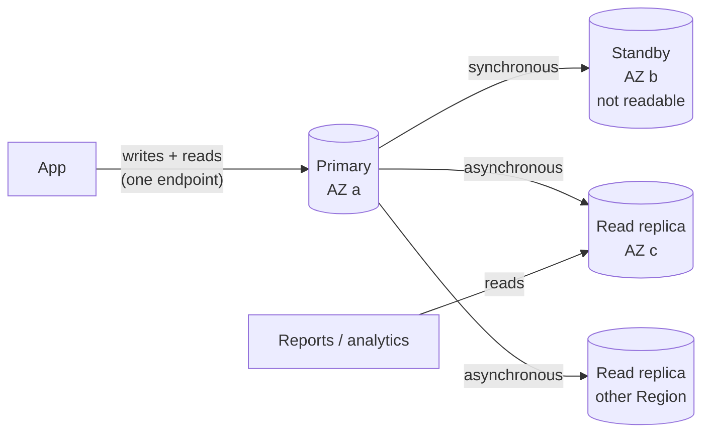
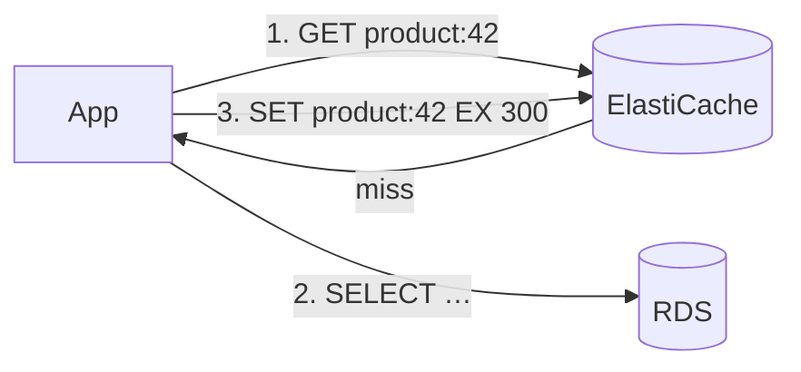

## The big idea

Running your own database on a server is like **owning a car and doing all the maintenance yourself**: oil changes (patches), spare tyres (backups), a second car in case of breakdowns (replicas). A **managed database** is a **full-service lease**: you drive, AWS does the maintenance.

AWS offers different vehicles for different trips:

- **RDS / Aurora**: relational SQL (PostgreSQL, MySQL…). Joins, transactions, flexible queries.
- **DynamoDB**: key-value/document NoSQL. Single-digit-millisecond at any scale, but you design around **access patterns**.
- **ElastiCache**: in-memory Redis/Valkey/Memcached for caching, sessions and rate limits.


## Choosing a database

| Need | Choose |
| --- | --- |
| Relational data, joins, ad-hoc queries, strong transactions | **RDS PostgreSQL/MySQL** or **Aurora** |
| Huge scale, simple known queries, serverless, predictable latency | **DynamoDB** |
| Cache, sessions, leaderboards, rate limiting | **ElastiCache (Redis/Valkey)** |
| MongoDB-compatible documents | DocumentDB |
| Analytics / data warehouse | Redshift, Athena on S3 |
| Graph relationships | Neptune |
| Full-text search | OpenSearch |
| Time series | Timestream |

## RDS: managed relational databases

Engines: **PostgreSQL, MySQL, MariaDB, Oracle, SQL Server, Db2**, plus **Aurora** (MySQL/PostgreSQL-compatible).

AWS handles provisioning, OS and engine patching (in your maintenance window), automated backups, monitoring and failover. You handle schema, queries, indexes, parameters, users and sizing.

### Multi-AZ vs read replicas ⭐



| | **Multi-AZ** | **Read replica** |
| --- | --- | --- |
| Purpose | **High availability** | **Read scaling** (and cross-Region DR) |
| Replication | Synchronous | Asynchronous (replica lag) |
| Readable? | Classic standby: no. Multi-AZ **cluster** (2 readable standbys): yes | Yes, own endpoint |
| Failover | Automatic, same DNS endpoint, ~60–120s | Manual **promotion** to a standalone DB |
| Cross-Region | No | Yes |

**Your app must reconnect after failover**: use connection retries and a short DNS TTL cache.

### Backups and recovery

| Feature | Details |
| --- | --- |
| **Automated backups** | Daily snapshot + transaction logs, retention 1–35 days |
| **Point-in-time recovery (PITR)** | Restore to any second in the retention window, as a **new** instance |
| **Manual snapshots** | Kept until you delete them; copy to other Regions/accounts |
| **AWS Backup** | Central policies across RDS, DynamoDB, EBS, EFS, S3 |

Restores always create a **new instance with a new endpoint**. Practice it before you need it.

### Security

- Put RDS in **private subnets**, `Publicly accessible = No`, security group allows only the app's SG.
- **Encryption at rest** with KMS must be chosen at creation (to encrypt later: snapshot → encrypted copy → restore).
- Enforce TLS (`rds.force_ssl=1` for PostgreSQL).
- Store the master password in **Secrets Manager** (RDS can manage and rotate it for you), or use **IAM database authentication** (short-lived tokens instead of passwords).

### RDS Proxy

Serverless and autoscaled apps open many connections; each PostgreSQL connection costs memory. **RDS Proxy** pools and shares connections, speeds up failover (keeps client connections open) and can enforce IAM auth. Especially useful with **Lambda**.

### Performance tools

**Performance Insights** / **CloudWatch Database Insights** show the top SQL and wait events; **Enhanced Monitoring** shows OS metrics. Classic signals: high `CPUUtilization`, low `FreeableMemory`, rising `DatabaseConnections`, `ReadLatency`, and `ReplicaLag`.

## Aurora

Aurora separates compute from a **distributed storage layer** that keeps **6 copies across 3 AZs** and grows automatically up to 128 TiB.

| Feature | Benefit |
| --- | --- |
| Up to 15 low-lag **Aurora Replicas** | Read scaling; failover target in ~30s |
| **Cluster endpoints** | Writer endpoint, reader endpoint (load balanced), custom endpoints |
| **Aurora Serverless v2** | Capacity scales in fine steps (ACUs) with load, can scale to zero for dev |
| **Global Database** | Cross-Region replication in ~1s; promote another Region for DR |
| **Backtrack / fast clones** | Rewind (MySQL) or copy a large DB in minutes |
| **Aurora I/O-Optimized** | Predictable pricing for I/O-heavy workloads |

Choose Aurora for high availability and scale with less tuning; plain RDS is often cheaper for small, steady workloads.

## DynamoDB

A fully managed, serverless key-value and document database. No servers, no connections to pool, **single-digit-millisecond** reads and writes at any scale.

### Keys and items

| Term | Meaning |
| --- | --- |
| **Table** | Collection of items (no fixed schema beyond the key) |
| **Item** | A record, up to **400 KB** |
| **Partition key (PK)** | Hashed to choose the partition. Must spread load evenly |
| **Sort key (SK)** | Orders items within a partition; enables range queries (`begins_with`, `between`) |
| **GSI** (global secondary index) | Different PK/SK over the same data; eventually consistent; own capacity |
| **LSI** (local secondary index) | Same PK, different SK; must be created with the table |

### Design for access patterns ⭐

In SQL you design tables, then write queries. In DynamoDB you **list your queries first**, then design keys so each query is a single `Query` on one partition.

| Access pattern | Key design |
| --- | --- |
| Get customer profile | `PK=CUSTOMER#42`, `SK=PROFILE` |
| List a customer's orders, newest first | `PK=CUSTOMER#42`, `SK begins_with ORDER#` (SK = `ORDER#2026-09-30#1001`) |
| Get one order with its items | `PK=ORDER#1001`, `SK begins_with ITEM#` |
| Orders by status for the warehouse | GSI1: `GSI1PK=STATUS#PENDING`, `GSI1SK=2026-09-30T10:00Z` |

```js
import { DynamoDBClient } from "@aws-sdk/client-dynamodb";
import { DynamoDBDocumentClient, QueryCommand, PutCommand, UpdateCommand } from "@aws-sdk/lib-dynamodb";

const db = DynamoDBDocumentClient.from(new DynamoDBClient({}));

// Newest 20 orders for a customer — one partition, sorted by SK
const { Items } = await db.send(new QueryCommand({
  TableName: "shop",
  KeyConditionExpression: "PK = :pk AND begins_with(SK, :sk)",
  ExpressionAttributeValues: { ":pk": "CUSTOMER#42", ":sk": "ORDER#" },
  ScanIndexForward: false,
  Limit: 20,
}));

// Create only if it doesn't exist (idempotent insert)
await db.send(new PutCommand({
  TableName: "shop",
  Item: { PK: "ORDER#1001", SK: "META", status: "PENDING", total: 4200 },
  ConditionExpression: "attribute_not_exists(PK)",
}));

// Optimistic locking: update only if the version matches
await db.send(new UpdateCommand({
  TableName: "shop",
  Key: { PK: "ORDER#1001", SK: "META" },
  UpdateExpression: "SET #s = :paid, version = version + :one",
  ConditionExpression: "version = :v",
  ExpressionAttributeNames: { "#s": "status" },
  ExpressionAttributeValues: { ":paid": "PAID", ":one": 1, ":v": 3 },
}));
```

| Operation | Cost / behaviour |
| --- | --- |
| `GetItem` | One item by full key; cheapest |
| `Query` | Items in one partition, filtered by SK; efficient |
| `Scan` | Reads the **whole table**; slow and expensive, avoid in request paths |
| `FilterExpression` | Applied **after** reading: you still pay for everything read |
| `BatchGet/BatchWrite` | Up to 100 reads / 25 writes per call |
| `TransactWriteItems` | All-or-nothing across up to 100 items |

### Capacity and consistency

| | **On-demand** | **Provisioned** (+ auto scaling) |
| --- | --- | --- |
| Billing | Per request | Per RCU/WCU-hour |
| Best for | Unknown or spiky traffic, new apps | Steady, predictable traffic (cheaper) |

- 1 **RCU** = one strongly consistent read of up to 4 KB per second (or two eventually consistent). 1 **WCU** = one write of up to 1 KB per second.
- Reads are **eventually consistent** by default; ask for `ConsistentRead: true` on the table (not available on GSIs).
- A **hot partition** (one very popular key) gets throttled; spread keys (e.g. add a suffix shard).

### More DynamoDB features

| Feature | Use |
| --- | --- |
| **TTL** | Auto-delete expired items (sessions, temporary tokens) at no cost |
| **Streams** | Ordered change log → Lambda for projections, search indexing, events |
| **PITR** | Restore to any second in the last 35 days |
| **Global tables** | Multi-Region, multi-active replication |
| **DAX** | In-memory cache for microsecond reads |

## ElastiCache (Redis / Valkey / Memcached)



- **Cache-aside** (above) is the most common pattern; set TTLs and invalidate on writes.
- Also: sessions, rate limiting (`INCR` + `EXPIRE`), leaderboards (sorted sets), distributed locks, pub/sub.
- Use **cluster mode** with replicas across AZs and automatic failover; **ElastiCache Serverless** removes capacity planning. Valkey is the open-source Redis-compatible engine AWS now recommends for new clusters.
- Keep it in private subnets; enable encryption in transit and AUTH/IAM auth.

## Key takeaways

- Use **RDS/Aurora** for relational data, **DynamoDB** for massive scale with known access patterns, **ElastiCache** for caching.
- **Multi-AZ = availability** (synchronous standby, automatic failover); **read replicas = read scaling** (asynchronous).
- Automated backups + PITR restore to a **new** instance; encrypt at creation; keep databases private; RDS Proxy for many short connections.
- In DynamoDB, **design keys from access patterns**; prefer `Query` over `Scan`; use conditional writes, TTL and streams.
- Plan for failover in your app: retries, reconnects and idempotent writes.
