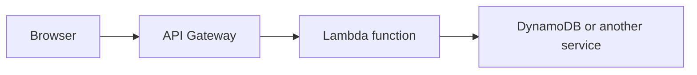

## What serverless means here

With Lambda, you upload a function. AWS runs it when an event arrives and charges for the time it runs. You still write, test, secure, and monitor the code; AWS manages the servers.

## The important settings

| Setting | Plain meaning |
| --- | --- |
| **Memory** | RAM; more memory also gives more CPU |
| **Timeout** | Longest one invocation may run |
| **Concurrency** | How many invocations may run at once |
| **Role** | AWS permissions the function has |

Set a timeout deliberately. A function that waits forever wastes money and makes failures harder to understand.

## API Gateway

API Gateway receives HTTP requests, optionally checks authentication, then calls Lambda. Use HTTP APIs for many simple APIs; use REST APIs when you specifically need their extra features.

Do not forget CORS when a browser frontend calls your API from a different domain.

## Retries require idempotency

AWS can retry some event deliveries. Your handler must handle the same event more than once without creating duplicate charges, emails, or records. Use a stable event ID or idempotency key stored with the result.

For failed asynchronous work, configure a dead-letter queue or failure destination so messages are not silently lost.

## When not to use Lambda

Choose a container or server for long-running connections, very long jobs, specialized runtime needs, or consistently high work where a service is easier to operate.

## Remember this

- Lambda runs code for events; API Gateway exposes it over HTTP.
- Memory, timeout, concurrency, and role are core settings.
- Assume events can be retried; make side effects idempotent.
- Use a queue or failure destination for work that must not disappear.
