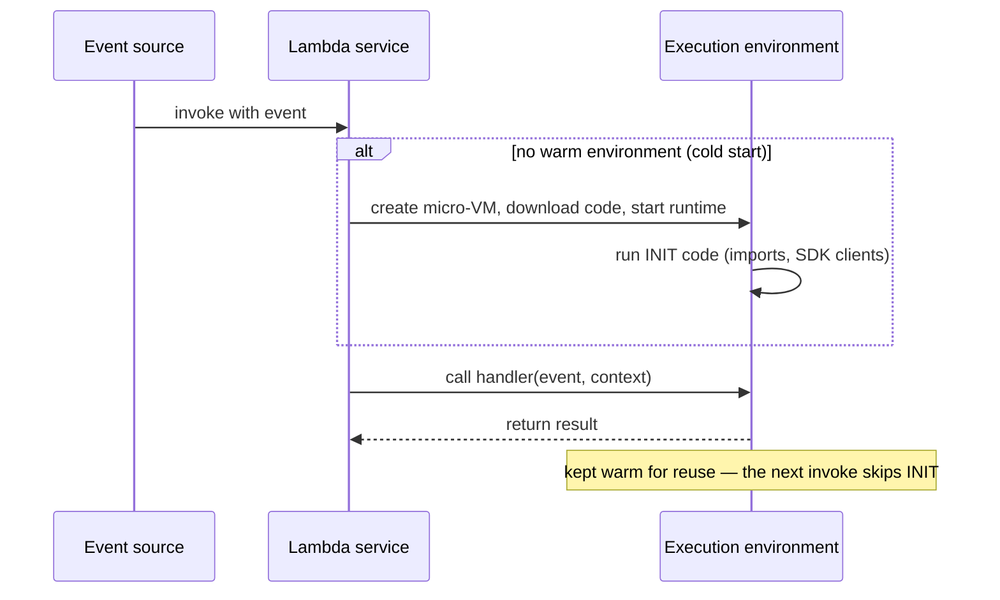

## The big idea

With a server, you pay for a **shop that's open all day**, customers or not. With **Lambda**, you hire a **worker per customer**: they appear when an event arrives, do the job, and you pay only for the milliseconds they worked. Ten thousand customers at once? Ten thousand workers appear.

- **Lambda** runs your function in response to **events**: an HTTP request, a file in S3, a message in SQS, a schedule.
- **API Gateway** is the **front door** that turns HTTP requests into Lambda events, with auth, throttling and CORS.
- **SAM** (Serverless Application Model) describes the whole thing as code and deploys it.


## How Lambda works



| Setting | Range | Notes |
| --- | --- | --- |
| **Memory** | 128 MB – 10,240 MB | **CPU scales with memory**: more memory is often faster *and* cheaper |
| **Timeout** | Up to 15 minutes | Longer jobs → ECS/Fargate or Step Functions |
| **Ephemeral storage** `/tmp` | 512 MB – 10 GB | Not shared across environments |
| **Package** | 50 MB zipped / 250 MB unzipped, or a **container image** up to 10 GB | Use layers or images for big dependencies |
| **Architecture** | x86_64 or **arm64** (Graviton) | arm64 is ~20% cheaper per GB-second |

**Pricing:** requests + GB-seconds of duration. A generous free tier covers hobby projects.

### Write handlers for reuse

```js
// Created once per execution environment (INIT), reused by later invocations
import { DynamoDBClient } from "@aws-sdk/client-dynamodb";
import { DynamoDBDocumentClient, GetCommand } from "@aws-sdk/lib-dynamodb";
const db = DynamoDBDocumentClient.from(new DynamoDBClient({}));

export const handler = async (event, context) => {
  const id = event.pathParameters?.id;
  const { Item } = await db.send(new GetCommand({ TableName: process.env.TABLE_NAME, Key: { id } }));
  if (!Item) return { statusCode: 404, body: JSON.stringify({ error: "Not found" }) };
  return { statusCode: 200, headers: { "content-type": "application/json" }, body: JSON.stringify(Item) };
};
```

- Initialise SDK clients and DB connections **outside** the handler.
- Keep functions **stateless**: anything in memory or `/tmp` may vanish.
- Log JSON to stdout: it goes to CloudWatch Logs automatically.

### Cold starts

| Reduce cold starts by | Why |
| --- | --- |
| Small bundles (esbuild, tree-shaking), fewer dependencies | Less to download and load |
| Lazy-load rarely used modules | Faster INIT |
| More memory | More CPU during INIT |
| Go / Rust, or **SnapStart** (Java, Python, .NET) | Fast-starting runtimes / snapshotted INIT |
| **Provisioned concurrency** | Keeps N environments initialised (you pay for them) |

## Concurrency

Each environment handles **one request at a time**. Concurrency = requests per second × average duration (s). 100 req/s × 0.2 s = 20 concurrent environments.

| Control | Meaning |
| --- | --- |
| Account concurrency limit | Default 1,000 per Region (can be raised) |
| **Reserved concurrency** | Guarantees *and caps* a function's concurrency; protects a database from being overwhelmed |
| **Provisioned concurrency** | Pre-warmed environments for latency-sensitive paths |

## Invocation types and error handling

| Type | Sources | Retries | Where failures go |
| --- | --- | --- | --- |
| **Synchronous** | API Gateway, ALB, SDK `Invoke` | Caller decides | Error returned to caller |
| **Asynchronous** | S3, SNS, EventBridge | 2 retries by Lambda | **On-failure destination** or DLQ (SQS/SNS) |
| **Poll-based** (event source mapping) | SQS, Kinesis, DynamoDB Streams | Until success, expiry or max attempts | SQS redrive **DLQ**; bisect/partial-batch responses |

```js
// SQS batch: report only the failed messages so successful ones aren't retried
export const handler = async (event) => {
  const batchItemFailures = [];
  for (const record of event.Records) {
    try {
      await processOrder(JSON.parse(record.body));
    } catch {
      batchItemFailures.push({ itemIdentifier: record.messageId });
    }
  }
  return { batchItemFailures }; // requires ReportBatchItemFailures on the event source mapping
};
```

> ⚠️ Retries mean **your function may run more than once for the same event**. Make handlers **idempotent**: e.g. a conditional write keyed by an event/order ID.

## API Gateway

| | **HTTP API** ⭐ | **REST API** | **WebSocket API** |
| --- | --- | --- | --- |
| Cost / latency | Cheaper, faster | Higher | Per message + connection minutes |
| Auth | JWT (Cognito/OIDC), Lambda, IAM | Cognito, Lambda, IAM, **API keys + usage plans** | Lambda, IAM |
| Extras | CORS, auto-deploy, private integrations | **Request validation**, transformations, caching, WAF, canary stages, edge-optimized/private endpoints | Real-time two-way |
| Choose when | Most Lambda/HTTP backends | You need its extra features | Chat, live updates |

### Proxy integration event (HTTP API, payload v2)

```json
{
  "routeKey": "GET /products/{id}",
  "rawPath": "/products/42",
  "pathParameters": { "id": "42" },
  "queryStringParameters": { "fields": "name,price" },
  "headers": { "authorization": "Bearer eyJ..." },
  "requestContext": { "authorizer": { "jwt": { "claims": { "sub": "user-123" } } } },
  "body": null,
  "isBase64Encoded": false
}
```

### Security and limits

- **Authorizers:** JWT authorizer with Cognito/Auth0 (no code), Lambda authorizer for custom logic, IAM for service-to-service.
- **Throttling:** account-level default 10,000 req/s with a burst of 5,000; set per-route limits to protect back ends. Clients get **429**.
- **CORS:** configure allowed origins, methods and headers on the API (and return the headers from Lambda for REST proxy integrations).
- API Gateway's integration timeout is ~29 seconds by default: long work should be **asynchronous** (return 202 + poll or webhook).

## A complete CRUD API with SAM

```yaml
# template.yaml
AWSTemplateFormatVersion: "2010-09-09"
Transform: AWS::Serverless-2016-10-31

Globals:
  Function:
    Runtime: nodejs22.x
    Architectures: [arm64]
    MemorySize: 512
    Timeout: 10
    Environment:
      Variables:
        TABLE_NAME: !Ref ProductsTable

Resources:
  ProductsTable:
    Type: AWS::DynamoDB::Table
    Properties:
      BillingMode: PAY_PER_REQUEST
      AttributeDefinitions: [{ AttributeName: id, AttributeType: S }]
      KeySchema: [{ AttributeName: id, KeyType: HASH }]
      PointInTimeRecoverySpecification: { PointInTimeRecoveryEnabled: true }

  Api:
    Type: AWS::Serverless::HttpApi
    Properties:
      CorsConfiguration:
        AllowOrigins: ["https://app.example.com"]
        AllowMethods: [GET, POST, PUT, DELETE]
        AllowHeaders: [content-type, authorization]

  CreateProduct:
    Type: AWS::Serverless::Function
    Properties:
      Handler: src/create.handler
      Policies: [{ DynamoDBWritePolicy: { TableName: !Ref ProductsTable } }]
      Events:
        Http: { Type: HttpApi, Properties: { ApiId: !Ref Api, Path: /products, Method: POST } }

  GetProduct:
    Type: AWS::Serverless::Function
    Properties:
      Handler: src/get.handler
      Policies: [{ DynamoDBReadPolicy: { TableName: !Ref ProductsTable } }]
      Events:
        Http: { Type: HttpApi, Properties: { ApiId: !Ref Api, Path: /products/{id}, Method: GET } }

Outputs:
  ApiUrl:
    Value: !Sub "https://${Api}.execute-api.${AWS::Region}.amazonaws.com"
```

```js
// src/create.js
import { randomUUID } from "node:crypto";
import { DynamoDBClient } from "@aws-sdk/client-dynamodb";
import { DynamoDBDocumentClient, PutCommand } from "@aws-sdk/lib-dynamodb";

const db = DynamoDBDocumentClient.from(new DynamoDBClient({}));
const json = (statusCode, body) => ({ statusCode, headers: { "content-type": "application/json" }, body: JSON.stringify(body) });

export const handler = async (event) => {
  let input;
  try {
    input = JSON.parse(event.body ?? "{}");
  } catch {
    return json(400, { error: "Body must be JSON" });
  }
  if (typeof input.name !== "string" || typeof input.price !== "number" || input.price < 0) {
    return json(400, { error: "name (string) and price (number >= 0) are required" });
  }

  const product = { id: randomUUID(), name: input.name, price: input.price, createdAt: new Date().toISOString() };
  await db.send(new PutCommand({ TableName: process.env.TABLE_NAME, Item: product }));
  return json(201, product);
};
```

```bash
sam build
sam local start-api                # run locally in Docker
sam deploy --guided                # first time: stack name, Region, confirm IAM
curl -X POST "$API_URL/products" -H "content-type: application/json" -d '{"name":"Mug","price":12.5}'
sam logs -n CreateProduct --tail   # stream CloudWatch logs
```

### The same handler in Go

```go
package main

import (
	"context"
	"encoding/json"
	"net/http"
	"os"

	"github.com/aws/aws-lambda-go/events"
	"github.com/aws/aws-lambda-go/lambda"
	"github.com/aws/aws-sdk-go-v2/aws"
	"github.com/aws/aws-sdk-go-v2/config"
	"github.com/aws/aws-sdk-go-v2/feature/dynamodb/attributevalue"
	"github.com/aws/aws-sdk-go-v2/service/dynamodb"
	"github.com/aws/aws-sdk-go-v2/service/dynamodb/types"
)

var db *dynamodb.Client // created once per execution environment

func handler(ctx context.Context, req events.APIGatewayV2HTTPRequest) (events.APIGatewayV2HTTPResponse, error) {
	out, err := db.GetItem(ctx, &dynamodb.GetItemInput{
		TableName: aws.String(os.Getenv("TABLE_NAME")),
		Key:       map[string]types.AttributeValue{"id": &types.AttributeValueMemberS{Value: req.PathParameters["id"]}},
	})
	if err != nil {
		return events.APIGatewayV2HTTPResponse{StatusCode: http.StatusInternalServerError}, err
	}
	if out.Item == nil {
		return events.APIGatewayV2HTTPResponse{StatusCode: http.StatusNotFound, Body: `{"error":"not found"}`}, nil
	}
	var p map[string]any
	_ = attributevalue.UnmarshalMap(out.Item, &p)
	body, _ := json.Marshal(p)
	return events.APIGatewayV2HTTPResponse{StatusCode: 200, Body: string(body), Headers: map[string]string{"content-type": "application/json"}}, nil
}

func main() {
	cfg, err := config.LoadDefaultConfig(context.Background())
	if err != nil {
		panic(err)
	}
	db = dynamodb.NewFromConfig(cfg)
	lambda.Start(handler)
}
```

Build for the `provided.al2023` runtime: `GOOS=linux GOARCH=arm64 go build -tags lambda.norpc -o bootstrap .` and zip `bootstrap`.

## Other serverless building blocks

| Service | Use |
| --- | --- |
| **Step Functions** | Orchestrate multi-step workflows with retries, waits, parallel branches, human approval |
| **EventBridge Scheduler** | Cron and one-off schedules invoking Lambda, ECS tasks, and more |
| **Lambda function URLs** | A simple HTTPS endpoint for one function, without API Gateway |
| **Powertools for AWS Lambda** | Structured logging, metrics, tracing, idempotency and batch helpers |

## When Lambda is *not* the best fit

- Steady high traffic 24/7 (containers can be cheaper).
- Jobs longer than 15 minutes, or long-lived connections (use ECS; WebSockets via API Gateway).
- Very latency-sensitive paths that can't tolerate cold starts (unless you pay for provisioned concurrency).
- Heavy connection-based databases without RDS Proxy.

## Key takeaways

- Lambda runs **stateless** handlers per event; initialise clients outside the handler; memory sets CPU.
- Cold starts: small packages, arm64, more memory, SnapStart or provisioned concurrency.
- Know the invocation type: sync returns errors, async retries twice then goes to a **destination/DLQ**, SQS uses redrive DLQs and partial batch failures. Make handlers **idempotent**.
- **HTTP APIs** for most back ends; REST APIs when you need validation, API keys, caching or WAF.
- Describe it all with **SAM** (or CDK/Terraform): table, functions, least-privilege policies and routes in one template.
