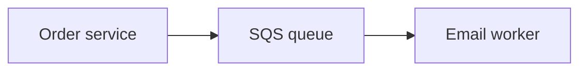

## Why messages help

If checkout sends an email directly and the email system is slow, checkout becomes slow too. A message lets checkout save the order quickly and hand the email work to another worker.

## Pick the tool by the job

| Service | Best simple description |
| --- | --- |
| **SQS** | A queue: one worker eventually handles each message |
| **SNS** | A topic: one message can notify many subscribers |
| **EventBridge** | An event router: rules send events to services by type/content |
| **Kinesis** | Ordered, high-volume stream processing |

## SQS basics that prevent lost work

When a worker receives a message, SQS hides it temporarily (visibility timeout). The worker deletes it only after success. If it fails repeatedly, send it to a dead-letter queue for investigation.

SQS is at-least-once delivery: design workers so a duplicate message is safe. Use a message or business ID to record work already completed.

## SNS fan-out example

For `order.placed`, SNS can send one copy to the email queue, analytics queue, and audit system. Each subscriber works independently.

## Remember this

- A queue separates the producer’s speed from the worker’s speed.
- Delete SQS messages only after successful processing.
- Expect duplicates and use a dead-letter queue.
- SNS broadcasts; EventBridge routes events by rules.
