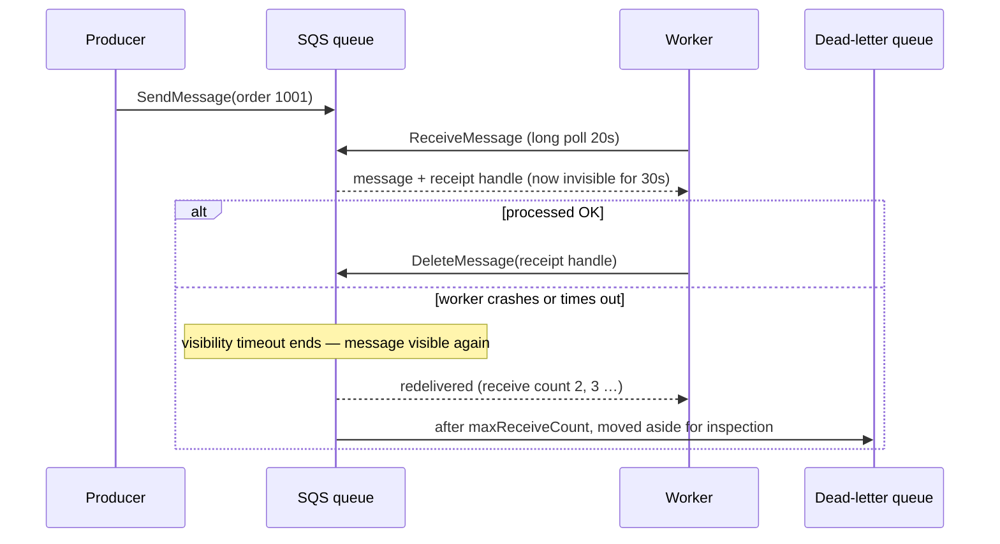
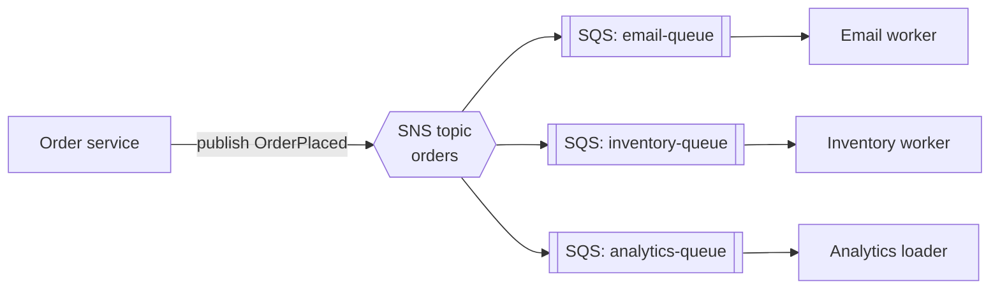

## The big idea

When a restaurant takes an order, the waiter doesn't stand in the kitchen until the dish is ready. They **pin the ticket on the rail** and go back to customers. Cooks take tickets when they're free. If the kitchen gets busy, tickets wait on the rail instead of getting lost.

- **SQS** is the **ticket rail**: a queue that holds work until a worker takes it.
- **SNS** is the **kitchen bell / loudspeaker**: one announcement delivered to every subscriber at once.
- **EventBridge** is the **restaurant's dispatcher**: it reads each event and routes it to the right teams based on rules.
- **Kinesis** is a **conveyor belt with a recording**: a high-volume ordered stream that many readers can replay.


## Why decouple?

| Without a queue | With a queue |
| --- | --- |
| A slow email provider slows down checkout | Checkout writes a message and returns instantly |
| A traffic spike overloads workers | Messages wait; workers process at their own pace |
| A crashed consumer loses the request | The message stays in the queue and is retried |
| Adding a new consumer means changing the producer | New subscribers attach without touching the producer |

## SQS: queues



### Standard vs FIFO

| | **Standard** | **FIFO** |
| --- | --- | --- |
| Throughput | Nearly unlimited | 300 msg/s per API action (3,000 with batching; far more in high-throughput mode) |
| Ordering | Best effort | **Strict** within a **message group ID** |
| Delivery | **At least once** (occasional duplicates) | **Exactly-once processing** within a 5-minute deduplication window |
| Name | any | must end in `.fifo` |
| Use | Most background jobs | Order matters per entity (per account, per order) |

### The settings that matter

| Setting | Meaning | Tip |
| --- | --- | --- |
| **Visibility timeout** | How long a received message is hidden from others | Longer than your worst-case processing time (≥ 6× Lambda timeout for Lambda triggers) |
| **Receive wait time** (long polling) | Wait up to 20s for messages | Set to 20: fewer empty responses, lower cost |
| **Message retention** | 1 minute – 14 days (default 4 days) | Long enough to survive an outage |
| **Delay** | Hide new messages for up to 15 minutes | Simple scheduled retries |
| **Max message size** | 1 MiB (was 256 KB until 2025; SNS is still 256 KB) | Store big payloads in S3, send a pointer |
| **Redrive policy** | Move to a **DLQ** after `maxReceiveCount` failures | Alarm on DLQ depth; **redrive** back after fixing |

```js
import { SQSClient, SendMessageCommand, ReceiveMessageCommand, DeleteMessageCommand } from "@aws-sdk/client-sqs";

const sqs = new SQSClient({});
const QueueUrl = process.env.ORDERS_QUEUE_URL;

await sqs.send(new SendMessageCommand({
  QueueUrl,
  MessageBody: JSON.stringify({ type: "OrderPlaced", orderId: "1001" }),
  // FIFO only:
  // MessageGroupId: "customer-42", MessageDeduplicationId: "order-1001",
}));

// A long-running worker (on ECS). With Lambda, the event source mapping does this loop for you.
while (true) {
  const { Messages = [] } = await sqs.send(new ReceiveMessageCommand({ QueueUrl, MaxNumberOfMessages: 10, WaitTimeSeconds: 20 }));
  for (const m of Messages) {
    await handle(JSON.parse(m.Body));                                   // must be idempotent
    await sqs.send(new DeleteMessageCommand({ QueueUrl, ReceiptHandle: m.ReceiptHandle }));
  }
}
```

> ⚠️ With standard queues a message can arrive **twice**. Make consumers **idempotent**: store processed message/order IDs (e.g. a DynamoDB conditional write) and skip repeats.

## SNS: publish/subscribe

A **topic** receives a message once and pushes a copy to **every subscription**: SQS queues, Lambda functions, HTTPS endpoints, email, SMS, mobile push, Kinesis Data Firehose.

### The fan-out pattern ⭐



Each consumer gets **its own queue**, so each can fail, retry and scale independently. A slow analytics loader never delays emails.

**Subscription filter policies** send only matching messages to a subscriber:

```json
{ "eventType": ["OrderPlaced"], "country": ["DE", "FR"] }
```

SNS also has **FIFO topics** (paired with FIFO queues) and is the usual target for **CloudWatch alarm notifications**.

## EventBridge: an event router

EventBridge receives **events** (JSON with `source`, `detail-type`, `detail`) on an **event bus** and routes them with **rules** to targets.

```json
{
  "source": "shop.orders",
  "detail-type": "OrderPlaced",
  "detail": { "orderId": "1001", "total": 4200, "country": "DE" }
}
```

```json
{
  "source": ["shop.orders"],
  "detail-type": ["OrderPlaced"],
  "detail": { "total": [{ "numeric": [">", 10000] }] }
}
```

The rule above matches only orders over 100.00 and could target a fraud-check Lambda.

| Feature | Use |
| --- | --- |
| **Default bus** | AWS service events (EC2 state changes, ECS task stopped, S3 via EventBridge) |
| **Custom buses** | Your application's domain events |
| **Partner buses** | SaaS events (Stripe, Auth0, Datadog, Zendesk…) |
| **Archive and replay** | Re-send past events after a bug fix or to a new consumer |
| **Schema registry** | Discover event shapes, generate code bindings |
| **Pipes** | Source (SQS, Kinesis, DynamoDB stream) → filter → enrich → target, without glue code |
| **Scheduler** | Cron/rate and one-time schedules at scale |

## Kinesis Data Streams

For **high-volume, ordered streams** that several consumers read independently and can **replay**: clickstreams, IoT telemetry, logs, change data.

| Concept | Meaning |
| --- | --- |
| **Shard** | Unit of capacity: 1 MB/s or 1,000 records/s in, 2 MB/s out (on-demand mode manages shards for you) |
| **Partition key** | Chooses the shard; order is guaranteed **per shard** |
| **Retention** | 24 hours by default, up to 365 days; consumers track their own position |
| **Enhanced fan-out** | Dedicated 2 MB/s per consumer per shard |
| **Firehose** | Load streams into S3, Redshift or OpenSearch with no code |

Kinesis is AWS's managed alternative to Kafka (Amazon **MSK** also runs Apache Kafka for you).

## Choosing the right tool ⭐

| Need | Use |
| --- | --- |
| A work queue: one message processed by one worker | **SQS** |
| Order per key + no duplicates | **SQS FIFO** |
| One event → many subscribers, simple | **SNS** (+ SQS per subscriber) |
| Content-based routing, many event types, SaaS/AWS events, replay | **EventBridge** |
| Millions of ordered records/s, multiple replaying consumers, analytics | **Kinesis** or **MSK (Kafka)** |
| Multi-step workflow with state and retries | **Step Functions** |

## Reliability checklist

- [ ] Every queue has a **DLQ** and an alarm on its depth
- [ ] Consumers are **idempotent** and delete messages only after success
- [ ] Visibility timeout > processing time; long polling on
- [ ] Large payloads go to S3 and the message carries a pointer (claim-check pattern)
- [ ] Alarm on `ApproximateAgeOfOldestMessage`: work is falling behind
- [ ] Autoscale workers on queue depth (backlog per worker)
- [ ] Use the **outbox pattern** when a DB write and a publish must both happen

## Key takeaways

- **SQS** buffers work (at-least-once; FIFO for order and dedup); tune visibility timeout, use long polling and a **DLQ**.
- **SNS** pushes one message to many subscribers; **SNS → SQS fan-out** isolates consumers.
- **EventBridge** routes JSON events by content, integrates AWS and SaaS sources, and supports archive/replay and schedules.
- **Kinesis** handles massive ordered streams with replay; choose it (or MSK) for streaming analytics.
- Assume duplicates and failures: idempotent consumers, DLQ alarms and backlog-based autoscaling.
