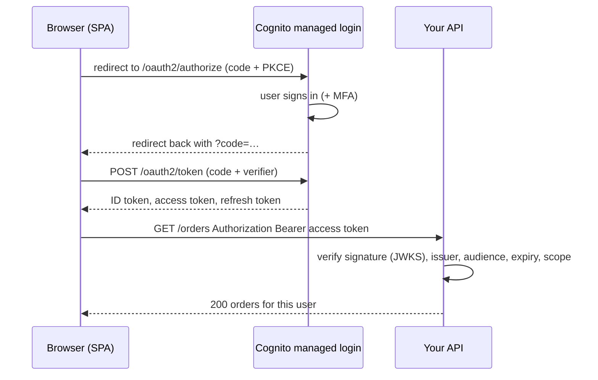
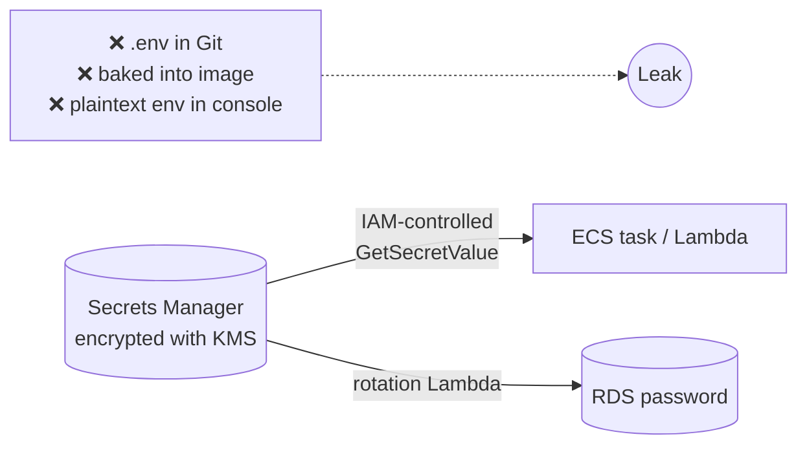
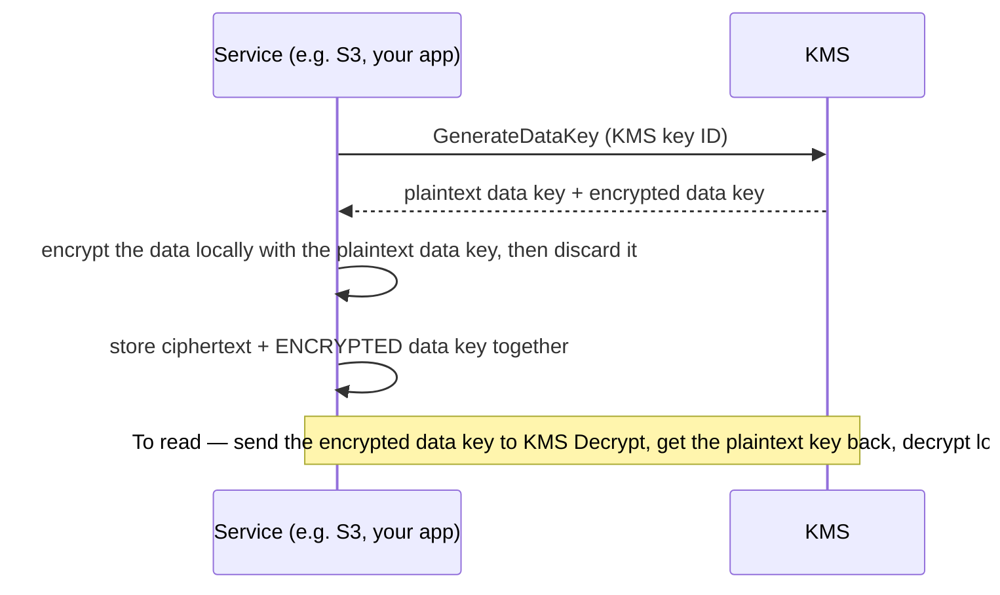

## The big idea

Three different jobs that are easy to confuse:

- **Cognito** is the **reception desk that checks ID** and hands visitors a **wristband** (a JWT) saying who they are.
- **Secrets Manager / Parameter Store** is the **locked key cabinet** where the building keeps database passwords and API keys, with a log of who opened it.
- **KMS** is the **master-key vault**: it never hands out the master key itself, it only **locks and unlocks** things for you, and records every use.


## Cognito user pools: sign-up and sign-in

A **user pool** is a managed user directory: sign-up, sign-in, email/phone verification, password policy, MFA, account recovery, social and enterprise login (Google, Apple, SAML, OIDC), and a **managed login page**.



### The three tokens

| Token | Contains | Use it for | Lifetime |
| --- | --- | --- | --- |
| **ID token** | Who the user is: `sub`, email, name, groups | Show profile info in the UI | ~1 hour |
| **Access token** | What the client may do: `scope`, `cognito:groups`, `client_id` | **Authorise API calls** | ~1 hour (5 min–1 day) |
| **Refresh token** | Opaque | Get new ID/access tokens without logging in again | Days (configurable) |

Use the **authorization code flow with PKCE** for web and mobile apps. Don't use the implicit flow.

### Verifying a token in your API

```js
import { CognitoJwtVerifier } from "aws-jwt-verify";

const verifier = CognitoJwtVerifier.create({
  userPoolId: process.env.USER_POOL_ID,
  tokenUse: "access",
  clientId: process.env.APP_CLIENT_ID,
});

export async function requireAuth(req, res, next) {
  try {
    const token = req.get("authorization")?.replace(/^Bearer /, "");
    req.user = await verifier.verify(token); // checks signature, issuer, expiry, token_use, client
    next();
  } catch {
    res.status(401).json({ error: "Unauthorized" });
  }
}

// Authorisation is still your job: check groups/scopes and resource ownership
const isAdmin = req.user["cognito:groups"]?.includes("admin");
```

With **API Gateway HTTP APIs**, a **JWT authorizer** does this verification for you before Lambda runs. An **ALB** can also authenticate users with Cognito/OIDC at the listener.

### Lambda triggers

Customise flows with Lambda: **pre sign-up** (block disposable emails), **post confirmation** (create a profile row), **pre token generation** (add custom claims), custom messages, and migrate-user (lazy migration from a legacy database).

### Identity pools: AWS credentials for users

An **identity pool** exchanges a login token for **temporary AWS credentials** tied to an IAM role, e.g. let a mobile app upload directly to `s3://bucket/private/${cognito-identity.amazonaws.com:sub}/*`. User pool = *who are you*; identity pool = *which AWS permissions do you get*.

## Secrets: never in code, Git or images



### Secrets Manager vs Parameter Store

| | **Secrets Manager** | **SSM Parameter Store** |
| --- | --- | --- |
| Built for | Credentials, API keys | Config values and some secrets (`SecureString`) |
| Automatic **rotation** | ✅ Built in (RDS, Redshift, DocumentDB) or custom Lambda | ❌ (DIY) |
| Cross-account sharing | ✅ Resource policies | Limited (advanced tier) |
| Replication to other Regions | ✅ | ❌ |
| Size | 64 KB | 4 KB standard / 8 KB advanced |
| Cost | Per secret per month + API calls | Standard tier free |

Rule of thumb: **passwords and keys that rotate → Secrets Manager; feature flags, URLs and non-secret config → Parameter Store.**

```js
import { SecretsManagerClient, GetSecretValueCommand } from "@aws-sdk/client-secrets-manager";

const sm = new SecretsManagerClient({});
let cached; let cachedAt = 0;

export async function getDbCredentials() {
  if (cached && Date.now() - cachedAt < 5 * 60_000) return cached; // cache: fewer calls, lower cost
  const { SecretString } = await sm.send(new GetSecretValueCommand({ SecretId: "my-api/prod/database" }));
  cached = JSON.parse(SecretString); // { username, password, host, port, dbname }
  cachedAt = Date.now();
  return cached;
}
```

- Name secrets by **app/environment/purpose** (`my-api/prod/database`) so IAM can scope with wildcards.
- ECS can inject secrets as env vars at start (see *Containers*); Lambda can use the **Parameters and Secrets extension** for a local cache.
- With rotation, your app must **re-fetch on authentication failure**, because the value changes.
- Let **RDS manage the master password** in Secrets Manager: rotation is automatic.

## KMS: encryption keys

KMS stores keys in hardware security modules. Keys **never leave KMS unencrypted**; you ask KMS to encrypt, decrypt or generate data keys, and every call is logged in CloudTrail.

| Key type | Managed by | Control | Cost |
| --- | --- | --- | --- |
| **AWS owned** | AWS, shared across accounts | None, invisible | Free |
| **AWS managed** (`aws/s3`, `aws/rds`) | AWS, in your account | View only; rotated automatically | Free storage, pay per use |
| **Customer managed** | You | Key policy, rotation, disable, delete, grants, cross-account | Monthly + per request |

### Envelope encryption ⭐

KMS can directly encrypt only up to 4 KB. For real data, services use **envelope encryption**:



Large data never travels to KMS, and losing access to the KMS key makes the data unreadable (which is exactly what you want for a stolen disk).

### Key policies

Every KMS key has a **key policy**. Unlike most resources, IAM permissions alone are not enough unless the key policy allows the account to delegate to IAM.

```json
{
  "Sid": "AllowAppToDecrypt",
  "Effect": "Allow",
  "Principal": { "AWS": "arn:aws:iam::123456789012:role/my-api-prod-task-role" },
  "Action": ["kms:Decrypt", "kms:GenerateDataKey"],
  "Resource": "*",
  "Condition": { "StringEquals": { "kms:ViaService": "s3.us-east-1.amazonaws.com" } }
}
```

- Turn on **automatic rotation** for customer managed keys (old versions are kept, so old data still decrypts).
- Deleting a key has a **7–30 day waiting period**; **disable** first to see what breaks.
- "Access Denied" when reading an encrypted object often means the caller lacks **`kms:Decrypt`**.

## Account-wide security services

| Service | What it does |
| --- | --- |
| **CloudTrail** | Records every API call (who, what, when, from where) |
| **GuardDuty** | Threat detection from CloudTrail, VPC Flow Logs and DNS: crypto-mining, credential misuse, malicious IPs |
| **Security Hub** | Central findings + checks against best-practice standards (CIS, AWS Foundational) |
| **Inspector** | Scans EC2, ECR images and Lambda for vulnerabilities |
| **Macie** | Finds sensitive data (PII) in S3 |
| **IAM Access Analyzer** | Finds resources shared publicly or cross-account, and unused access |
| **AWS Config** | Records resource configuration history and evaluates compliance rules |
| **WAF / Shield** | Web attack and DDoS protection (see *CloudFront*) |

## Security checklist

- [ ] Users sign in via Cognito (or your IdP) with MFA available; APIs verify **access tokens**
- [ ] No secrets in Git, images or plaintext env vars; Secrets Manager with rotation for DB credentials
- [ ] Customer managed KMS keys for sensitive data, with tight key policies and rotation
- [ ] Encryption at rest everywhere (S3, EBS, RDS, DynamoDB) and TLS in transit
- [ ] CloudTrail, GuardDuty and Security Hub enabled in every account

## Key takeaways

- **Cognito user pools** handle sign-up/sign-in and issue JWTs; APIs verify **access tokens** (signature, issuer, audience, expiry) and still check ownership.
- **Identity pools** swap a login for temporary, scoped AWS credentials.
- **Secrets Manager** for rotating credentials, **Parameter Store** for config; cache values and re-fetch on auth failure.
- **KMS** protects keys with envelope encryption; key policies control use; every call is audited.
- Turn on CloudTrail, GuardDuty, Security Hub and Inspector as the account's security baseline.
