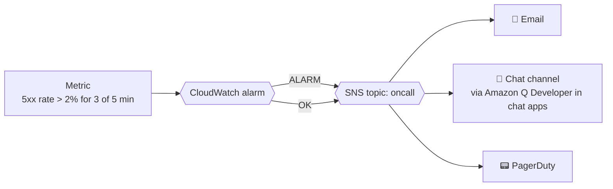

## The big idea

Running software without observability is like **driving at night with no dashboard**. You find out you're out of fuel when the engine stops.

- **Logs** are the **trip diary**: what happened, line by line.
- **Metrics** are the **dashboard gauges**: speed, fuel, temperature over time.
- **Alarms** are the **warning lights** that turn on before disaster.
- **Traces** are the **GPS route**: exactly where one journey (request) spent its time.
- **CloudTrail** is the **dashcam**: who touched the controls, and when.


## CloudWatch Logs

| Concept | Meaning |
| --- | --- |
| **Log group** | One per app/function, e.g. `/ecs/my-api`, `/aws/lambda/create-product` |
| **Log stream** | One per source (task, instance, Lambda environment) |
| **Retention** | Default **never expires**: set 14–90 days or pay forever |
| **Metric filter** | Turn log patterns into metrics (count `level=error`) |
| **Subscription filter** | Stream logs to Lambda, Kinesis/Firehose, OpenSearch |
| **Log classes** | Standard, or Infrequent Access (cheaper, fewer features) |

ECS (`awslogs` driver or FireLens), Lambda and API Gateway send logs automatically. On EC2, install the **CloudWatch agent**.

### Log structured JSON

```js
import pino from "pino";
const log = pino({ base: { service: "my-api", env: process.env.NODE_ENV } });

log.info({ requestId, userId, route: "POST /orders", durationMs: 84, status: 201 }, "order created");
log.error({ requestId, err }, "payment failed");
```

Plain-text logs are hard to search. JSON fields become queryable columns.

### Logs Insights

```sql
fields @timestamp, route, status, durationMs
| filter status >= 500
| stats count(*) as errors, avg(durationMs) as avgMs by route
| sort errors desc
| limit 20
```

```sql
-- p95/p99 latency per 5 minutes
filter ispresent(durationMs)
| stats pct(durationMs, 95) as p95, pct(durationMs, 99) as p99 by bin(5m)
```

```sql
-- Lambda: cold starts and memory use
filter @type = "REPORT"
| stats count(*) as invocations, sum(ispresent(@initDuration)) as coldStarts,
        max(@maxMemoryUsed / 1000 / 1000) as maxMemoryMB by bin(1h)
```

## CloudWatch metrics

A **metric** is a time series identified by **namespace + name + dimensions** (e.g. `AWS/ApplicationELB` · `TargetResponseTime` · `LoadBalancer=app/api/…`).

| Service | Metrics you'll watch |
| --- | --- |
| **ALB** | `RequestCount`, `HTTPCode_Target_5XX_Count`, `TargetResponseTime`, `UnHealthyHostCount` |
| **ECS** | `CPUUtilization`, `MemoryUtilization`, running task count (Container Insights) |
| **Lambda** | `Invocations`, `Errors`, `Throttles`, `Duration`, `ConcurrentExecutions` |
| **API Gateway** | `Count`, `4XXError`/`5XXError` (`4xx`/`5xx` on HTTP APIs), `Latency` |
| **RDS** | `CPUUtilization`, `FreeableMemory`, `DatabaseConnections`, `FreeStorageSpace`, `ReplicaLag` |
| **DynamoDB** | `ConsumedRead/WriteCapacityUnits`, `ThrottledRequests`, `SystemErrors` |
| **SQS** | `ApproximateNumberOfMessagesVisible`, `ApproximateAgeOfOldestMessage` |

EC2 **memory and disk** aren't visible to AWS from outside the VM: install the CloudWatch agent for them.

### Custom metrics with Embedded Metric Format (EMF)

Print a specially shaped JSON log line and CloudWatch extracts metrics from it, with no API calls in your hot path:

```js
console.log(JSON.stringify({
  _aws: {
    Timestamp: Date.now(),
    CloudWatchMetrics: [{
      Namespace: "Shop",
      Dimensions: [["Service"]],
      Metrics: [{ Name: "OrdersPlaced", Unit: "Count" }, { Name: "OrderValue", Unit: "None" }],
    }],
  },
  Service: "checkout",
  OrdersPlaced: 1,
  OrderValue: 42.5,
  orderId: "1001", // extra fields stay searchable in Logs Insights
}));
```

**Powertools for AWS Lambda** wraps this in a `metrics.addMetric(...)` helper. Beware **high-cardinality dimensions** (user ID, order ID): each unique combination is a separate billed metric.

## Alarms

An alarm watches one metric (or a **metric math** expression) and changes state: `OK` → `ALARM` → `INSUFFICIENT_DATA`.

```bash
aws cloudwatch put-metric-alarm \
  --alarm-name my-api-5xx-high \
  --namespace AWS/ApplicationELB --metric-name HTTPCode_Target_5XX_Count \
  --dimensions Name=LoadBalancer,Value=app/api/50dc6c495c0c9188 \
  --statistic Sum --period 60 --evaluation-periods 5 --datapoints-to-alarm 3 \
  --threshold 10 --comparison-operator GreaterThanThreshold \
  --treat-missing-data notBreaching \
  --alarm-actions arn:aws:sns:us-east-1:123456789012:oncall
```

| Concept | Meaning |
| --- | --- |
| **Period / evaluation periods / datapoints to alarm** | "3 of the last 5 minutes above 10" avoids flapping on one spike |
| **Missing data treatment** | What silence means: for errors `notBreaching`, for heartbeats `breaching` |
| **Metric math** | Error **rate** = errors / requests × 100, more meaningful than raw counts |
| **Anomaly detection** | Band learned from history; alarm when outside it |
| **Composite alarm** | Combine alarms (`5xx high AND latency high`) to reduce noise |
| **Actions** | SNS (email, chat, PagerDuty/Opsgenie), Auto Scaling, EC2 recover/stop, Systems Manager |

### Alert on symptoms, not causes



Page a human for **user-facing symptoms** (errors, latency, queue age, failed deploys). Send causes (high CPU) to dashboards or tickets. **Test the notification path end to end** before you rely on it.

## The alarm set every service needs

| Alarm | Signal |
| --- | --- |
| **Error rate** (ALB 5xx / API Gateway 5xx / Lambda Errors) | Users see failures |
| **Latency p95/p99** (`TargetResponseTime`, `Latency`, `Duration`) | Users see slowness |
| **No healthy targets** (`UnHealthyHostCount` > 0, `HealthyHostCount` < min) | Capacity is gone |
| **Task restarts / Lambda throttles** | Crashing or capacity-starved |
| **Database pressure** (CPU, connections, free storage, replica lag) | The bottleneck is forming |
| **Queue age** (`ApproximateAgeOfOldestMessage`) and **DLQ depth > 0** | Work is stuck |
| **Failed deployments** (ECS circuit breaker rollback events via EventBridge) | A release went wrong |
| **Budget** alerts | Costs are drifting |

## Dashboards

Build one dashboard per service with the four **golden signals**: **traffic, errors, latency, saturation**. Add deploy markers and database/queue widgets. Keep dashboards in code (CloudFormation/Terraform/CDK) so every environment gets the same view.

## Tracing: X-Ray and OpenTelemetry

In a distributed system, one request can cross API Gateway → Lambda → SQS → ECS → DynamoDB. A **trace** follows it with a shared **trace ID** and shows each **segment** and its timing.

```mermaid
gantt
    title One request (trace 1-5f84c7a1-…)
    dateFormat x
    axisFormat %L ms
    section API Gateway
    route and auth        :0, 12
    section Lambda
    handler               :12, 180
    section DynamoDB
    GetItem               :30, 45
    section Payment API
    POST /charge          :60, 170
```



- Enable **active tracing** on Lambda/API Gateway with one setting; for ECS/EC2, run the **ADOT (AWS Distro for OpenTelemetry) collector** or CloudWatch agent and instrument with OpenTelemetry SDKs.
- **CloudWatch Application Signals** builds service maps, SLOs and golden-signal dashboards from that telemetry.
- **Synthetics canaries** run scripted checks (login, checkout) every few minutes from outside; **RUM** measures real users' page performance.

Always propagate a **correlation/request ID** in logs so you can jump from a trace to the matching log lines.

## CloudTrail: the audit log

| Question | CloudTrail answers |
| --- | --- |
| Who deleted the S3 bucket? | `DeleteBucket` event with the principal, IP and time |
| Why did my role get Access Denied? | The event with `errorCode: AccessDenied` and exact action |
| Which actions does this app really use? | Feed events into Access Analyzer policy generation |

- **Event history**: 90 days of management events, free.
- A **trail** to S3 (organisation-wide, with log file validation) for long-term retention; **data events** (S3 object reads, Lambda invokes) are extra.
- Query with **CloudTrail Lake** or Athena.

## Cost control for observability

- Set **retention on every log group**; don't log full request bodies or secrets.
- Sample debug logs; use log levels.
- Avoid high-cardinality metric dimensions.
- Use Infrequent Access log class for logs you rarely query.

## Key takeaways

- **Logs** (structured JSON, Logs Insights), **metrics** (built-in + EMF custom), **traces** (X-Ray/OpenTelemetry) and **CloudTrail** audit are the four pillars.
- Set log **retention**; beware high-cardinality custom metrics.
- Alarm on **user-facing symptoms** (error rate, latency, no healthy targets, queue age, DLQ depth, failed deploys) with "M of N" datapoints.
- Route alarms through **SNS** to email/chat/paging, and test the full path.
- Build golden-signal dashboards in code and propagate a request ID across logs and traces.
