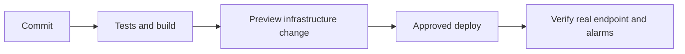

## Two habits that prevent surprises

1. Define infrastructure in code (Terraform, CloudFormation, or CDK), not only by clicking in the console.
2. Deploy through a reviewed pipeline, not from one person’s laptop.

## Infrastructure as code

| Tool | Simple description |
| --- | --- |
| Terraform | Works across many cloud providers; stores state remotely |
| CloudFormation | AWS-native templates and stacks |
| CDK | Write AWS infrastructure using programming languages |

Use separate environments and protect remote state. Treat the preview (`terraform plan` or CloudFormation change set) as something to review, not an automatic approval.

## CI/CD credentials

GitHub Actions can use OpenID Connect (OIDC) to assume an AWS role for a short time. This is safer than saving long-lived AWS keys as GitHub secrets. Restrict the role to the repository, branch/environment, and exact deployment permissions.

## Deployment safety

- Build an immutable artifact/image with a version.
- Test before production.
- Roll out gradually where possible.
- Keep a rollback path to the prior version.
- Verify the external route after deployment, not only “pipeline passed.”

## Remember this

- IaC makes infrastructure reviewable and repeatable.
- Preview changes before applying them.
- Use temporary OIDC roles for CI/CD.
- A successful deployment is not complete until the real service works.
