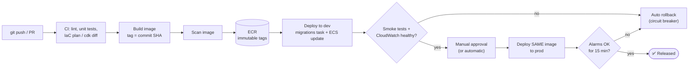

## The big idea

Clicking through the console to build infrastructure is like **cooking a great meal without writing down the recipe**. It works once, but nobody (including you, in six months) can reproduce it, review it, or undo a change.

- **Infrastructure as Code (IaC)** is the **written recipe**: VPCs, databases, roles and services described in files, reviewed in pull requests and applied automatically.
- **CI/CD** is the **kitchen routine**: every change is tested the same way and delivered through the same steps, so releases become boring.


## Why IaC

| Console clicking | Infrastructure as code |
| --- | --- |
| Undocumented, hard to repeat | Every environment built from the same code |
| Changes invisible | Diffs reviewed in pull requests |
| Drift between dev and prod | Detect and fix drift |
| Disaster recovery = memory | Recreate an environment from Git |
| Who changed that security group? | Git history + CloudTrail |

## The tools

| Tool | Language | State | Notes |
| --- | --- | --- | --- |
| **CloudFormation** | YAML/JSON | Managed by AWS (stacks) | Native, change sets, drift detection, StackSets for many accounts |
| **AWS CDK** | TypeScript, Python, Go, Java, C# | Synthesises to CloudFormation | Real programming language, high-level constructs |
| **AWS SAM** | YAML (CloudFormation extension) | CloudFormation | Shorthand for serverless apps (see *Serverless*) |
| **Terraform / OpenTofu** | HCL | Your state file (S3 backend) | Multi-cloud, huge provider ecosystem, `plan` before `apply` |

### CloudFormation essentials

```yaml
AWSTemplateFormatVersion: "2010-09-09"
Description: Uploads bucket and queue for my-api
Parameters:
  Env: { Type: String, AllowedValues: [dev, staging, prod] }
Resources:
  UploadsBucket:
    Type: AWS::S3::Bucket
    DeletionPolicy: Retain                 # keep data if the stack is deleted
    Properties:
      BucketName: !Sub "my-api-uploads-${Env}-${AWS::AccountId}"
      VersioningConfiguration: { Status: Enabled }
      PublicAccessBlockConfiguration:
        { BlockPublicAcls: true, BlockPublicPolicy: true, IgnorePublicAcls: true, RestrictPublicBuckets: true }
  JobsQueue:
    Type: AWS::SQS::Queue
    Properties:
      RedrivePolicy: { deadLetterTargetArn: !GetAtt JobsDlq.Arn, maxReceiveCount: 5 }
  JobsDlq:
    Type: AWS::SQS::Queue
Outputs:
  BucketName: { Value: !Ref UploadsBucket, Export: { Name: !Sub "${Env}-uploads-bucket" } }
```

- A **stack** is a deployed template. Update it with a **change set** to preview what will be added, modified or **replaced**.
- A failed update **rolls back automatically**.
- Protect data with `DeletionPolicy: Retain`/`Snapshot` and **stack termination protection**.

### CDK: the same, in TypeScript

```ts
import { App, Stack, Duration, RemovalPolicy } from "aws-cdk-lib";
import * as s3 from "aws-cdk-lib/aws-s3";
import * as sqs from "aws-cdk-lib/aws-sqs";
import * as ecs from "aws-cdk-lib/aws-ecs";
import * as ecsPatterns from "aws-cdk-lib/aws-ecs-patterns";

class ApiStack extends Stack {
  constructor(scope: App, id: string, props: { env: { account: string; region: string }; imageTag: string }) {
    super(scope, id, props);

    const uploads = new s3.Bucket(this, "Uploads", {
      versioned: true,
      blockPublicAccess: s3.BlockPublicAccess.BLOCK_ALL,
      enforceSSL: true,
      removalPolicy: RemovalPolicy.RETAIN,
    });

    const dlq = new sqs.Queue(this, "JobsDlq", { retentionPeriod: Duration.days(14) });
    const jobs = new sqs.Queue(this, "Jobs", { deadLetterQueue: { queue: dlq, maxReceiveCount: 5 } });

    // One construct: VPC wiring, ALB, target group, Fargate service, log group, roles
    const service = new ecsPatterns.ApplicationLoadBalancedFargateService(this, "Api", {
      cpu: 512,
      memoryLimitMiB: 1024,
      desiredCount: 2,
      circuitBreaker: { rollback: true },
      taskImageOptions: {
        image: ecs.ContainerImage.fromRegistry(`123456789012.dkr.ecr.us-east-1.amazonaws.com/my-api:${props.imageTag}`),
        containerPort: 8080,
        environment: { UPLOAD_BUCKET: uploads.bucketName, JOBS_QUEUE_URL: jobs.queueUrl },
      },
    });

    uploads.grantPut(service.taskDefinition.taskRole);   // least-privilege policy generated for you
    jobs.grantSendMessages(service.taskDefinition.taskRole);
  }
}

const app = new App();
new ApiStack(app, "my-api-dev", { env: { account: "111111111111", region: "us-east-1" }, imageTag: process.env.IMAGE_TAG ?? "dev" });
```

```bash
npx cdk bootstrap        # once per account/Region
npx cdk diff             # what will change
npx cdk deploy my-api-dev
```

`grant*` methods are CDK's superpower: they write least-privilege IAM policies for you.

### Terraform essentials

```hcl
terraform {
  required_providers { aws = { source = "hashicorp/aws", version = "~> 6.0" } }
  backend "s3" {
    bucket       = "acme-terraform-state"
    key          = "my-api/dev/terraform.tfstate"
    region       = "us-east-1"
    use_lockfile = true      # S3-native state locking
    encrypt      = true
  }
}

provider "aws" {
  region = "us-east-1"
  default_tags { tags = { project = "my-api", env = var.env, managed_by = "terraform" } }
}

module "vpc" {
  source  = "terraform-aws-modules/vpc/aws"
  name    = "my-api-${var.env}"
  cidr    = "10.0.0.0/16"
  azs             = ["us-east-1a", "us-east-1b"]
  public_subnets  = ["10.0.0.0/24", "10.0.1.0/24"]
  private_subnets = ["10.0.10.0/24", "10.0.11.0/24"]
  enable_nat_gateway = true
  single_nat_gateway = var.env != "prod"   # save money outside prod
}
```

```bash
terraform init
terraform plan -out=tfplan      # review!
terraform apply tfplan
```

- Keep **state remote** (S3, versioned, encrypted, locked). Never commit it: it can contain secrets.
- One state per **environment and component** (network, data, app) to limit blast radius.
- Run `plan` in pull requests and `apply` only from the pipeline.

## A safe release flow ⭐



Principles:

1. **Build once, promote the same artefact** (same image SHA) through every environment.
2. **Immutable tags**; never deploy `latest`, so rollback is "deploy the previous SHA".
3. **Infrastructure and app deploy from code**, not the console.
4. **Automated health gates**: smoke tests, alarms, circuit breaker.
5. **Separate accounts** for dev/staging/prod, each with its own deploy role.

## GitHub Actions with OIDC: no stored AWS keys

GitHub gets a short-lived OIDC token; AWS trusts it for **one repository and branch** and returns temporary credentials.

```json
{
  "Effect": "Allow",
  "Principal": { "Federated": "arn:aws:iam::123456789012:oidc-provider/token.actions.githubusercontent.com" },
  "Action": "sts:AssumeRoleWithWebIdentity",
  "Condition": {
    "StringEquals": { "token.actions.githubusercontent.com:aud": "sts.amazonaws.com" },
    "StringLike": { "token.actions.githubusercontent.com:sub": "repo:acme/my-api:ref:refs/heads/main" }
  }
}
```

```yaml
# .github/workflows/deploy.yml
name: deploy
on:
  push: { branches: [main] }
permissions:
  id-token: write          # required for OIDC
  contents: read
jobs:
  deploy:
    runs-on: ubuntu-latest
    environment: dev
    steps:
      - uses: actions/checkout@v4
      - uses: actions/setup-node@v4
        with: { node-version: 22, cache: npm }
      - run: npm ci && npm test
      - uses: aws-actions/configure-aws-credentials@v4
        with:
          role-to-assume: arn:aws:iam::123456789012:role/github-deploy-my-api-dev
          aws-region: us-east-1
      - id: ecr
        uses: aws-actions/amazon-ecr-login@v2
      - name: Build and push
        env: { IMAGE: "${{ steps.ecr.outputs.registry }}/my-api:${{ github.sha }}" }
        run: |
          docker build -t "$IMAGE" .
          docker push "$IMAGE"
          echo "IMAGE=$IMAGE" >> "$GITHUB_ENV"
      - name: Render task definition
        id: td
        uses: aws-actions/amazon-ecs-render-task-definition@v1
        with: { task-definition: infra/taskdef.json, container-name: api, image: "${{ env.IMAGE }}" }
      - name: Deploy to ECS
        uses: aws-actions/amazon-ecs-deploy-task-definition@v2
        with:
          task-definition: ${{ steps.td.outputs.task-definition }}
          cluster: dev
          service: my-api
          wait-for-service-stability: true
```

The role `github-deploy-my-api-dev` gets only the ECR push, ECS update and scoped `iam:PassRole` permissions from the *IAM* lesson.

## CodeBuild and CodePipeline

| Service | Role |
| --- | --- |
| **CodeBuild** | Runs build/test commands in a managed container (`buildspec.yml`); pay per build minute |
| **CodePipeline** | Orchestrates stages: source (GitHub/CodeCommit/S3) → build → approve → deploy |
| **CodeDeploy** | Blue/green and canary deployments for ECS, Lambda and EC2 |
| **CodeConnections** | Connects to GitHub/GitLab/Bitbucket |

```yaml
# buildspec.yml
version: 0.2
env:
  variables: { REPO: my-api }
phases:
  pre_build:
    commands:
      - ACCOUNT=$(aws sts get-caller-identity --query Account --output text)
      - REGISTRY=$ACCOUNT.dkr.ecr.$AWS_REGION.amazonaws.com
      - aws ecr get-login-password | docker login --username AWS --password-stdin $REGISTRY
      - TAG=${CODEBUILD_RESOLVED_SOURCE_VERSION:0:7}
  build:
    commands:
      - npm ci && npm test
      - docker build -t $REGISTRY/$REPO:$TAG .
  post_build:
    commands:
      - docker push $REGISTRY/$REPO:$TAG
      - printf '[{"name":"api","imageUri":"%s"}]' $REGISTRY/$REPO:$TAG > imagedefinitions.json
artifacts:
  files: [imagedefinitions.json]
```

CodeBuild runs as its own **service role**, never the developer's identity. Scope it to its source connection, log group, **one** ECR repository, its artefact bucket and only the secrets it truly needs. Never give CI broad IAM or production database admin rights.

## Deployment strategies

| Strategy | How | Rollback | Cost |
| --- | --- | --- | --- |
| **Rolling** | Replace tasks/instances a few at a time | Redeploy previous version | Low |
| **Blue/green** | Start a full new environment, switch traffic | Switch back instantly | Double capacity briefly |
| **Canary** | Send 5–10% of traffic, then the rest if healthy | Shift back | Low |
| **Linear** | +10% every N minutes | Shift back | Low |
| **Feature flags** | Deploy dark, enable per user (AppConfig) | Toggle off | Low |

## Environment promotion and config

- Same code and image; environment differences only in **parameters** (instance sizes, counts, domain names), stored in IaC variables, Parameter Store or AppConfig.
- Promote with a PR or approval step; production deploys only from the pipeline.
- Keep secrets in Secrets Manager; CI never prints them.

## Key takeaways

- Treat infrastructure as code: CloudFormation/CDK/SAM (AWS-native) or Terraform (remote, locked state); review plans/diffs in PRs.
- **Build once**, tag with the commit SHA, **promote the same image**, and gate each step on health checks and alarms.
- Use **GitHub OIDC** or CodeBuild **service roles**: no long-lived keys, tightly scoped permissions.
- Prefer rolling with circuit breaker, blue/green or canary so rollback is fast and automatic.
- Separate accounts per environment; production changes only through the pipeline.
