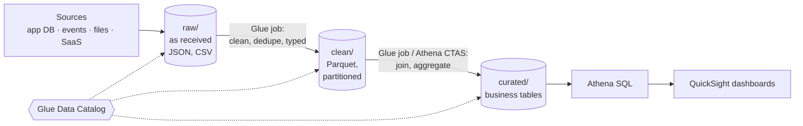
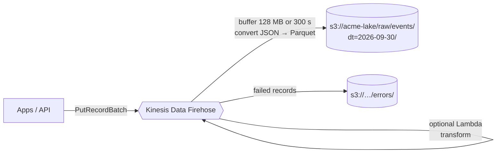
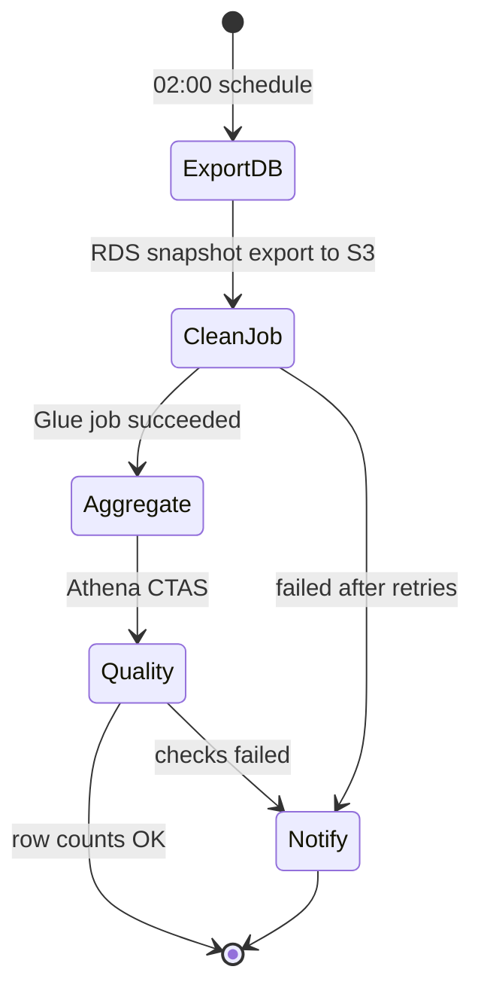

## The big idea

Your app's database is a **busy shop floor**: it's organised for serving customers fast, not for answering "what sold best in each region last year?" Asking that on the shop floor slows everyone down.

A **data pipeline** is the **delivery truck and back-office**: it regularly copies data out (Extract), cleans and reshapes it (Transform) and stores it in a **warehouse built for questions** (Load), usually an **S3 data lake** queried with **Athena**.


## The building blocks

| Service | Role |
| --- | --- |
| **S3** | The data lake: cheap, durable storage for all files |
| **Glue Data Catalog** | Table definitions (schema, location, partitions) shared by Athena, Glue, EMR, Redshift Spectrum |
| **Glue crawlers** | Scan S3 and infer schemas/partitions into the catalog |
| **Glue ETL jobs** | Serverless Spark (or Python shell) jobs to transform data |
| **Athena** | Serverless SQL on S3, pay per TB scanned |
| **Kinesis Data Firehose** | Streaming ingestion: buffers and writes events to S3/Redshift/OpenSearch, can convert to Parquet |
| **Step Functions / EventBridge Scheduler** | Orchestrate and schedule pipeline steps |
| **Lake Formation** | Fine-grained (table/column/row) permissions on the lake |
| **Redshift** | Data warehouse for heavy, frequent BI queries |
| **EMR** | Managed Spark/Hadoop clusters for large custom processing |
| **QuickSight** | Dashboards and BI |

## Zones of a data lake



| Zone | Contains | Rules |
| --- | --- | --- |
| **raw** | Exactly what arrived | Immutable; lets you reprocess after bugs |
| **clean** | Validated, typed, deduplicated, Parquet | One row per real event/entity |
| **curated** | Business-ready aggregates and joins | What analysts and dashboards use |

## File formats and partitioning ⭐

Athena charges by **data scanned**, so layout is everything.

| Format | Scan for 1 column of 50 | Compression | Use |
| --- | --- | --- | --- |
| CSV / JSON | Whole file | Poor | Raw landing only |
| **Parquet / ORC** | Just that column | Excellent | **Clean and curated zones** |

**Partitioning** stores data in folders by common filters, so queries skip whole folders:

```text
s3://acme-lake/clean/orders/year=2026/month=09/day=30/part-0001.snappy.parquet
```

```sql
-- Reads only one day's folder instead of the whole table
SELECT country, sum(total_cents) / 100.0 AS revenue
FROM clean.orders
WHERE year = '2026' AND month = '09' AND day = '30'
GROUP BY country
ORDER BY revenue DESC;
```

- Aim for files of **128 MB–1 GB**; thousands of tiny files are slow (compact them).
- Partition by what you filter on (date, maybe region), not by high-cardinality IDs.
- **Partition projection** in Athena computes partitions from a pattern, so you don't need crawlers for new dates.
- Open table formats (**Apache Iceberg**, supported by Athena and Glue) add ACID updates/deletes, time travel and schema evolution.

## Glue: catalog, crawlers and jobs

```python
# Glue ETL job (PySpark): raw JSON orders → clean partitioned Parquet
import sys
from awsglue.context import GlueContext
from awsglue.utils import getResolvedOptions
from pyspark.context import SparkContext
from pyspark.sql import functions as F

args = getResolvedOptions(sys.argv, ["RUN_DATE"])
glue = GlueContext(SparkContext.getOrCreate())
spark = glue.spark_session

raw = spark.read.json(f"s3://acme-lake/raw/orders/dt={args['RUN_DATE']}/")

clean = (
    raw.filter(F.col("orderId").isNotNull())
       .dropDuplicates(["orderId"])
       .withColumn("total_cents", F.col("total").cast("long"))
       .withColumn("created_at", F.to_timestamp("createdAt"))
       .withColumn("year", F.date_format("created_at", "yyyy"))
       .withColumn("month", F.date_format("created_at", "MM"))
       .withColumn("day", F.date_format("created_at", "dd"))
       .select("orderId", "customerId", "country", "total_cents", "created_at", "year", "month", "day")
)

(clean.write.mode("overwrite")
      .option("partitionOverwriteMode", "dynamic")    # replace only the partitions we wrote
      .partitionBy("year", "month", "day")
      .parquet("s3://acme-lake/clean/orders/"))
```

- **Job bookmarks** let Glue process only new data since the last run.
- Glue jobs are billed per **DPU-hour**; use Flex execution for non-urgent jobs.
- Small transforms (a few GB) are often simpler and cheaper as **Athena CTAS/INSERT** queries or a Lambda.

## Athena

```sql
-- Create a table over existing Parquet files (or let a crawler do it)
CREATE EXTERNAL TABLE clean.orders (
  orderId string, customerId string, country string, total_cents bigint, created_at timestamp
)
PARTITIONED BY (year string, month string, day string)
STORED AS PARQUET
LOCATION 's3://acme-lake/clean/orders/';

-- CTAS: materialise a curated table as partitioned Parquet
CREATE TABLE curated.daily_revenue
WITH (format = 'PARQUET', external_location = 's3://acme-lake/curated/daily_revenue/', partitioned_by = ARRAY['year'])
AS SELECT date(created_at) AS day, country, sum(total_cents) AS revenue_cents, year
   FROM clean.orders GROUP BY 1, 2, year;
```

Use **workgroups** to separate teams, enforce result locations and set per-query **data scanned limits**.

## Streaming ingestion with Firehose



Firehose handles batching, compression, retries and format conversion (using a Glue table schema) with no servers. Use **dynamic partitioning** to write into `dt=…/` folders based on record fields.

## Orchestration



**Step Functions** runs each step with retries, catches errors and sends alerts; **EventBridge Scheduler** starts it nightly. **Glue workflows** and **Amazon MWAA** (managed Apache Airflow) are alternatives for many interdependent jobs.

### Getting data out of the app database

| Method | Notes |
| --- | --- |
| **RDS snapshot export to S3** | Parquet export of a snapshot, no load on the live DB |
| **AWS DMS** | Full load + ongoing **change data capture (CDC)** into S3/Redshift |
| **Aurora zero-ETL** integration | Near real-time replication into Redshift without pipelines |
| **DynamoDB export to S3** | Point-in-time export without consuming read capacity |
| **Events** | Publish domain events → Firehose → S3 |

## Choosing the query engine

| Need | Choose |
| --- | --- |
| Ad-hoc SQL on S3, occasional use, serverless | **Athena** |
| Many concurrent dashboards, complex joins, sub-second BI | **Redshift** (Serverless or provisioned) |
| Custom large-scale Spark/Hadoop, ML feature engineering | **EMR** / Glue |
| Search and log analytics | **OpenSearch** |

## Data governance checklist

- [ ] Separate buckets or prefixes per zone; raw is write-once
- [ ] Encryption (SSE-KMS) and Block Public Access on every lake bucket
- [ ] Lake Formation or IAM for table/column-level access; mask PII in curated data
- [ ] Data quality checks (row counts, nulls, ranges) with Glue Data Quality or SQL
- [ ] Lifecycle rules: raw to Glacier after N days; delete per retention policy
- [ ] Every pipeline run observable: logs, metrics, failure alerts

## Key takeaways

- ETL moves data out of the transactional DB into an **S3 data lake** with **raw → clean → curated** zones.
- Store analytics data as **partitioned Parquet** (or Iceberg); partition by what you filter on; avoid tiny files.
- **Glue** catalogs and transforms; **Athena** queries S3 with SQL (pay per data scanned); **Firehose** streams events into S3.
- Orchestrate with **Step Functions** + schedules; get data out of databases with snapshot export, DMS CDC or zero-ETL.
- Use **Redshift** when many users need fast, frequent BI queries.
