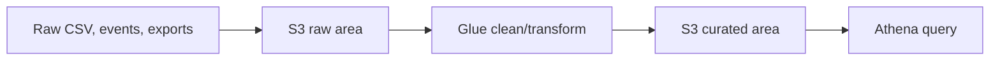

## The simple data journey

This is a **data lake**: files in S3 organized so analytics tools can read them.

## Keep the areas separate

| Area | What belongs there |
| --- | --- |
| **Raw** | Original data; do not silently change it |
| **Clean** | Validated, normalized data |
| **Curated** | Business-ready tables for reports |

Keeping raw data lets you fix a transformation later without asking the source system to resend everything.

## The tools

| Tool | Job |
| --- | --- |
| S3 | Stores the files |
| Glue Data Catalog | Keeps table definitions for files |
| Glue job | Transforms data |
| Athena | Runs SQL directly over S3 data |
| Firehose | Delivers streaming data into S3 |

Use Parquet for analytical data when possible: it is compressed and column-oriented, so Athena scans less data and costs less. Partition files by a field you filter often, such as date.

## Remember this

- A data lake is organized files in S3.
- Keep raw, clean, and curated data separate.
- Glue describes/transforms data; Athena queries it with SQL.
- Parquet and partitions reduce query cost.
