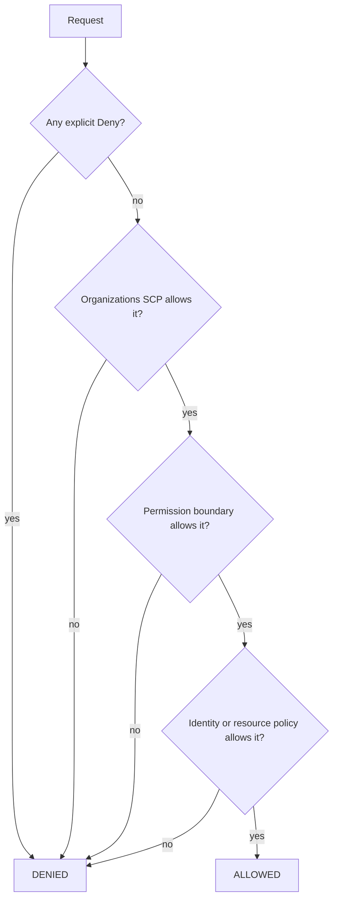
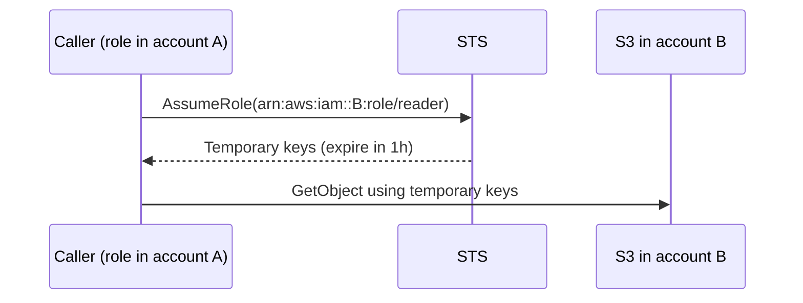

## How AWS decides: the evaluation logic

Every request starts as an **implicit deny**. The rules are applied in this order.



Three facts to remember:

1. An **explicit Deny always wins**.
2. SCPs and permission boundaries **limit** permissions; they never grant them.
3. Within the **same account**, a resource policy can grant access on its own. For **cross-account** access, both sides must allow it.

## Policy types

| Policy | Attached to | Purpose |
| --- | --- | --- |
| **Identity-based** | User, group, role | What this identity may do |
| **Resource-based** | S3 bucket, SQS queue, KMS key, Lambda | Who may use this resource |
| **Permission boundary** | User or role | Maximum permissions it can ever have |
| **SCP** | Organization, OU or account | Maximum permissions for the whole account |
| **Session policy** | A temporary session | Narrows one session further |

## Roles and STS

A **role** has no password or long-term keys. A principal **assumes** it through **STS** and receives temporary credentials.



A role has two policies:

- **Trust policy**: who may assume it.
- **Permissions policy**: what it may do after assumption.

```json
{
  "Version": "2012-10-17",
  "Statement": [{
    "Effect": "Allow",
    "Principal": { "AWS": "arn:aws:iam::111111111111:role/deployer" },
    "Action": "sts:AssumeRole",
    "Condition": { "StringEquals": { "sts:ExternalId": "partner-2024" } }
  }]
}
```

Use an **external ID** when a third party assumes a role in your account, to prevent the confused-deputy problem.

```bash
aws sts assume-role --role-arn arn:aws:iam::222222222222:role/reader --role-session-name audit
aws sts get-caller-identity     # who am I right now?
```

## Conditions make policies precise

```json
{
  "Effect": "Allow",
  "Action": "s3:*",
  "Resource": ["arn:aws:s3:::shop-uploads", "arn:aws:s3:::shop-uploads/*"],
  "Condition": {
    "Bool": { "aws:SecureTransport": "true" },
    "IpAddress": { "aws:SourceIp": "203.0.113.0/24" }
  }
}
```

Useful condition keys: `aws:SourceIp`, `aws:SourceVpce`, `aws:MultiFactorAuthPresent`, `aws:PrincipalOrgID`, `aws:RequestedRegion`, `aws:PrincipalTag/*`.

Use `aws:PrincipalOrgID` in resource policies to allow "anyone in my organization" without listing every account.

## Attribute-based access control (ABAC)

Instead of one policy per team, match **tags** on the person and the resource:

```json
{
  "Effect": "Allow",
  "Action": ["ec2:StartInstances", "ec2:StopInstances"],
  "Resource": "*",
  "Condition": {
    "StringEquals": { "aws:ResourceTag/team": "${aws:PrincipalTag/team}" }
  }
}
```

A user tagged `team=payments` can only touch instances tagged `team=payments`. New teams need no new policy.

## Permission boundaries for safe delegation

Let developers create roles, but cap what those roles can do:

```json
{
  "Effect": "Allow",
  "Action": ["iam:CreateRole", "iam:AttachRolePolicy"],
  "Resource": "arn:aws:iam::*:role/app-*",
  "Condition": {
    "StringEquals": {
      "iam:PermissionsBoundary": "arn:aws:iam::123456789012:policy/dev-boundary"
    }
  }
}
```

Without this, a developer with `iam:CreateRole` could create an admin role: a classic **privilege escalation**.

## Finding and fixing problems

- **IAM Policy Simulator** tests whether a principal can perform an action.
- **IAM Access Analyzer** finds resources shared outside your account and can generate least-privilege policies from CloudTrail activity.
- **Last accessed** data shows unused permissions to remove.
- Decode `AccessDenied` messages: `aws sts decode-authorization-message --encoded-message ...`.

## Remember this

- Explicit deny wins; SCPs and boundaries only restrict.
- Cross-account needs a trust policy plus a permission in the assumed role (or both sides of a resource policy).
- Prefer roles and short-lived credentials over access keys.
- Use conditions and tags to be precise; watch for IAM privilege escalation paths.
