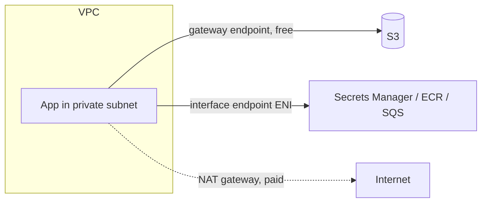
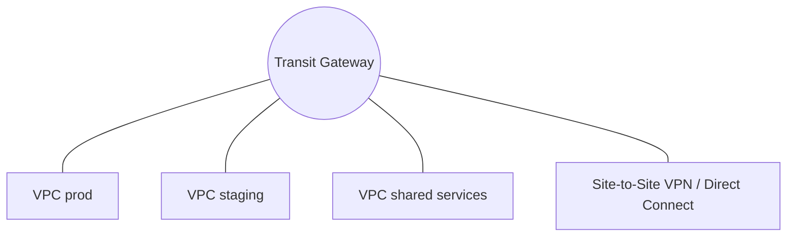

## Keep AWS traffic off the internet

By default, a private subnet reaches S3 or DynamoDB through a **NAT gateway**, which costs money per hour and per GB. **VPC endpoints** give a private path instead.

| Endpoint type | Used for | Cost |
| --- | --- | --- |
| **Gateway endpoint** | S3 and DynamoDB only | Free |
| **Interface endpoint** (PrivateLink) | Most other AWS services and third-party services | Hourly plus per GB |



Quick win: add a **gateway endpoint for S3** to every VPC. ECR image layers are stored in S3, so this alone often reduces NAT bills significantly.

Endpoint policies restrict what can be done through an endpoint:

```json
{
  "Statement": [{
    "Effect": "Allow",
    "Principal": "*",
    "Action": ["s3:GetObject"],
    "Resource": "arn:aws:s3:::shop-assets/*"
  }]
}
```

Combine with a bucket policy using `aws:SourceVpce` so the bucket is reachable only through your endpoint.

## Security groups versus network ACLs

| | Security group | Network ACL |
| --- | --- | --- |
| Level | Network interface | Subnet |
| State | **Stateful** (return traffic allowed) | **Stateless** (allow both directions) |
| Rules | Allow only | Allow and deny, evaluated by number |
| Typical use | Main control | Coarse guardrail or blocking an IP range |

Tip: reference **another security group** as the source, such as "port 5432 from `sg-app`", instead of IP ranges.

## Connecting VPCs

| Option | Good for | Limits |
| --- | --- | --- |
| **VPC peering** | A few VPCs, simple 1:1 links | Not transitive; CIDRs cannot overlap |
| **Transit Gateway** | Many VPCs and on-premises, hub and spoke | Hourly and per-GB cost |
| **PrivateLink** | Expose **one service** to other VPCs or accounts | One direction, no CIDR overlap problem |



Plan non-overlapping **CIDR ranges** from day one. Overlaps are painful to fix later.

## Hybrid connectivity

| Option | Notes |
| --- | --- |
| **Site-to-Site VPN** | Encrypted over the internet; fast to set up; two tunnels for redundancy |
| **Direct Connect** | Dedicated private link; consistent latency; takes weeks to provision |
| **VPN over Direct Connect** or a second connection | Redundancy and encryption |

Use **Route 53 Resolver** inbound and outbound endpoints to resolve DNS names across AWS and on-premises.

## IPv6 and egress

An **egress-only internet gateway** lets IPv6 instances reach out without accepting inbound connections, like NAT for IPv6 without the cost. Consider one NAT gateway per AZ for resilience, balanced against cost in non-production.

## Troubleshooting with VPC Flow Logs

Flow logs record accepted and rejected traffic per network interface.

```text
version account-id interface-id srcaddr dstaddr srcport dstport protocol packets bytes start end action log-status
2 123456789012 eni-0abc 10.0.1.5 10.0.2.9 51234 5432 6 10 840 1700000000 1700000060 REJECT OK
```

A `REJECT` on port 5432 points at a security group or NACL. Query logs in S3 with Athena or in CloudWatch Logs Insights.

**Reachability Analyzer** traces a path between two resources and tells you which component blocks it, without sending packets.

Checklist when "it cannot connect":

1. Route table of the source subnet has a route to the target.
2. Security group on both ends allows the port.
3. NACLs allow both directions, including ephemeral return ports.
4. DNS resolves to the expected private IP.
5. The service is listening on the right interface and port.

## Remember this

- Gateway endpoints for S3 and DynamoDB are free; add them everywhere.
- Peering is not transitive; Transit Gateway scales hub and spoke; PrivateLink shares one service.
- Security groups are stateful; NACLs are stateless.
- Use Flow Logs and Reachability Analyzer instead of guessing.
