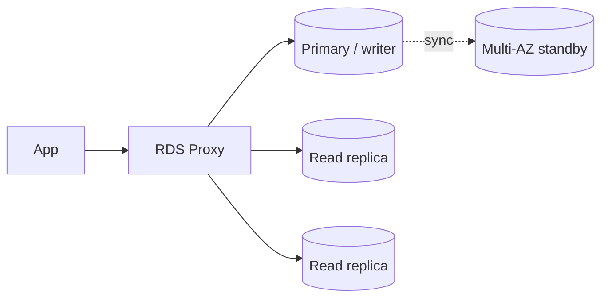

## DynamoDB: design for questions, not entities

In SQL you model data first and query later. In DynamoDB you **list your access patterns first**, then design keys to serve them.

Example access patterns for a shop:

1. Get a customer by ID.
2. List a customer's orders, newest first.
3. Get one order with its items.
4. Find orders by status.

### Keys

| Key | Role |
| --- | --- |
| **Partition key (PK)** | Hashed to choose the storage partition; must spread load evenly |
| **Sort key (SK)** | Orders items inside a partition; enables range queries |

Single-table design stores related items together:

| PK | SK | Data |
| --- | --- | --- |
| `CUSTOMER#42` | `PROFILE` | name, email |
| `CUSTOMER#42` | `ORDER#2025-03-01#9001` | total, status |
| `CUSTOMER#42` | `ORDER#2025-03-07#9014` | total, status |

```bash
# All orders for customer 42, newest first
aws dynamodb query --table-name shop \
  --key-condition-expression "PK = :pk AND begins_with(SK, :o)" \
  --expression-attribute-values '{":pk":{"S":"CUSTOMER#42"},":o":{"S":"ORDER#"}}' \
  --no-scan-index-forward
```

### Indexes

- **GSI** (global secondary index): a different PK/SK, eventually consistent, its own throughput. Use for "orders by status".
- **LSI**: same PK, different SK; must be created with the table.
- Use **sparse indexes**: only items that have the index attribute appear in it.

### Pitfalls

- **Hot partitions** from a low-cardinality key (such as `status=ACTIVE`). Add a suffix or shard the key.
- **Scan** reads the entire table. Avoid it in application paths.
- Items are limited to **400 KB**; store large blobs in S3 and keep the pointer.
- Choose **on-demand** capacity for unpredictable traffic and **provisioned with auto scaling** for steady traffic.

### Useful features

| Feature | Use |
| --- | --- |
| **TTL** | Auto-expire sessions or temporary data for free |
| **Streams** | Trigger Lambda on changes; build projections |
| **Transactions** | All-or-nothing across up to 100 items |
| **Conditional writes** | Optimistic locking: `attribute_not_exists(PK)` |
| **DAX** | In-memory cache for microsecond reads |
| **Global tables** | Multi-region active-active replication |
| **PITR** | Point-in-time recovery for the last 35 days |

## Relational scaling on RDS and Aurora



### Multi-AZ is for availability

- RDS **Multi-AZ** keeps a synchronous standby in another AZ and fails over automatically (typically 1 to 2 minutes). The standby does **not** serve reads in the classic single-standby setup.
- **Aurora** stores data in six copies across three AZs, and failover to a replica is usually faster.

### Read replicas are for read scale

- Asynchronous, so reads can be slightly stale (**replica lag**).
- Route reporting and read-heavy queries there. Do not read-your-own-write from a replica without handling lag.
- Aurora offers a **reader endpoint** that balances over replicas.

### RDS Proxy for connection storms

Lambda and autoscaling containers can open thousands of connections and exhaust the database. **RDS Proxy** pools and reuses connections, and speeds up failover because apps stay connected to the proxy.

### Other scaling tools

- **Aurora Serverless v2** scales capacity in fine steps for variable load.
- **Aurora Global Database** replicates to other regions with typically under a second of lag, for low-latency reads and disaster recovery.
- **ElastiCache** (Redis or Valkey) absorbs repeated reads.
- Fix queries first: use **Performance Insights**, add indexes, and check slow-query logs before buying a bigger instance.

## Backups and recovery

| Mechanism | Notes |
| --- | --- |
| Automated backups + PITR | Restore to any second within retention (up to 35 days) into a **new** instance |
| Manual snapshots | Kept until deleted; can be copied across regions and accounts |
| **AWS Backup** | Central policies, cross-account and cross-region copies, vault lock |

Restores create a new database, so plan the endpoint switch. Test restores regularly.

## Choosing quickly

| Need | Pick |
| --- | --- |
| Known access patterns, huge scale, low ops | DynamoDB |
| Joins, ad-hoc queries, transactions | Aurora or RDS |
| Variable relational load | Aurora Serverless v2 |
| Sub-millisecond repeated reads | ElastiCache or DAX |

## Remember this

- DynamoDB: write down access patterns first, avoid scans and hot keys.
- Multi-AZ gives availability; read replicas give read scale.
- Use RDS Proxy with Lambda and bursty clients.
- Backups matter only if restores are tested.
