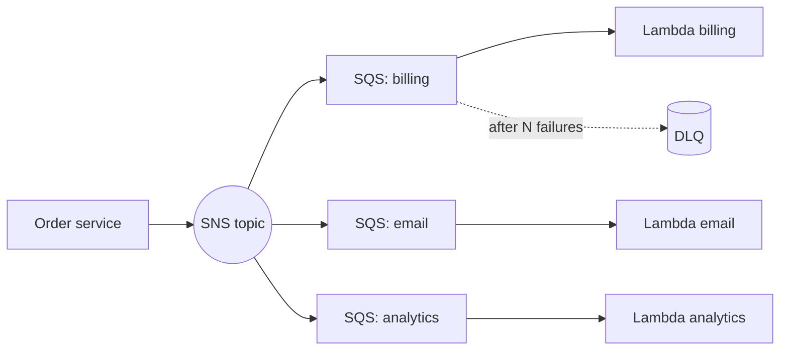

## Messages are delivered at least once

SQS standard queues, SNS, EventBridge and Lambda retries can all deliver a message **more than once**. Design for it: make handlers **idempotent**, so running twice gives the same result as running once.

```text
handler(event):
  key = event.orderId
  if already_processed(key): return        # e.g. conditional write in DynamoDB
  do_work()
  mark_processed(key)
```

A simple way is a DynamoDB conditional write: `PutItem` with `attribute_not_exists(id)`. **Powertools for AWS Lambda** ships an idempotency utility doing this for you.

## Choose the right glue

| Service | Pattern | Use when |
| --- | --- | --- |
| **SQS** | Queue, one consumer group | Buffering work, smoothing spikes |
| **SNS** | Pub/sub fan-out | One event, many subscribers |
| **EventBridge** | Event bus with rules and filtering | Routing events between services, SaaS and schedules |
| **Kinesis / MSK** | Ordered streams | High-throughput, replayable streams |
| **Step Functions** | Orchestrated workflow | Multi-step flows with branching, retries and waits |

**SNS to SQS fan-out** is a classic: publish once, and each team has its own queue and DLQ.



## Making SQS plus Lambda reliable

1. **Visibility timeout** must be at least **6 times** the Lambda timeout, so a message is not retried while still processing.
2. Configure a **dead-letter queue** with `maxReceiveCount` (3 to 5). Alarm on DLQ depth.
3. Enable **partial batch response** so one bad message does not retry the whole batch:

```json
{ "batchItemFailures": [ { "itemIdentifier": "msg-id-7" } ] }
```

4. Use **FIFO queues** with a `MessageGroupId` when order matters; remember the throughput limits per group.
5. Set **reserved concurrency** or event source `maximumConcurrency` so a burst cannot overwhelm your database.

## Lambda concurrency and cold starts

| Setting | Effect |
| --- | --- |
| **Reserved concurrency** | Guarantees and caps a function's concurrency |
| **Provisioned concurrency** | Keeps environments warm to avoid cold starts |
| **SnapStart** (Java and some runtimes) | Restores from a snapshot for faster start |

Reduce cold starts by keeping packages small, initializing SDK clients **outside** the handler, and choosing arm64 (Graviton) for lower cost.

## Step Functions: orchestration instead of spaghetti

Putting a multi-step flow inside one Lambda, or chaining Lambdas through queues, makes failures hard to follow. **Step Functions** draws the flow as a state machine with built-in retries, timeouts, waits and parallel branches.

```json
{
  "StartAt": "ChargeCard",
  "States": {
    "ChargeCard": {
      "Type": "Task",
      "Resource": "arn:aws:states:::lambda:invoke",
      "Parameters": { "FunctionName": "charge-card", "Payload.$": "$" },
      "Retry": [{
        "ErrorEquals": ["States.TaskFailed"],
        "IntervalSeconds": 2, "MaxAttempts": 3, "BackoffRate": 2.0
      }],
      "Catch": [{ "ErrorEquals": ["States.ALL"], "Next": "RefundAndFail" }],
      "Next": "ReserveStock"
    },
    "ReserveStock": { "Type": "Task", "Resource": "arn:aws:states:::lambda:invoke",
      "Parameters": { "FunctionName": "reserve-stock", "Payload.$": "$" }, "End": true },
    "RefundAndFail": { "Type": "Task", "Resource": "arn:aws:states:::lambda:invoke",
      "Parameters": { "FunctionName": "refund", "Payload.$": "$" }, "Next": "Failed" },
    "Failed": { "Type": "Fail" }
  }
}
```

| Workflow type | Best for |
| --- | --- |
| **Standard** | Long-running (up to 1 year), exactly-once execution, auditable history |
| **Express** | High-volume, short (up to 5 minutes), at-least-once, cheaper at scale |

Features worth knowing: `Map` for parallel iteration over a list, `Wait` for timers, **callback tokens** to pause for a human approval, and direct **SDK integrations** that call 200+ AWS services without a Lambda.

### The saga pattern

There are no distributed transactions across services. Instead each step has a **compensating action** (charge, then refund). The `Catch` above is a tiny saga.

## EventBridge tips

- Create **custom buses** per domain and filter with event patterns:

```json
{ "source": ["shop.orders"], "detail-type": ["OrderPlaced"], "detail": { "total": [{ "numeric": [">", 100] }] } }
```

- **Archive and replay** events to recover from bugs.
- **Pipes** connect a source (SQS, DynamoDB stream) to a target with optional filtering and enrichment.
- Use **EventBridge Scheduler** for one-off and recurring tasks at scale.
- Register schemas in the **schema registry** to keep producers and consumers aligned.

## Remember this

- Assume duplicates: idempotent handlers, DLQs, and partial batch responses.
- Visibility timeout at least 6 times the function timeout.
- Fan out with SNS plus SQS; route with EventBridge; orchestrate with Step Functions.
- Use sagas with compensation instead of hoping for distributed transactions.
