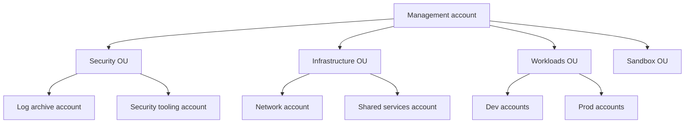
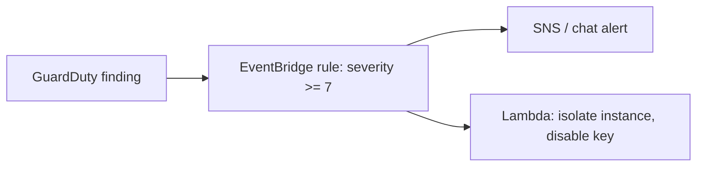

## Why many accounts

An AWS account is the strongest isolation boundary: separate permissions, quotas, billing and blast radius. Mature organizations use **many accounts**, not one big one.



Typical split:

- **Management account**: billing and Organizations only; no workloads.
- **Log archive**: immutable, centralized CloudTrail and Config logs.
- **Security tooling**: GuardDuty, Security Hub and Access Analyzer administration.
- **Network**: Transit Gateway, shared egress and inspection.
- **Workload accounts**: per team, per environment (dev, staging, prod).

## AWS Organizations and SCPs

**Service Control Policies** set the maximum permissions for every principal in an account, including the root user. They are guardrails, not grants.

```json
{
  "Version": "2012-10-17",
  "Statement": [
    {
      "Sid": "DenyOutsideApprovedRegions",
      "Effect": "Deny",
      "NotAction": ["iam:*", "organizations:*", "sts:*", "cloudfront:*", "route53:*", "support:*"],
      "Resource": "*",
      "Condition": { "StringNotEquals": { "aws:RequestedRegion": ["ap-south-1", "eu-west-1"] } }
    },
    {
      "Sid": "ProtectSecurityServices",
      "Effect": "Deny",
      "Action": ["cloudtrail:StopLogging", "cloudtrail:DeleteTrail", "guardduty:DeleteDetector", "config:StopConfigurationRecorder"],
      "Resource": "*"
    }
  ]
}
```

Test SCPs on a sandbox OU first. A bad SCP can lock teams out.

## Control Tower and landing zones

**AWS Control Tower** builds a landing zone: OU structure, log archive, baseline guardrails (preventive SCPs and detective Config rules), and **Account Factory** to vend new accounts consistently. Customize with **Account Factory for Terraform** or CloudFormation StackSets so every account gets the same baseline.

## Access across many accounts

- Use **IAM Identity Center** (SSO) with permission sets assigned per account and group, tied to your identity provider.
- Avoid IAM users; use short-lived SSO credentials.
- Deploy pipelines assume a **role in the target account** through OIDC or cross-account trust (see the IAM deep dive).
- Use **AWS RAM** to share resources (subnets, Transit Gateway) instead of duplicating them.

## Detective controls: know what happened

| Service | What it gives you |
| --- | --- |
| **CloudTrail** | Who called which API, when, from where. Use an **organization trail** to a locked S3 bucket with log file validation |
| **AWS Config** | Resource configuration history and compliance rules (for example "S3 buckets must not be public") with auto-remediation |
| **GuardDuty** | Threat detection from CloudTrail, VPC Flow Logs, DNS and S3, EKS and malware scanning |
| **Security Hub** | Aggregates findings and scores against standards (CIS, AWS Foundational) |
| **Macie** | Finds sensitive data in S3 |
| **Inspector** | Vulnerability scanning for EC2, ECR images and Lambda |
| **IAM Access Analyzer** | External and unused access findings |

Wire findings into **EventBridge** so critical ones trigger a Lambda, ticket or chat alert, or an automated fix:



## Preventive controls checklist

- Block public S3 access at the **account** level.
- Enforce encryption (EBS default encryption, S3 default encryption, RDS encrypted).
- Require **IMDSv2** on EC2.
- Disable root access keys and enable MFA on the root user.
- Use **customer managed KMS keys** with key policies for sensitive data.
- Tag everything (owner, environment, cost-center) and enforce with **tag policies**.

## Incident response outline

1. **Detect**: GuardDuty, alarms, anomaly in CloudTrail.
2. **Contain**: revoke sessions (attach an explicit deny with a `TokenIssueTime` condition), isolate the instance with a quarantine security group, rotate keys.
3. **Investigate**: snapshot disks, preserve logs in the log archive, query with Athena or CloudTrail Lake.
4. **Recover**: redeploy from known-good infrastructure as code.
5. **Learn**: write the blameless post-mortem and add a guardrail.

Prepare in advance with runbooks and a dedicated, pre-approved **break-glass role**.

## Remember this

- Use many accounts grouped into OUs; keep the management account empty of workloads.
- SCPs are guardrails that cap every principal, including root.
- Centralize CloudTrail and Config in a protected log archive account.
- Automate response with EventBridge, and keep a tested incident runbook.
