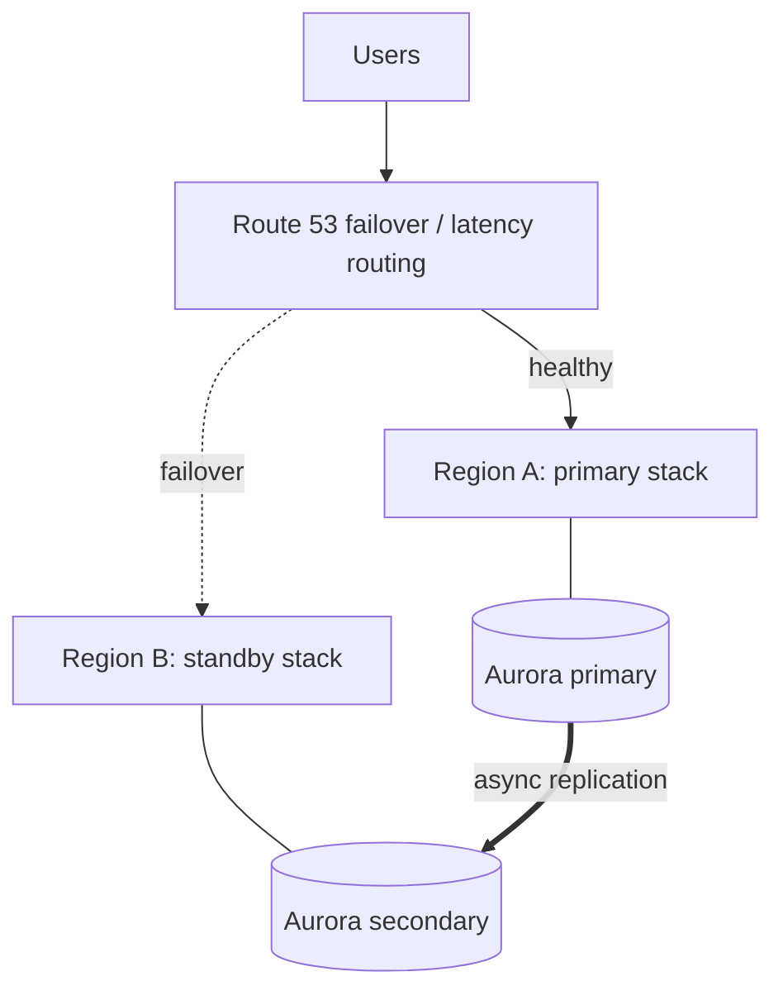

## Start with two numbers

| Term | Question |
| --- | --- |
| **RPO** (recovery point objective) | How much data can we afford to lose? (time) |
| **RTO** (recovery time objective) | How long can we be down? (time) |

These come from the business, not from engineering. Tighter targets cost much more, so define them **per workload**, not for everything.

## Failure scopes

| Scope | Example failure | Defence |
| --- | --- | --- |
| Instance / task | Crash, bad deploy | Auto Scaling, health checks, rollback |
| **Availability Zone** | Power or network loss in one data centre group | Run in 2 or 3 AZs |
| **Region** | Rare regional service disruption | DR region or active-active |
| Account / human | Deleted data, compromised credentials | Backups in another account, vault lock |
| Dependency | Third-party outage | Timeouts, circuit breakers, graceful degradation |

Most outages are caused by **change** (bad deploys, configuration) and **human error**, not by regions disappearing. Multi-AZ plus excellent deployment practices cover most needs.

## The four DR strategies


| Strategy | RTO / RPO | How it works | Cost |
| --- | --- | --- | --- |
| **Backup and restore** | Hours | Copy backups to another region; rebuild from IaC after a disaster | Lowest |
| **Pilot light** | Tens of minutes | Data replicated and running; app servers off, started on demand | Low |
| **Warm standby** | Minutes | Scaled-down full copy always running; scale up on failover | Medium |
| **Active-active** | Near zero | Both regions serve traffic | Highest, most complex |

## Building blocks by layer

**Compute**: everything as code (CloudFormation, CDK, Terraform) and container images replicated with **ECR cross-region replication**; AMIs copied to the DR region.

**Data** is the hard part:

| Data store | Cross-region feature |
| --- | --- |
| S3 | **Cross-Region Replication** (needs versioning; replicates new objects) |
| DynamoDB | **Global tables** (multi-writer, last-writer-wins) |
| Aurora | **Global Database** (typical lag under a second; promote the secondary) |
| RDS | Cross-region read replica or automated backup replication |
| EBS / EC2 | Snapshots copied cross-region; **AWS Elastic Disaster Recovery** for servers |
| Secrets / KMS | Multi-region secrets and **multi-Region KMS keys** |

**Traffic**: Route 53 health checks with failover or latency routing, or **Global Accelerator** for fast failover without waiting for DNS TTLs. For control of failover decisions during major events, use **Application Recovery Controller** routing controls.



## Designing for failure inside a region

- Spread across **at least 2 AZs**; size so the loss of one AZ still handles load (N+1).
- Make services **stateless**; put state in managed, replicated stores.
- Prefer **static stability**: a system that keeps working without calling the control plane at failure time. Pre-provision capacity rather than depending on scaling during an AZ failure.
- Use **timeouts, retries with exponential backoff and jitter**, **circuit breakers**, and **bulkheads** so one slow dependency does not take down everything.
- Apply **load shedding** and graceful degradation: serve cached or reduced features rather than errors.
- Use **health checks** that reflect real readiness, but beware shallow checks that mark everything healthy and deep checks that cascade failures.

```text
delay = random(0, min(cap, base * 2^attempt))      # exponential backoff with full jitter
```

## Backups that survive disasters

- Use **AWS Backup** with plans for RDS, DynamoDB, EFS, EBS and S3.
- Copy backups to a **separate account** and region.
- Turn on **Backup Vault Lock** (WORM) to protect against ransomware and deletion.
- Enable **S3 versioning**, MFA delete where appropriate, and **Object Lock** for compliance data.

## Test, do not assume

1. **Game days**: rehearse an AZ loss and a region failover.
2. **AWS Fault Injection Service** injects failures (stop instances, throttle APIs, add latency) in a controlled way.
3. Restore backups into a clean environment and time it against your RTO.
4. Document runbooks and keep them close to the on-call team; automate steps wherever possible.
5. Use the **AWS Resilience Hub** to assess an application against RTO and RPO targets.

Also run failback plans: returning to the primary region is another migration.

## Remember this

- Set RTO and RPO per workload; pick the cheapest DR strategy that meets them.
- Multi-AZ solves most availability needs; multi-region is for rare and critical cases.
- Data replication is the hardest part; use native cross-region features.
- Protect backups in a separate account with vault lock, and test restores and failovers regularly.
