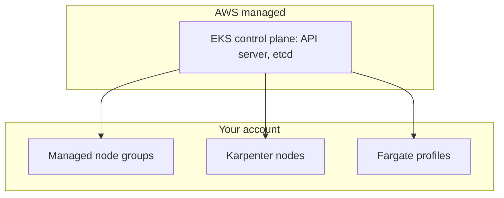

## ECS or EKS?

| | ECS | EKS |
| --- | --- | --- |
| Control plane | AWS-native, no extra fee | Managed Kubernetes, hourly fee per cluster |
| Learning curve | Lower | Higher |
| Portability | AWS-specific | Standard Kubernetes APIs |
| Ecosystem | Smaller | Huge (Helm, operators, service meshes, GitOps) |
| Best for | Teams who want simple, AWS-integrated containers | Teams already using Kubernetes or needing its ecosystem |

Neither is "more advanced". Choose ECS unless you have a concrete reason for Kubernetes.

## ECS production patterns

### Deployment safety

```json
"deploymentConfiguration": {
  "minimumHealthyPercent": 100,
  "maximumPercent": 200,
  "deploymentCircuitBreaker": { "enable": true, "rollback": true }
}
```

- The **deployment circuit breaker** stops and rolls back a rollout when new tasks keep failing.
- **CodeDeploy blue/green** shifts traffic between two target groups with linear or canary patterns and CloudWatch alarm rollback.
- Set a load balancer **health check grace period** for slow-starting apps and a deregistration delay for connection draining.
- Handle `SIGTERM`; `stopTimeout` controls the wait before `SIGKILL`.

### Scaling

| Policy | Behaviour |
| --- | --- |
| **Target tracking** | Hold average CPU at 60% or `ALBRequestCountPerTarget` at a target |
| **Step scaling** | Add or remove tasks by alarm thresholds |
| **Scheduled** | Scale for known peaks |
| **Queue-based** | Scale workers on SQS backlog per task |

For EC2 launch type, **capacity providers** with managed scaling grow the instance pool when tasks cannot be placed. **Fargate Spot** can cut cost for interruptible workers, as it can reclaim capacity with a two-minute warning.

### Service-to-service communication

- **ECS Service Connect** gives short DNS names, load balancing, retries and metrics between services without managing a mesh.
- **Cloud Map** is the service discovery layer underneath.
- Use an internal ALB for simple request routing, or VPC Lattice for cross-VPC and cross-account service networking.

### Security and operations

- One **task role** per service with least privilege; separate **execution role**.
- Inject secrets from **Secrets Manager or SSM Parameter Store** with the task definition `secrets` field.
- Use **awsvpc** networking so each task has its own ENI and security group.
- **ECS Exec** gives a shell into a running task for debugging, audited through CloudTrail.
- Enable **Container Insights** for CPU, memory and network metrics; ship logs with `awslogs` or FireLens (Fluent Bit).

## EKS essentials



### Compute options

| Option | Notes |
| --- | --- |
| **Managed node groups** | AWS manages EC2 lifecycle and rolling upgrades |
| **Karpenter** | Provisions the right instance for pending pods in seconds; consolidates and uses Spot well |
| **Fargate** | Serverless pods; fewer features (no DaemonSets, limited storage options) |
| **EKS Auto Mode** | AWS manages compute, networking and storage add-ons for you |

### Identity: pods need AWS permissions

Never give nodes broad roles. Map **Kubernetes ServiceAccounts to IAM roles**:

- **EKS Pod Identity** (simpler, association-based) or **IRSA** (OIDC-based).
- The pod receives short-lived credentials for only its own role.

For user access to the cluster, use **EKS access entries** and map IAM principals to Kubernetes RBAC.

### Networking

- The **VPC CNI** gives pods real VPC IP addresses. Plan subnet sizes, or use prefix delegation or custom networking if IPs run out.
- Use the **AWS Load Balancer Controller** to turn Ingress or Service resources into ALBs and NLBs (use `target-type: ip`).
- Enforce **NetworkPolicies** with VPC CNI network policy support or Cilium, and attach **security groups for pods** when needed.
- Add **external-dns** and **cert-manager** or ACM for DNS and certificates.

### Operations

- Upgrade one minor version at a time: control plane, then node groups, then add-ons. Plan for the support window of each version.
- Manage add-ons (CoreDNS, kube-proxy, VPC CNI, EBS CSI) as **EKS add-ons**.
- Use **GitOps** (Argo CD or Flux) and infrastructure as code (Terraform, CDK, eksctl) for repeatable clusters.
- Observe with **Container Insights**, Amazon Managed Prometheus and Grafana, or your own stack.
- Control cost: right-size requests, use Spot via Karpenter for tolerant workloads, and use Savings Plans for the stable base.
- Keep the API endpoint private or restricted by CIDR, and enable **control plane logging** (audit, authenticator).

## Image supply chain

- Scan images with **ECR enhanced scanning** (Inspector).
- Use **immutable tags** and pull by digest in production.
- Add **lifecycle policies** to expire old images.
- Replicate to other regions for DR, and use pull-through cache for public registries to avoid rate limits.

## Decision guide

| Situation | Choice |
| --- | --- |
| Small team, a handful of services | ECS on Fargate |
| Cost-sensitive steady workload | ECS on EC2 or EKS with Karpenter plus Savings Plans |
| Need Helm charts, operators, portability | EKS |
| Event-driven, spiky, short tasks | Lambda or Fargate tasks |

## Remember this

- ECS is simpler and AWS-native; EKS brings the Kubernetes ecosystem and its complexity.
- Use circuit breakers or blue/green for safe deployments.
- Use task roles, Pod Identity or IRSA; never share node-wide credentials.
- Karpenter, Spot and right-sized requests are the main EKS cost levers.
