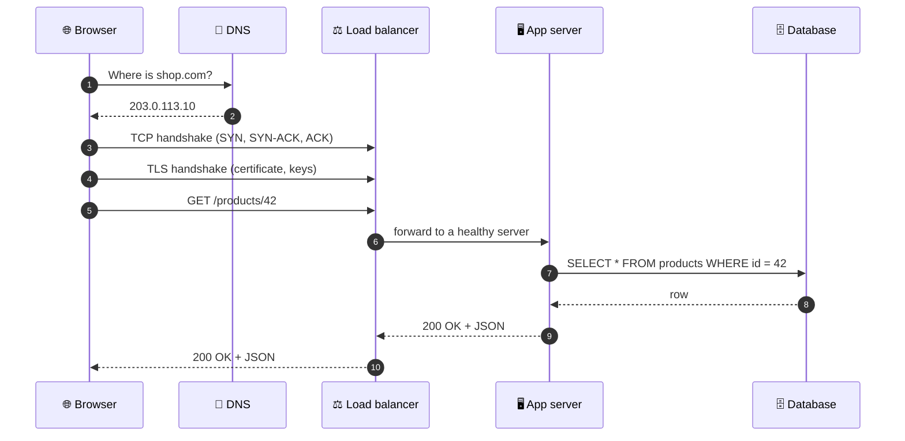
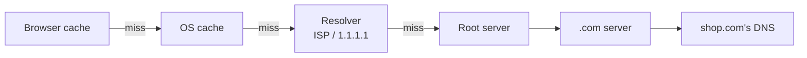
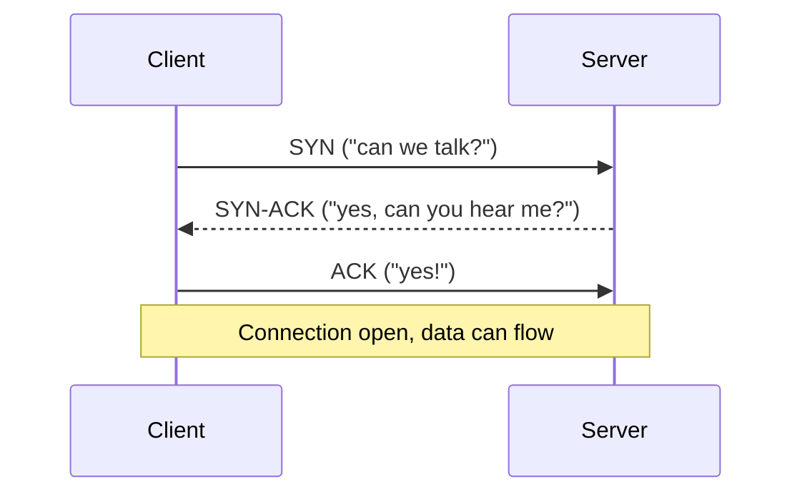
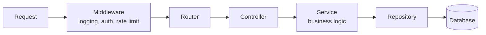
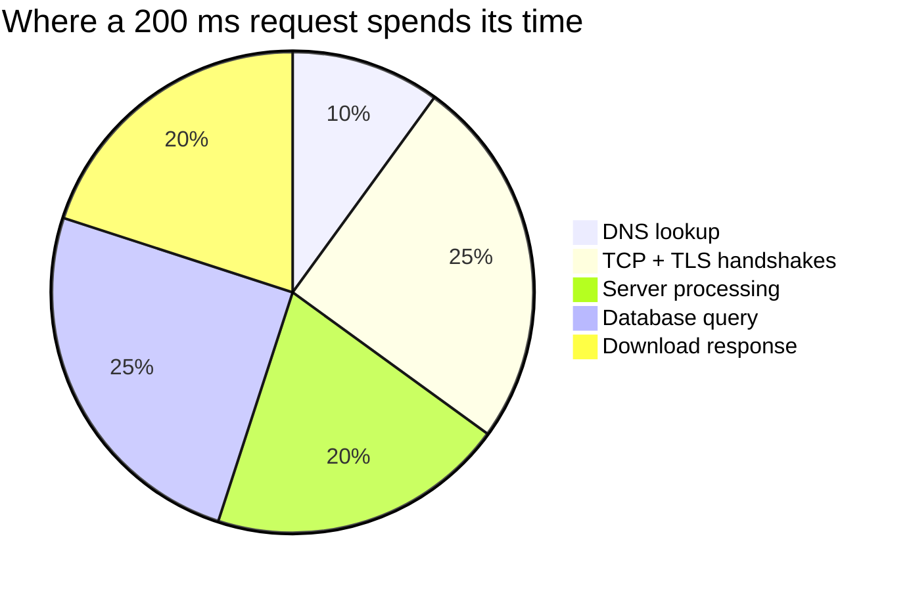

## The big idea

Sending a request is like **mailing a letter**:

1. You know the person's name, but you need their **address** → **DNS** turns `shop.com` into an IP address.
2. You establish a reliable **delivery route** → **TCP** connection.
3. You put the letter in a **sealed envelope** → **TLS** encryption (the "S" in HTTPS).
4. You write the letter in a **format everyone understands** → **HTTP**.
5. Someone at the destination **reads it and replies** → your **server code** (often asking a **database**).


## Step by step



### 1. DNS: the internet's phone book

Computers talk using IP addresses (`142.250.74.46`), but humans remember names (`google.com`). DNS translates them, with caching at every level: the browser, the OS, your router and your ISP.



### 2. TCP: a reliable connection

TCP guarantees that data arrives **complete and in order**, resending lost packets. It starts with a **three-way handshake**:



### 3. TLS: the sealed envelope

TLS encrypts everything so nobody in between (Wi-Fi owner, ISP) can read or change it. The server proves its identity with a **certificate** signed by a trusted authority, which is the padlock 🔒 in your address bar.

### 4. HTTP: the language of the web

An HTTP request is just text:

```http
GET /products/42 HTTP/1.1
Host: shop.com
Accept: application/json
Authorization: Bearer eyJhbGciOi...
```

And the response:

```http
HTTP/1.1 200 OK
Content-Type: application/json
Cache-Control: max-age=60

{ "id": 42, "name": "Keyboard", "price": 49.99 }
```

#### HTTP methods

| Method | Meaning | Safe? | Idempotent? |
| --- | --- | --- | --- |
| `GET` | Read | ✅ | ✅ |
| `POST` | Create / action | ❌ | ❌ |
| `PUT` | Replace | ❌ | ✅ |
| `PATCH` | Partial update | ❌ | ❌* |
| `DELETE` | Remove | ❌ | ✅ |

> 💡 **Idempotent** = doing it twice has the same effect as doing it once. Deleting order 42 twice still leaves it deleted. Charging a card twice… is not idempotent! (See *REST API Design*.)

#### Status codes by family

| Range | Meaning | Common ones |
| --- | --- | --- |
| **2xx** ✅ | Success | 200 OK, 201 Created, 204 No Content |
| **3xx** ↪️ | Redirect | 301 Moved Permanently, 304 Not Modified |
| **4xx** 🙋 | *Client* made a mistake | 400 Bad Request, 401 Unauthorized, 403 Forbidden, 404 Not Found, 409 Conflict, 429 Too Many Requests |
| **5xx** 💥 | *Server* failed | 500 Internal Error, 502 Bad Gateway, 503 Unavailable, 504 Gateway Timeout |

### 5. Your server code

Inside the server, a request typically passes through layers:



```js
// A minimal Node.js (Express) endpoint
app.get("/products/:id", async (req, res) => {
  const product = await productService.getById(req.params.id);
  if (!product) return res.status(404).json({ error: "Product not found" });
  res.set("Cache-Control", "public, max-age=60").json(product);
});
```

## HTTP versions at a glance

| Version | Year | Key idea |
| --- | --- | --- |
| HTTP/1.1 | 1997 | Text protocol, one request at a time per connection |
| HTTP/2 | 2015 | Binary, **multiplexing**: many requests share one connection |
| HTTP/3 | 2022 | Runs on **QUIC** (UDP): faster setup, no head-of-line blocking |

## Where time goes

A typical 200 ms page request might be spent roughly like this:



That's why we use **CDNs** (serve from nearby), **keep-alive** connections (skip handshakes), **caching** and **database indexes**. All covered in later lessons.

## Key takeaways

- DNS finds the address, TCP makes a reliable connection, TLS encrypts it, HTTP carries the message.
- HTTP methods have meanings: GET reads, POST creates, PUT replaces, PATCH updates, DELETE removes.
- 4xx = the client's fault, 5xx = the server's fault.
- Inside the server: middleware → router → controller → service → database.
- Performance work targets each hop: DNS, handshakes, server time, queries and payload size.
