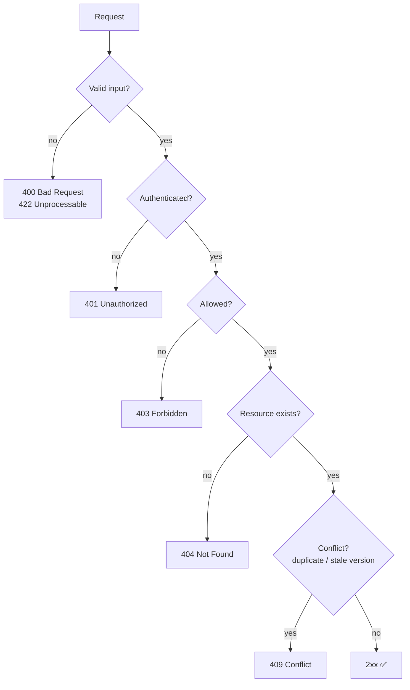
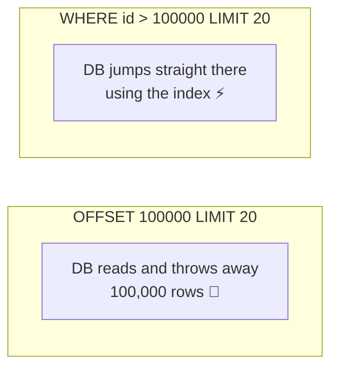
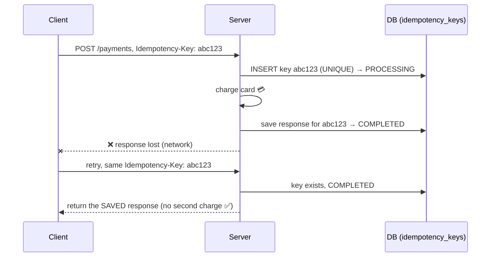

## The big idea

A good API is like a well-organised **restaurant menu**: items are grouped logically, named clearly, and ordering works the same way for every dish. Once you've ordered one thing, you can guess how to order anything.

**REST** (Representational State Transfer) organises an API around **resources** (nouns like `users`, `orders`) and uses **HTTP methods** (verbs) to act on them.


## Rule 1: URLs are nouns, methods are verbs

| ❌ Verb in the URL | ✅ RESTful |
| --- | --- |
| `GET /getAllUsers` | `GET /users` |
| `POST /createUser` | `POST /users` |
| `GET /getUser?id=42` | `GET /users/42` |
| `POST /updateUser/42` | `PATCH /users/42` |
| `POST /deleteUser/42` | `DELETE /users/42` |
| `GET /getOrdersOfUser/42` | `GET /users/42/orders` |

### The standard CRUD map

| Action | Method + path | Success status |
| --- | --- | --- |
| List | `GET /articles` | 200 |
| Read one | `GET /articles/7` | 200 (or 404) |
| Create | `POST /articles` | **201** + `Location: /articles/7` |
| Replace | `PUT /articles/7` | 200 |
| Partial update | `PATCH /articles/7` | 200 |
| Delete | `DELETE /articles/7` | **204** No Content |

### Naming conventions

- **Plural nouns:** `/users`, not `/user`.
- **Lowercase, hyphens:** `/order-items`, not `/orderItems` or `/Order_Items`.
- **Nest only one level** for ownership: `/users/42/orders` ✅, `/users/42/orders/9/items/3/reviews` ❌ (use `/reviews?itemId=3`).
- **Actions that aren't CRUD:** use a sub-resource: `POST /orders/9/cancel`, `POST /users/42/password-reset`.

## Rule 2: Use status codes honestly



> ⚠️ Never return `200 OK` with `{ "error": "not found" }` in the body. Clients, caches and monitoring tools all rely on the status code.

## Rule 3: Consistent error format

Pick one error shape and use it everywhere. [RFC 9457 "Problem Details"](https://www.rfc-editor.org/rfc/rfc9457) is a good standard:

```json
{
  "type": "https://api.shop.com/errors/validation",
  "title": "Validation failed",
  "status": 422,
  "detail": "The request body has 2 invalid fields.",
  "errors": [
    { "field": "email", "message": "must be a valid email" },
    { "field": "age", "message": "must be at least 18" }
  ],
  "traceId": "a1b2c3d4"
}
```

## Rule 4: Paginate, filter and sort lists

Never return an unbounded list; one day it will be a million rows.

```http
GET /products?category=keyboards&minPrice=20&sort=-price&limit=20&cursor=eyJpZCI6MTAwfQ
```

| Style | Request | Pros | Cons |
| --- | --- | --- | --- |
| **Offset** | `?page=3&limit=20` | Simple, jump to any page | Slow on big tables; items shift when data changes |
| **Cursor** | `?cursor=abc&limit=20` | Fast and stable at any scale | Can't jump to page 50 |

```json
{
  "data": [ { "id": 101, "name": "Keyboard" } ],
  "pagination": { "nextCursor": "eyJpZCI6MTIwfQ", "hasMore": true }
}
```



## Rule 5: Idempotency for unsafe retries ⭐

Networks fail. A client sends `POST /payments`, the connection drops, and the client doesn't know if the payment happened. It retries… and the customer is **charged twice**.

**Fix:** the client sends a unique **Idempotency-Key**. The server remembers the result for that key and returns it again on a retry instead of charging again.



```js
app.post("/payments", async (req, res) => {
  const key = req.get("Idempotency-Key");
  if (!key) return res.status(400).json({ error: "Idempotency-Key header is required" });

  const existing = await idempotency.find(key);
  if (existing?.status === "COMPLETED") return res.status(existing.code).json(existing.body);
  if (existing?.status === "PROCESSING") return res.status(409).json({ error: "Request in progress" });

  await idempotency.start(key, hash(req.body)); // UNIQUE constraint stops concurrent duplicates
  const payment = await payments.charge(req.body, { idempotencyKey: key }); // pass it to the provider too
  await idempotency.complete(key, 201, payment);
  res.status(201).json(payment);
});
```

## Rule 6: Version your API

Once clients depend on your API, breaking changes hurt them. Common strategies:

| Strategy | Example |
| --- | --- |
| URL path (most common) | `/v1/users`, `/v2/users` |
| Header | `Accept: application/vnd.shop.v2+json` |
| Query | `/users?version=2` |

**Non-breaking changes** (adding a field, adding an endpoint) don't need a new version. **Breaking changes** (removing or renaming a field, changing a type) do.

## Rule 7: Document it with OpenAPI

An **OpenAPI** (Swagger) spec describes every endpoint in YAML/JSON. From it you get interactive docs, client SDK generation, request validation and contract tests.

```yaml
paths:
  /users/{id}:
    get:
      summary: Get a user by id
      parameters:
        - { name: id, in: path, required: true, schema: { type: string } }
      responses:
        "200": { description: The user, content: { application/json: { schema: { $ref: "#/components/schemas/User" } } } }
        "404": { description: User not found }
```

## Checklist

- [ ] Plural nouns, no verbs in paths
- [ ] Correct methods and status codes
- [ ] One consistent error format
- [ ] Pagination on every list endpoint
- [ ] Idempotency keys for payments and other critical POSTs
- [ ] Versioning strategy decided
- [ ] Authentication on every non-public route (see *Authentication & Security*)
- [ ] Rate limiting (see *Scaling*)
- [ ] OpenAPI documentation

## Key takeaways

- Resources are nouns in the URL; actions are HTTP methods.
- Status codes tell the truth: 2xx success, 4xx client error, 5xx server error.
- Paginate lists; prefer cursors at scale.
- Idempotency keys make retries of payments and other critical POSTs safe.
- Version breaking changes and document everything with OpenAPI.
