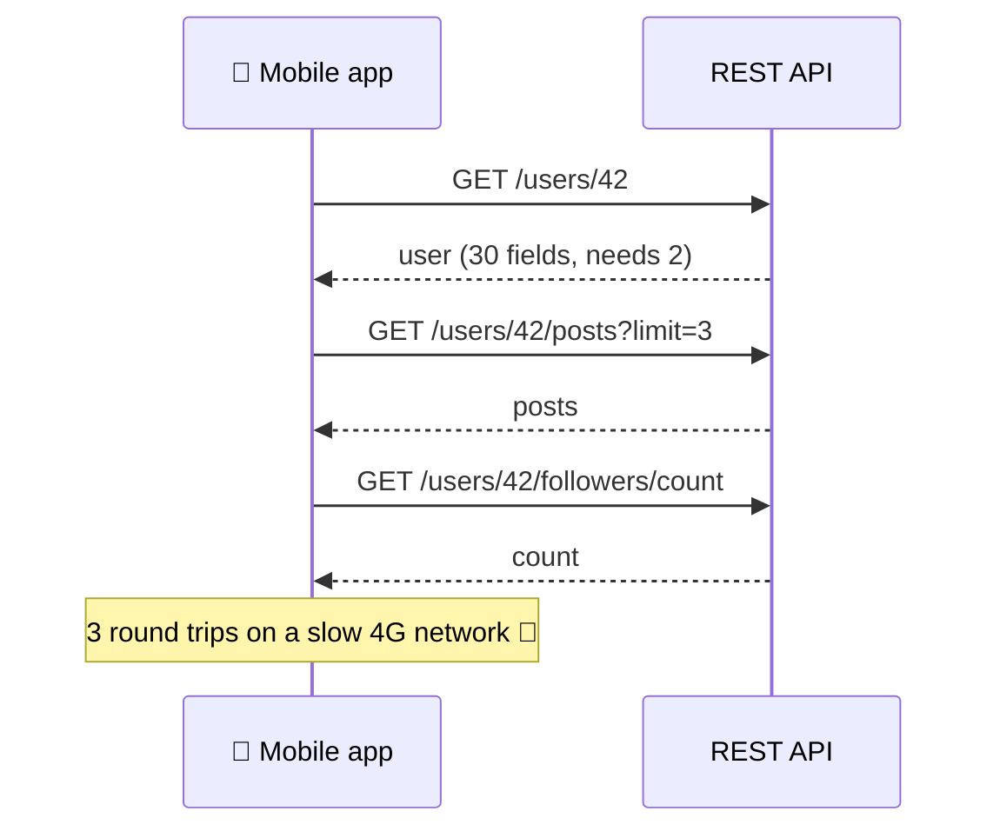
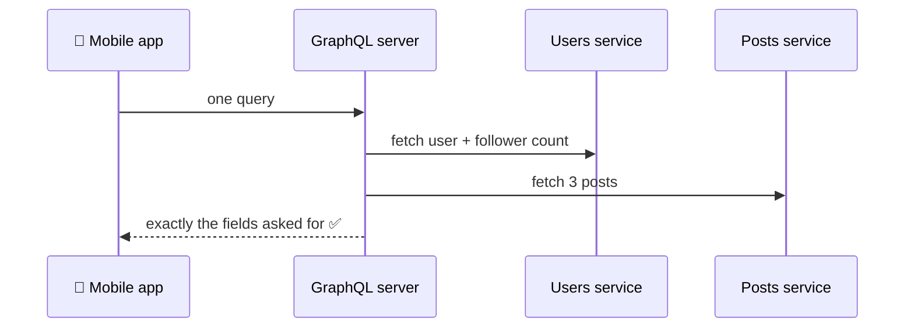
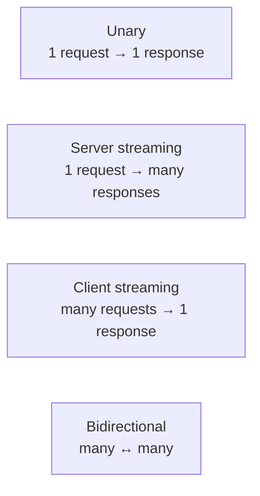
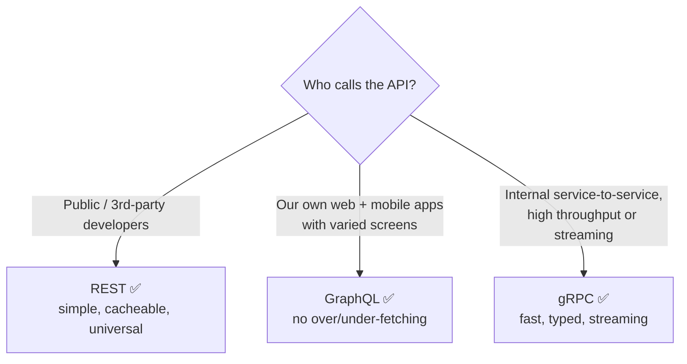
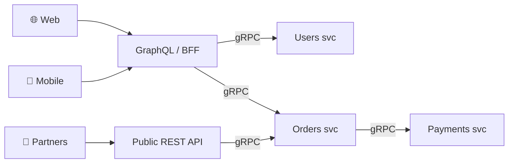

## The big idea

Three ways to order food:

- **REST** 🍱 = a **set menu**. Each dish (endpoint) comes as the kitchen designed it. Simple and predictable, but you might get extra sides you didn't want or need to order several dishes.
- **GraphQL** 🥗 = a **build-your-own salad bar**. You list exactly the ingredients you want, and get them in one bowl.
- **gRPC** 📞 = the **kitchen's internal intercom**. Super fast, strict shorthand between staff. Not meant for customers.


## REST: resources over HTTP

```http
GET /users/42
GET /users/42/posts?limit=3
GET /users/42/followers/count
```

**Problems it can have:**

- **Over-fetching:** `GET /users/42` returns 30 fields when the screen needs 2.
- **Under-fetching:** the profile screen needs 3 round trips (user + posts + followers).



## GraphQL: ask for exactly what you need

One endpoint (`POST /graphql`). The client sends a **query** describing the exact shape it wants:

```graphql
query ProfileScreen {
  user(id: 42) {
    name
    avatarUrl
    posts(limit: 3) { title likes }
    followers { totalCount }
  }
}
```

```json
{
  "data": {
    "user": {
      "name": "Ana",
      "avatarUrl": "https://…/ana.png",
      "posts": [{ "title": "Hello GraphQL", "likes": 12 }],
      "followers": { "totalCount": 1284 }
    }
  }
}
```



The server defines a **schema** (a typed contract) and **resolvers** (functions that fetch each field):

```graphql
type User {
  id: ID!
  name: String!
  avatarUrl: String
  posts(limit: Int = 10): [Post!]!
}

type Query {
  user(id: ID!): User
}

type Mutation {
  createPost(title: String!, body: String!): Post!
}
```

```js
const resolvers = {
  Query: { user: (_, { id }) => usersRepo.findById(id) },
  User: { posts: (user, { limit }) => postsRepo.byAuthor(user.id, limit) },
};
```

> ⚠️ **The N+1 problem:** listing 50 users and their posts can trigger 1 query for users + 50 queries for posts. Fix it with **DataLoader**, which batches those 50 calls into one `WHERE author_id IN (...)`.

**GraphQL challenges:** HTTP caching is harder (everything is a POST to one URL), expensive queries need depth/complexity limits, and the server is more complex.

## gRPC: fast, typed calls between services

gRPC (from Google) lets one service call a function on another as if it were local. Contracts are written in **Protocol Buffers** (`.proto`), and data travels as compact **binary** over **HTTP/2**.

```protobuf
syntax = "proto3";

service OrderService {
  rpc GetOrder (GetOrderRequest) returns (Order);
  rpc StreamOrderUpdates (GetOrderRequest) returns (stream OrderStatus); // server streaming
}

message GetOrderRequest { string order_id = 1; }

message Order {
  string id = 1;
  string customer_id = 2;
  double total = 3;
  repeated string items = 4;
}
```

From this file, tools **generate client and server code** in Go, Java, Node.js, Python…

```js
// Node.js client (generated stubs make it feel like a local call)
const order = await orderClient.getOrder({ orderId: "ord_123" });
```

### The four gRPC call types



**Why it's fast:** binary payloads are 3–10× smaller than JSON, HTTP/2 multiplexes many calls on one connection, and nothing is parsed from text.

**Limits:** browsers can't call gRPC directly (you need gRPC-Web or a proxy), payloads aren't human-readable, and it needs tooling for debugging.

## Side-by-side comparison

| | REST | GraphQL | gRPC |
| --- | --- | --- | --- |
| **Style** | Resources + HTTP verbs | Query language, one endpoint | Remote procedure calls |
| **Format** | JSON (text) | JSON (text) | Protobuf (binary) |
| **Transport** | HTTP/1.1 or 2 | HTTP | HTTP/2 |
| **Contract** | OpenAPI (optional) | Schema (required) | `.proto` (required) |
| **Data fetched** | Server decides | **Client decides** | Server decides |
| **HTTP caching** | ✅ Easy (GET + CDN) | ❌ Harder | ❌ No |
| **Streaming** | SSE / WebSockets separately | Subscriptions | ✅ Built in |
| **Browser support** | ✅ Native | ✅ Native | ⚠️ Needs gRPC-Web |
| **Performance** | Good | Good | **Excellent** |
| **Learning curve** | Low | Medium | Medium |

## Which should I choose?



Many companies use **all three**: gRPC between internal microservices, a GraphQL or **BFF** (Backend for Frontend) layer for their apps, and REST for public partners.



## Key takeaways

- **REST:** simple, cacheable, great for public APIs; can over- or under-fetch.
- **GraphQL:** the client asks for exactly what it needs in one request; watch out for N+1 and query cost.
- **gRPC:** binary, typed and streaming over HTTP/2; ideal between internal services.
- Choose by *who calls the API*, not by trends. Mixing them is normal.
