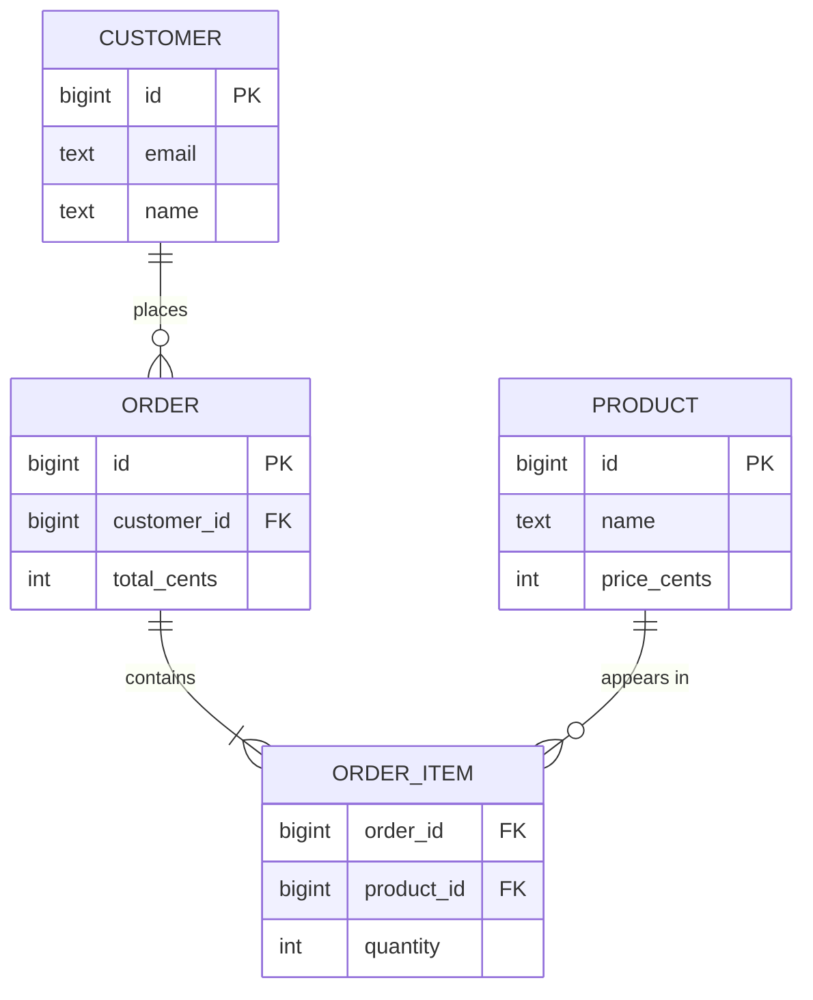
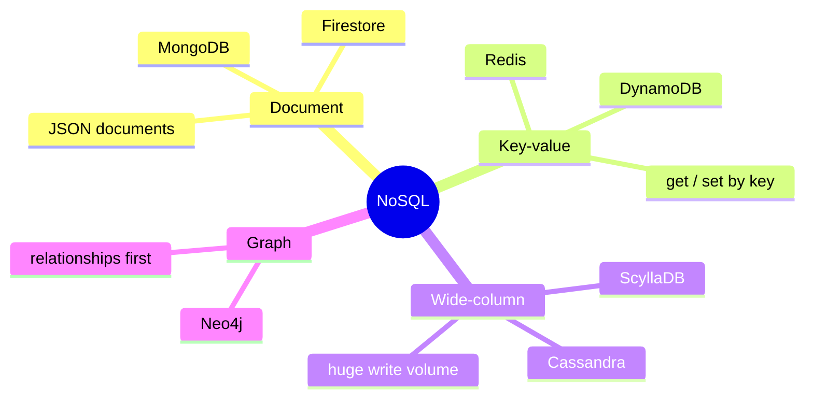
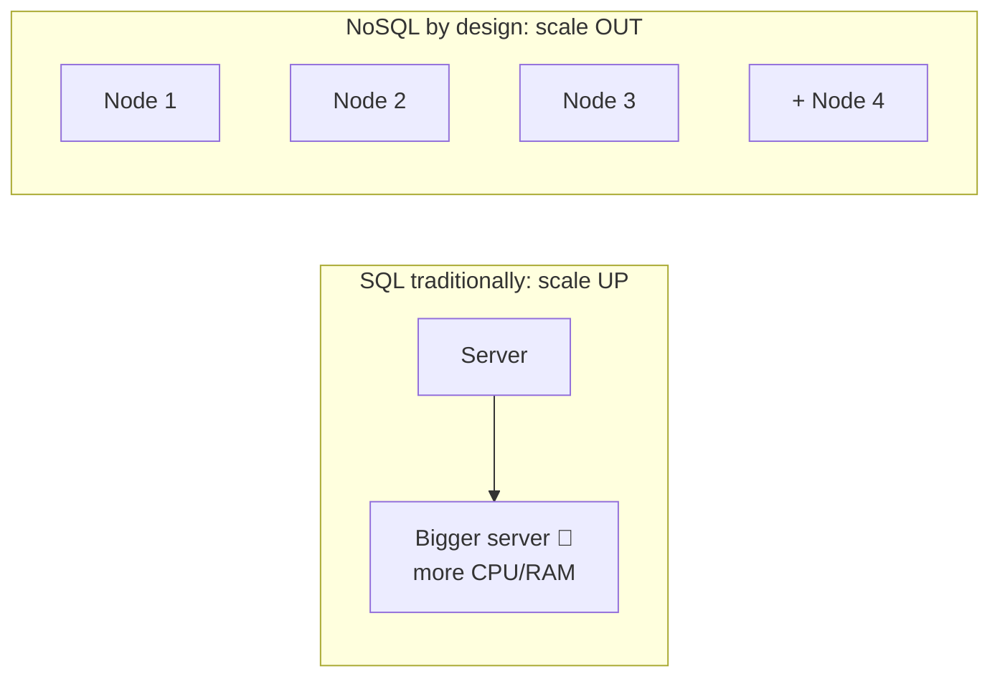
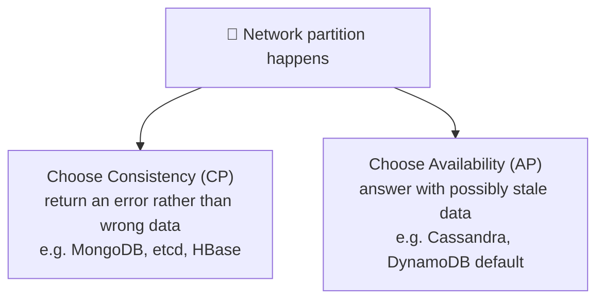

## The big idea

- **SQL (relational)** is like a set of **spreadsheets with strict columns** that reference each other: a `customers` sheet, an `orders` sheet, linked by customer ID. Very organised, very consistent.
- **NoSQL** is like a **filing cabinet of folders**: each folder (document) holds everything about one thing, and folders don't have to look identical.


## SQL: tables, rows, relationships

```sql
CREATE TABLE customers (
  id         BIGSERIAL PRIMARY KEY,
  email      TEXT NOT NULL UNIQUE,
  name       TEXT NOT NULL
);

CREATE TABLE orders (
  id          BIGSERIAL PRIMARY KEY,
  customer_id BIGINT NOT NULL REFERENCES customers(id),
  total_cents INTEGER NOT NULL CHECK (total_cents >= 0),
  created_at  TIMESTAMPTZ NOT NULL DEFAULT now()
);

-- Join them back together
SELECT c.name, o.total_cents, o.created_at
FROM orders o
JOIN customers c ON c.id = o.customer_id
WHERE c.email = 'ana@mail.com'
ORDER BY o.created_at DESC;
```



**Strengths:** a strict schema catches bad data, JOINs answer complex questions, **ACID transactions** keep money and inventory correct, and SQL is a universal language.

**Examples:** PostgreSQL, MySQL, SQL Server, SQLite (which this very app uses!).

### ACID: the four promises

| Letter | Promise | Example |
| --- | --- | --- |
| **A**tomicity | All or nothing | Transfer $100: debit AND credit both happen, or neither |
| **C**onsistency | Rules always hold | Balance can never go below 0 (constraint) |
| **I**solation | Concurrent transactions don't see each other's half-done work | Two people buying the last ticket |
| **D**urability | Once committed, it survives a crash | Power cut after "Payment successful" |

```sql
BEGIN;
UPDATE accounts SET balance = balance - 100 WHERE id = 1;
UPDATE accounts SET balance = balance + 100 WHERE id = 2;
COMMIT; -- both or neither
```

## NoSQL: four families



| Family | Think of it as… | Great for | Example |
| --- | --- | --- | --- |
| **Document** | A folder of JSON files | Catalogs, profiles, CMS content | MongoDB |
| **Key-value** | A giant hash map | Caching, sessions, counters | Redis, DynamoDB |
| **Wide-column** | Rows with millions of flexible columns, spread over many servers | Time series, IoT, messaging at massive scale | Cassandra |
| **Graph** | Nodes and relationships | Social networks, recommendations, fraud detection | Neo4j |

### A document example (MongoDB)

```js
// One document holds the order AND its items: no JOIN needed to read it
{
  _id: ObjectId("…"),
  customer: { id: 17, name: "Ana", email: "ana@mail.com" },
  items: [
    { productId: 5, name: "Keyboard", qty: 1, priceCents: 4999 },
    { productId: 9, name: "Mouse", qty: 2, priceCents: 1999 }
  ],
  totalCents: 8997,
  createdAt: ISODate("2026-09-28T10:00:00Z")
}

db.orders.find({ "customer.email": "ana@mail.com" }).sort({ createdAt: -1 });
```

> 💡 **Model for your queries.** In document databases, you design documents around how the app *reads* data. Data that is read together is stored together.

## Scaling: vertical vs horizontal



NoSQL databases like Cassandra and DynamoDB were built to **spread data across many machines** (sharding) from day one. SQL databases can scale out too (read replicas, Citus, Vitess, CockroachDB), but it's more work.

## ACID vs BASE and the CAP theorem

Distributed NoSQL systems often choose **BASE**: **B**asically **A**vailable, **S**oft state, **E**ventually consistent. After a write, some replicas may briefly show old data, but they catch up.

The **CAP theorem**: when the network between servers breaks (a **P**artition), a distributed database must choose between:

- **C**onsistency: refuse requests rather than return stale data (banks).
- **A**vailability: keep answering, even with possibly stale data (social feeds).



## How to choose

| Choose **SQL** when… | Choose **NoSQL** when… |
| --- | --- |
| Data is relational (customers ↔ orders ↔ products) | Data is naturally a self-contained document or key-value |
| You need transactions (money, inventory, bookings) | You need massive write throughput or global scale |
| Queries are varied and change over time | Access patterns are known and simple |
| Data integrity matters most | Schema changes constantly (early prototyping, user-defined fields) |

> 💡 **Default advice:** start with **PostgreSQL**. It's relational, rock solid, and it also handles JSON (`jsonb`), full-text search and geospatial data. Add a specialised NoSQL store when a real need appears: Redis for caching, Elasticsearch for search, Cassandra for huge write volumes. Using several databases for different jobs is called **polyglot persistence**.

## Key takeaways

- **SQL:** tables, schemas, JOINs and ACID transactions. The safe default for business data.
- **NoSQL:** document, key-value, wide-column and graph stores, built for flexibility and horizontal scale.
- In document DBs, model data for how you read it.
- CAP: during a network partition, choose consistency or availability.
- Start with Postgres; add specialised stores for specific needs.
