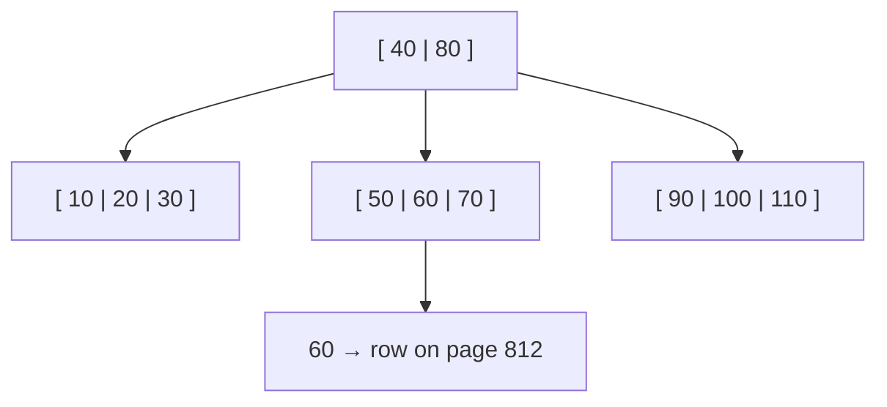
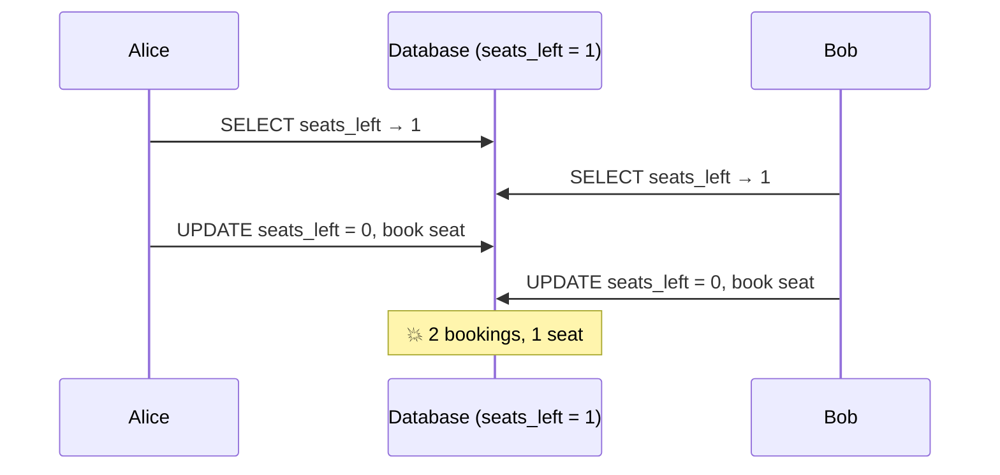

## Part 1: Indexes

### The big idea

To find "photosynthesis" in a 900-page textbook, you don't read every page. You check the **index at the back**: "photosynthesis … page 412". A database index works the same way.


| | No index (full table scan) | With a B-tree index |
| --- | --- | --- |
| Rows checked for 10M rows | 10,000,000 | ~4 page reads |
| Big-O | O(n) | O(log n) |
| Typical time | seconds | milliseconds |

### How a B-tree index works

A B-tree is a **short, wide, sorted tree**. Each node holds many keys, so even a billion rows fit in a tree only 3–4 levels deep.



Looking for `id = 60`: 60 is between 40 and 80 → middle child → found. Because the keys are **sorted**, B-trees also make `ORDER BY`, `BETWEEN` and `>` / `<` fast.

### Creating and checking indexes (PostgreSQL)

```sql
-- Slow: no index on email
SELECT * FROM users WHERE email = 'ana@mail.com';

CREATE INDEX idx_users_email ON users (email);
-- UNIQUE also prevents duplicates
CREATE UNIQUE INDEX idx_users_email_unique ON users (email);
```

Use `EXPLAIN ANALYZE` to see what the database actually does:

```sql
EXPLAIN ANALYZE SELECT * FROM users WHERE email = 'ana@mail.com';
```

```text
-- Before: reads every row
Seq Scan on users  (cost=0.00..18334.00 rows=1) (actual time=0.03..142.8 ms)
  Filter: (email = 'ana@mail.com')
  Rows Removed by Filter: 999999

-- After: jumps straight to it
Index Scan using idx_users_email on users  (actual time=0.02..0.03 ms)
  Index Cond: (email = 'ana@mail.com')
```

### Composite indexes and the left-most rule

An index on `(country, city, age)` is sorted like a phone book: by country, then city, then age.

```sql
CREATE INDEX idx_people_location ON people (country, city, age);
```

| Query filters on | Uses the index? |
| --- | --- |
| `country` | ✅ |
| `country, city` | ✅ |
| `country, city, age` | ✅ |
| `city` only | ❌ (skips the first column) |
| `country, age` | ⚠️ partly (country only) |

> 💡 Put the columns you filter by **equality** first and **range** filters (`>`, `BETWEEN`) last.

### Index types at a glance

| Type | Good for |
| --- | --- |
| **B-tree** (default) | `=`, `<`, `>`, `BETWEEN`, `ORDER BY`, prefix `LIKE 'abc%'` |
| **Hash** | Equality only |
| **GIN** | Full-text search, JSONB, arrays |
| **GiST** | Geospatial (PostGIS), ranges |
| **Partial** | `WHERE status = 'active'` only: smaller and faster |
| **Covering** (`INCLUDE`) | Answer the query from the index alone |

### The cost of indexes

Indexes aren't free:

- Every `INSERT`, `UPDATE` and `DELETE` must update **every** index on the table: slower writes.
- They take disk and memory.
- Unused indexes are pure cost. Check `pg_stat_user_indexes` and remove them.

**Index these:** primary keys (automatic), foreign keys, columns in frequent `WHERE`, `JOIN` and `ORDER BY` clauses.

### Queries that can't use an index

```sql
WHERE LOWER(email) = 'ana@mail.com'    -- ❌ function on the column (fix: index on LOWER(email))
WHERE name LIKE '%son'                 -- ❌ leading wildcard (fix: trigram / full-text index)
WHERE created_at::date = '2026-09-28'  -- ❌ cast on the column (fix: a range on created_at)
```

---

## Part 2: Transactions and concurrency

### The big idea

Two people try to book **the last seat** on a flight at the same moment. Both check: "1 seat left ✅". Both book. Now the flight is overbooked. This is a **race condition**, and transactions with the right **isolation** prevent it.



### Fix 1: let the database do it atomically

```sql
UPDATE flights
SET seats_left = seats_left - 1
WHERE id = 42 AND seats_left > 0
RETURNING seats_left;
-- 0 rows updated → sold out. The check and the update happen as ONE step.
```

### Fix 2: lock the row (pessimistic locking)

```sql
BEGIN;
SELECT seats_left FROM flights WHERE id = 42 FOR UPDATE; -- others must wait
-- … check and book …
UPDATE flights SET seats_left = seats_left - 1 WHERE id = 42;
COMMIT;
```

### Fix 3: version numbers (optimistic locking)

No locks. Each row has a `version`; an update only succeeds if nobody changed the row since you read it.

```sql
UPDATE products SET stock = 9, version = version + 1
WHERE id = 7 AND version = 3;   -- 0 rows → someone else won, reload and retry
```

| | Pessimistic (`FOR UPDATE`) | Optimistic (`version`) |
| --- | --- | --- |
| Idea | "Lock it, then work" | "Work, then check nobody interfered" |
| Best when | Conflicts are frequent | Conflicts are rare |
| Cost | Waiting, possible deadlocks | Retries on conflict |

### Isolation levels

Isolation controls **what a transaction can see** of other, concurrent transactions.

| Level | Dirty read | Non-repeatable read | Phantom read | Notes |
| --- | --- | --- | --- | --- |
| Read Uncommitted | possible | possible | possible | Almost never used |
| **Read Committed** | ✅ prevented | possible | possible | **Postgres default** |
| Repeatable Read | ✅ | ✅ prevented | possible* | MySQL InnoDB default |
| Serializable | ✅ | ✅ | ✅ prevented | Safest, slowest, may need retries |

\* Postgres's Repeatable Read also prevents phantoms.

- **Dirty read:** you see another transaction's changes *before* it commits (and it might roll back).
- **Non-repeatable read:** you read a row twice and get different values.
- **Phantom read:** you run the same query twice and new rows appear.

```sql
BEGIN ISOLATION LEVEL SERIALIZABLE;
-- …
COMMIT; -- may fail with "could not serialize access": retry the transaction
```

### Transaction tips

- **Keep transactions short.** Never wait for an HTTP call or user input inside one.
- **Always handle rollback** on errors (most ORMs do this for you).
- **Lock rows in a consistent order** to avoid deadlocks.
- Transactions don't span services or external APIs: for that, see *Sagas & the Outbox Pattern* in the Microservices lessons.

## Key takeaways

- Indexes turn O(n) scans into O(log n) lookups; B-trees handle equality, ranges and sorting.
- Use `EXPLAIN ANALYZE` to verify; follow the left-most rule for composite indexes.
- Indexes speed up reads but slow down writes, so add them deliberately.
- Race conditions: prefer atomic `UPDATE … WHERE`, then optimistic or pessimistic locking.
- Know the isolation levels; Postgres defaults to Read Committed.
