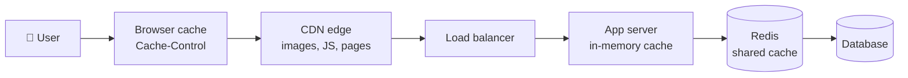
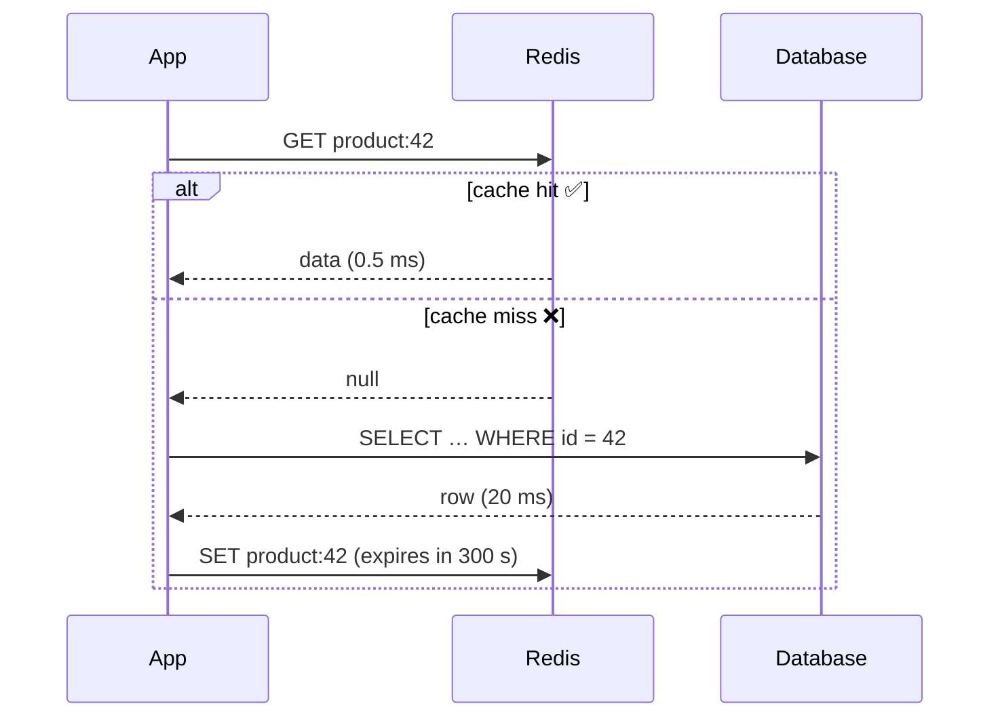
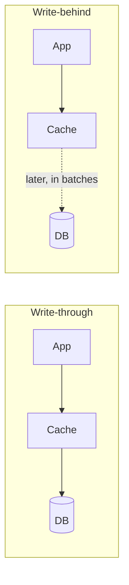
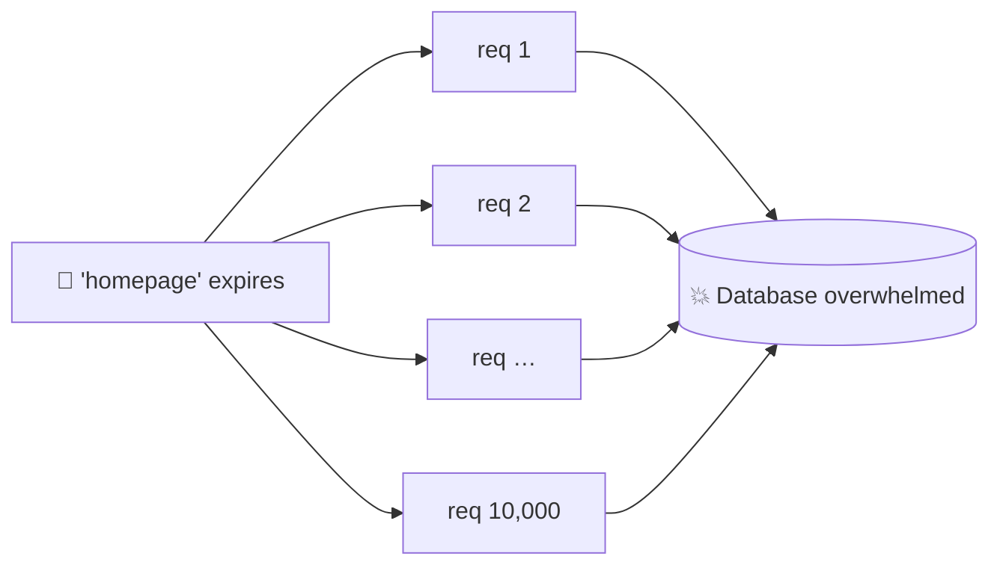

## The big idea

You keep the things you use every day (keys, phone, wallet) **on your desk**, not in the basement storage room. Going to the basement takes 5 minutes; reaching to your desk takes 1 second.

A **cache** is your desk: a small, fast store of copies of data that is expensive to fetch or compute.


| Where data lives | Typical latency | Analogy |
| --- | --- | --- |
| CPU cache | ~1 ns | In your hand |
| RAM / in-process cache | ~100 ns | On your desk |
| **Redis** over the network | ~0.5 ms | In the next room |
| Database with an index | ~5 ms | Downstairs |
| Slow DB query / external API | 100 ms – 2 s | Across town |

## Where caches live



Every layer can answer the request and save all the layers behind it.

## Strategy 1: Cache-aside (lazy loading) ⭐ most common

The app checks the cache first; on a miss it reads the database and stores the result.



```js
async function getProduct(id) {
  const key = `product:${id}`;
  const cached = await redis.get(key);
  if (cached) return JSON.parse(cached);

  const product = await db.products.findById(id);
  if (product) await redis.set(key, JSON.stringify(product), { EX: 300 }); // TTL 5 min
  return product;
}
```

## Other strategies

| Strategy | How it works | Pros | Cons |
| --- | --- | --- | --- |
| **Cache-aside** | App reads cache → DB on miss → fills cache | Simple, only caches what's used | First request is slow; can serve stale data |
| **Read-through** | The cache itself loads from the DB on a miss | Cleaner app code | Needs a cache library/provider that supports it |
| **Write-through** | Write to cache and DB together | Cache is always fresh | Slower writes, caches data nobody reads |
| **Write-behind** | Write to cache, flush to DB later | Very fast writes | Risk of losing data if the cache crashes |



## The hardest part: invalidation

> 📘 *"There are only two hard things in computer science: cache invalidation and naming things."* (Phil Karlton)

When data changes, the cached copy is **stale**. Options:

1. **TTL (time to live):** entries expire automatically. Simple; data can be stale for up to the TTL.
2. **Delete on write:** when the product changes, delete its cache key so the next read reloads it.
3. **Events:** publish `product.updated`; every service with a cached copy removes it.

```js
async function updateProduct(id, changes) {
  await db.products.update(id, changes);
  await redis.del(`product:${id}`); // delete, don't update: avoids race conditions
}
```

> 💡 Prefer **deleting** the key over writing the new value into it. Two concurrent updates can otherwise leave the older value in the cache.

## Eviction: when the cache is full

Memory is limited, so something must go:

| Policy | Evicts | Good for |
| --- | --- | --- |
| **LRU** (Least Recently Used) | The item not used for the longest time | Most workloads ✅ |
| **LFU** (Least Frequently Used) | The item used the fewest times | Stable "popular items" |
| **FIFO** | The oldest item | Simple streams |
| **TTL** | Expired items | Time-sensitive data |

In Redis: `maxmemory 2gb` and `maxmemory-policy allkeys-lru`.

## Classic caching problems

### 1. Cache stampede (thundering herd)

A popular key expires; 10,000 requests miss at the same moment and **all** hit the database.



**Fixes:** a lock so only one request rebuilds the value (others wait or get the stale copy), refreshing hot keys *before* they expire, and adding random **jitter** to TTLs so keys don't all expire together.

### 2. Cache penetration

Requests for IDs that **don't exist** always miss and always hit the DB (sometimes an attack). **Fix:** cache the "not found" result briefly, or use a **Bloom filter** to reject IDs that certainly don't exist.

### 3. Hot key

One key (a celebrity's profile) gets so much traffic it overloads a single Redis node. **Fix:** a small in-process cache in front of Redis, or replicate the key.

## Redis: more than a cache

Redis is an in-memory data-structure server. Its data types solve many real problems:

| Type | Commands | Use case |
| --- | --- | --- |
| **String** | `SET`, `GET`, `INCR`, `EXPIRE` | Cache, counters, rate limits |
| **Hash** | `HSET`, `HGETALL` | User sessions, objects |
| **List** | `LPUSH`, `RPOP`, `BLPOP` | Simple queues, recent activity |
| **Set** | `SADD`, `SISMEMBER` | Unique visitors, tags |
| **Sorted set** | `ZADD`, `ZRANGE`, `ZREVRANK` | **Leaderboards**, priority queues, time windows |
| **Stream** | `XADD`, `XREADGROUP` | Event log with consumer groups |
| **Pub/Sub** | `PUBLISH`, `SUBSCRIBE` | Real-time notifications, chat |

```js
// Leaderboard in 3 commands
await redis.zAdd("leaderboard", { score: 4200, value: "ana" });
await redis.zIncrBy("leaderboard", 50, "bo");
const top10 = await redis.zRangeWithScores("leaderboard", 0, 9, { REV: true });

// Rate limit: max 100 requests per minute per user
const key = `rate:${userId}:${Math.floor(Date.now() / 60000)}`;
const count = await redis.incr(key);
if (count === 1) await redis.expire(key, 60);
if (count > 100) throw new TooManyRequestsError();
```

### Persistence and availability

- **RDB snapshots:** save the whole dataset every N minutes (fast restarts, may lose the last minutes).
- **AOF (append-only file):** log every write (safer, bigger files). You can use both.
- **Replication + Sentinel:** automatic failover to a replica.
- **Redis Cluster:** shards data across nodes using 16,384 hash slots.

> ⚠️ Redis keeps data in RAM. Treat it as a cache or as fast secondary storage, **not** as your only copy of critical data (unless you configure persistence carefully).

## What to cache (and what not to)

✅ **Cache:** data read far more often than written (product pages, configs), expensive computations, sessions, rate-limit counters, 3rd-party API responses.

❌ **Don't cache:** data that must be perfectly fresh (account balance at the moment of payment), data that is rarely re-read, highly personalised data with no reuse.

## Key takeaways

- A cache stores copies of expensive data close to where it's needed.
- Cache-aside is the default pattern: check cache → DB on miss → store with a TTL.
- Invalidate by TTL, by deleting on write, or through events. Prefer delete over update.
- Guard against stampedes (locks, jitter), penetration (cache "not found") and hot keys.
- Redis offers strings, hashes, lists, sets, sorted sets and streams: leaderboards, rate limits, queues, sessions.
