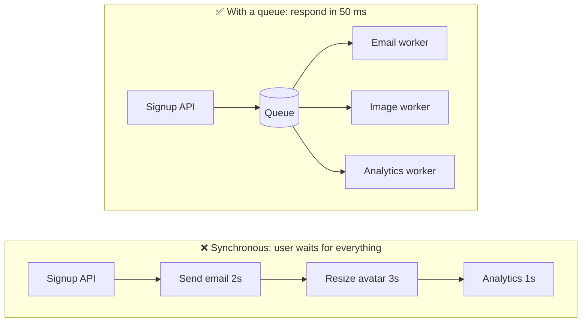
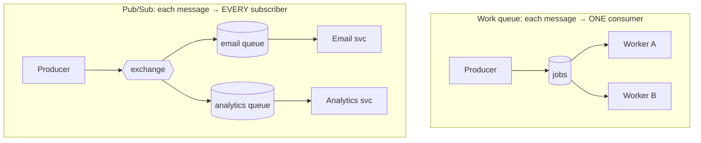
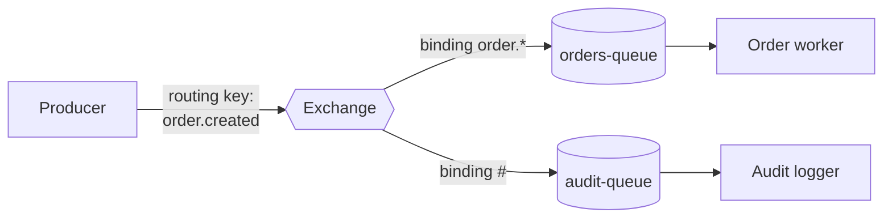
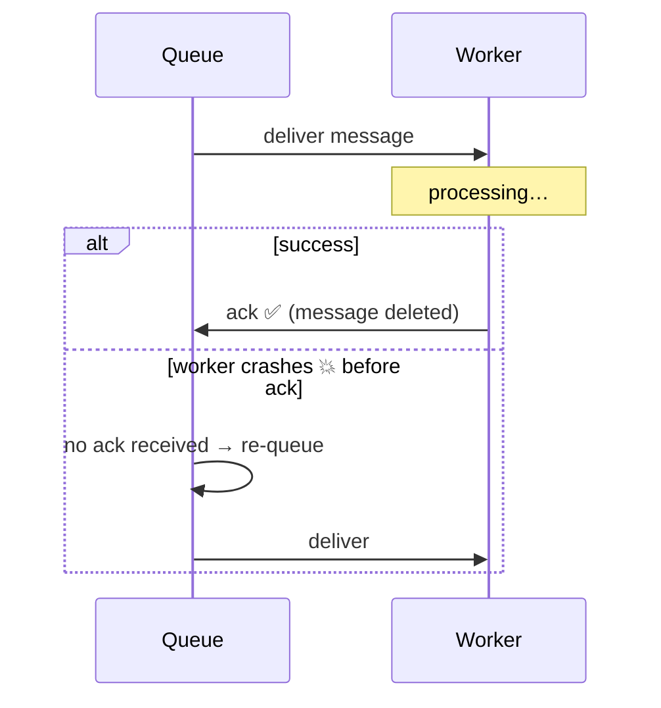
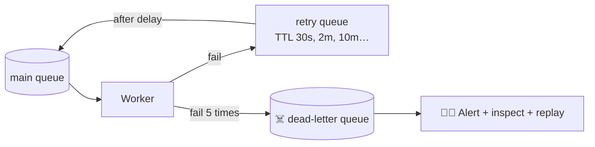

## The big idea

At a busy restaurant, the waiter doesn't stand in the kitchen waiting for each dish. They **pin the order ticket on a rail** and go back to serving customers. Cooks take tickets from the rail when they're ready.

The ticket rail is a **message queue**:

- **Producer** (waiter): puts messages in.
- **Queue** (rail): holds them safely, in order.
- **Consumer** (cook): takes messages out and does the work.


## Why use a queue?



| Benefit | What it means |
| --- | --- |
| **Faster responses** | Reply immediately; do slow work in the background |
| **Decoupling** | The producer doesn't know or care who consumes |
| **Load levelling** | A traffic spike fills the queue; workers drain it at their own pace |
| **Resilience** | If the email service is down, messages wait instead of being lost |
| **Scaling** | Add more consumers to process faster |

## Point-to-point vs publish/subscribe



- **Work queue:** "resize this image". Only one worker should do it.
- **Pub/Sub:** "a user signed up". Email, analytics and CRM *all* want to know.

## RabbitMQ in one picture

In RabbitMQ, producers never send directly to a queue. They send to an **exchange**, which routes messages to queues using **bindings**.



| Exchange type | Routing rule | Example |
| --- | --- | --- |
| **Direct** | Exact routing key match | `"pdf"` → pdf-queue |
| **Topic** | Wildcards: `*` = one word, `#` = zero or more | `order.*.eu` |
| **Fanout** | Copy to every bound queue, ignore the key | Broadcast "cache clear" |
| **Headers** | Match on message headers | Rarely used |

## Code: producer and consumer (Node.js, amqplib)

```js
// producer.js
import amqp from "amqplib";

const connection = await amqp.connect("amqp://localhost");
const channel = await connection.createChannel();
await channel.assertQueue("emails", { durable: true }); // survives broker restart

channel.sendToQueue(
  "emails",
  Buffer.from(JSON.stringify({ to: "ana@mail.com", template: "welcome" })),
  { persistent: true, messageId: crypto.randomUUID() }, // write to disk
);
```

```js
// consumer.js
const channel = await connection.createChannel();
await channel.assertQueue("emails", { durable: true });
channel.prefetch(10); // at most 10 unacknowledged messages per worker

channel.consume("emails", async (msg) => {
  const job = JSON.parse(msg.content.toString());
  try {
    await sendEmail(job);
    channel.ack(msg);                 // ✅ done: remove from the queue
  } catch (error) {
    channel.nack(msg, false, false);  // ❌ failed: send to the dead-letter queue
  }
});
```

## Acknowledgements: don't lose messages



Because a message can be **delivered more than once** (the worker processed it, then crashed before acking), consumers must be **idempotent**: processing the same message twice must be harmless.

```js
// Idempotent consumer: remember processed message IDs
if (await db.processedMessages.exists(msg.properties.messageId)) return channel.ack(msg);
await db.transaction(async (tx) => {
  await doTheWork(tx, job);
  await tx.processedMessages.insert(msg.properties.messageId);
});
channel.ack(msg);
```

## Retries and dead-letter queues

Some messages fail temporarily (an API is down); some fail forever (bad data). Don't retry forever, and don't lose them.



- **Exponential backoff:** wait 30 s, then 2 min, then 10 min… so a struggling service can recover.
- **Dead-letter queue (DLQ):** messages that keep failing are parked for a human to inspect and replay.
- **Poison message:** a message that crashes every consumer. The DLQ stops it from blocking the queue forever.

## Delivery guarantees

| Guarantee | Meaning | How |
| --- | --- | --- |
| **At most once** | May be lost, never duplicated | Ack before processing |
| **At least once** ⭐ | Never lost, may be duplicated | Ack after processing + idempotent consumers |
| **Exactly once** | Never lost, never duplicated | Very hard across systems; in practice, *at-least-once + idempotency* |

## Popular message brokers

| Broker | Model | Best for |
| --- | --- | --- |
| **RabbitMQ** | Smart broker, queues and routing | Task queues, complex routing, request/reply |
| **Apache Kafka** | Distributed append-only log | Event streaming, high throughput, replay (see the Kafka lessons) |
| **AWS SQS / SNS** | Managed queue / pub-sub | Serverless, no ops |
| **Redis Streams / BullMQ** | In-memory streams | Lightweight background jobs in Node.js |
| **NATS** | Lightweight pub/sub | Low-latency messaging |

## Key takeaways

- Queues decouple producers and consumers, smooth traffic spikes and make systems resilient.
- Work queues send each message to one consumer; pub/sub sends it to every subscriber.
- RabbitMQ routes messages through exchanges (direct, topic, fanout) to queues.
- Ack after processing, make consumers idempotent, and use retries with backoff plus a dead-letter queue.
- "Exactly once" in practice = at-least-once delivery + idempotent processing.
