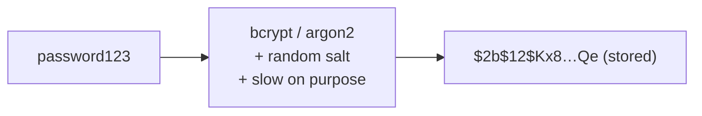
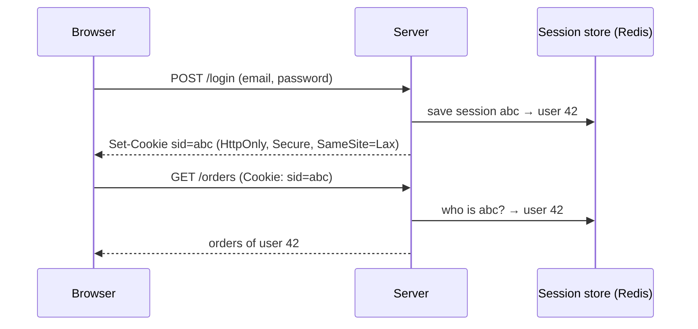
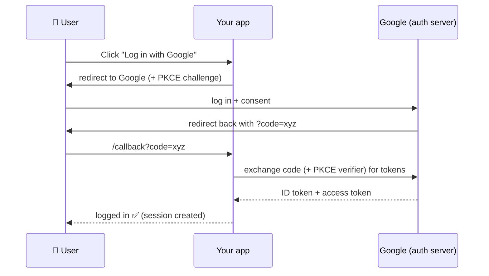

## The big idea

At an airport:

- **Authentication (AuthN)** = passport control: *"Who are you?"* You prove your identity.
- **Authorization (AuthZ)** = your boarding pass: *"What are you allowed to do?"* Economy passengers can't enter the business lounge.


AuthN always comes first. A **401 Unauthorized** means "I don't know who you are". A **403 Forbidden** means "I know who you are, and you're not allowed".

## Storing passwords: never in plain text



```js
import bcrypt from "bcrypt";

// Sign up
const passwordHash = await bcrypt.hash(password, 12); // 12 = cost factor (slower = safer)

// Log in
const ok = await bcrypt.compare(passwordAttempt, user.passwordHash);
```

| ❌ Never | ✅ Always |
| --- | --- |
| Plain text | **argon2id** or **bcrypt** |
| MD5 / SHA-1 / SHA-256 alone (too fast to brute-force) | A unique **salt** per user (built into bcrypt/argon2) |
| Your own crypto | Well-known libraries |

## Sessions vs JWT

### Session cookies (stateful)

The server stores the session; the browser holds only a random ID in a cookie.



### JWT (stateless tokens)

A **JSON Web Token** carries the user's claims, **signed** by the server. Any server with the key can verify it without a database lookup.

```text
eyJhbGciOiJIUzI1NiJ9 . eyJzdWIiOiI0MiIsInJvbGUiOiJhZG1pbiIsImV4cCI6MTc1OTA1MDAwMH0 . Sflk…
└── header ─────────┘   └── payload: { sub: "42", role: "admin", exp: … } ──────────┘   └ signature ┘
```

> ⚠️ The payload is only **Base64-encoded, not encrypted**. Anyone can read it. Never put secrets in a JWT.

```js
import jwt from "jsonwebtoken";

const accessToken = jwt.sign({ sub: user.id, role: user.role }, process.env.JWT_SECRET, { expiresIn: "15m" });

function authenticate(req, res, next) {
  const token = req.headers.authorization?.replace("Bearer ", "");
  try {
    req.user = jwt.verify(token, process.env.JWT_SECRET, { algorithms: ["HS256"] });
    next();
  } catch {
    res.status(401).json({ error: "Invalid or expired token" });
  }
}
```

| | Session cookie | JWT |
| --- | --- | --- |
| State | Server stores sessions | Stateless |
| Logout / revoke | ✅ Instant (delete the session) | ❌ Hard until it expires |
| Scaling | Needs a shared store (Redis) | Any server can verify |
| Best for | Traditional web apps | APIs, mobile apps, microservices |

**Common pattern:** a short-lived **access token** (15 min) plus a long-lived **refresh token** (days) stored in an `HttpOnly` cookie and rotated on every use.

## OAuth 2.0 and OpenID Connect

"**Log in with Google**". You let an app access your identity *without giving it your Google password*.

- **OAuth 2.0** = *authorization*: "this app may read my calendar".
- **OpenID Connect (OIDC)** = *authentication* on top of OAuth: "this is who the user is" (an ID token).



Use the **Authorization Code flow with PKCE**. It is the recommended flow for web, mobile and single-page apps.

## Authorization models

| Model | Idea | Example |
| --- | --- | --- |
| **RBAC** (role-based) | Permissions attached to roles | `admin` can delete, `viewer` can read |
| **ABAC** (attribute-based) | Rules over attributes | "Managers can approve expenses under $5k in their own department" |
| **ReBAC** (relationship-based) | Permissions from relationships | "You can edit docs shared with you" (Google Docs) |

```js
// Always check ownership, not just "is logged in"
app.get("/orders/:id", authenticate, async (req, res) => {
  const order = await orders.findById(req.params.id);
  if (!order) return res.sendStatus(404);
  if (order.userId !== req.user.sub && req.user.role !== "admin") return res.sendStatus(403);
  res.json(order);
});
```

## OWASP API Top risks (simplified)

| Risk | What happens | Defence |
| --- | --- | --- |
| **Broken object-level authorization (BOLA/IDOR)** | Change `/orders/41` to `/orders/42` and see someone else's order | Check ownership on **every** request |
| **Broken authentication** | Weak passwords, no rate limit on login, leaked tokens | MFA, rate limiting, short token lifetimes |
| **Injection** (SQL, NoSQL, command) | `' OR 1=1 --` returns every row | **Parameterised queries**, never string-concatenate input |
| **Excessive data exposure** | API returns `passwordHash` because it serialised the whole row | Explicit response DTOs / allow-lists |
| **No rate limiting** | Brute force, scraping, denial of service | Rate limits per user/IP (429) |
| **Security misconfiguration** | Debug mode in prod, open CORS `*` with credentials, default passwords | Secure defaults, config review |
| **SSRF** | API fetches a user-provided URL → hits internal services | Allow-list destinations |

```js
// ❌ SQL injection
db.query(`SELECT * FROM users WHERE email = '${req.body.email}'`);

// ✅ Parameterised query: input is always treated as data, never code
db.query("SELECT * FROM users WHERE email = $1", [req.body.email]);
```

## Security checklist

- [ ] HTTPS everywhere (HSTS)
- [ ] Passwords hashed with argon2id/bcrypt
- [ ] Cookies: `HttpOnly`, `Secure`, `SameSite`
- [ ] Validate all input (schema validation such as Zod or Joi)
- [ ] Parameterised queries / ORM
- [ ] Authorization check on every resource access
- [ ] Rate limiting on login and expensive endpoints
- [ ] Secrets in a vault or env vars, never in git
- [ ] Security headers (`helmet` in Express)
- [ ] Dependencies scanned (`npm audit`, Dependabot)
- [ ] Log security events, but never log passwords or tokens

## Key takeaways

- AuthN = who you are (401). AuthZ = what you may do (403).
- Hash passwords with argon2id or bcrypt; never store or log them in plain text.
- Sessions are easy to revoke; JWTs are stateless but hard to revoke, so keep them short-lived.
- Use OAuth 2.0 + OIDC (Authorization Code + PKCE) for "Log in with…".
- The #1 API bug is missing ownership checks. Authorize every request.
- Parameterised queries stop injection.
