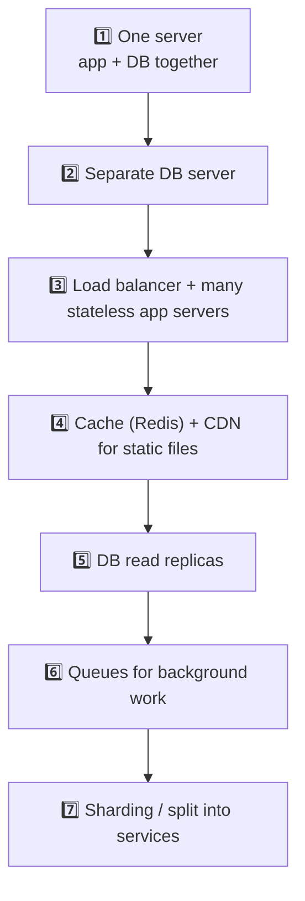
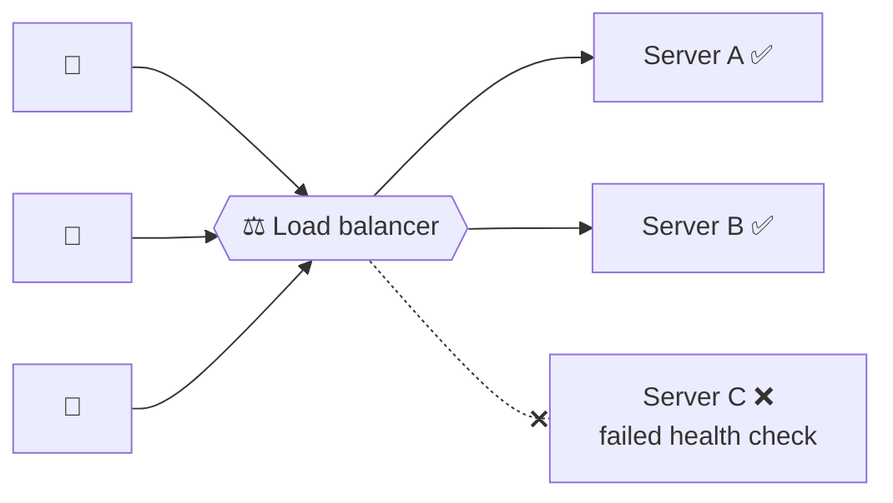
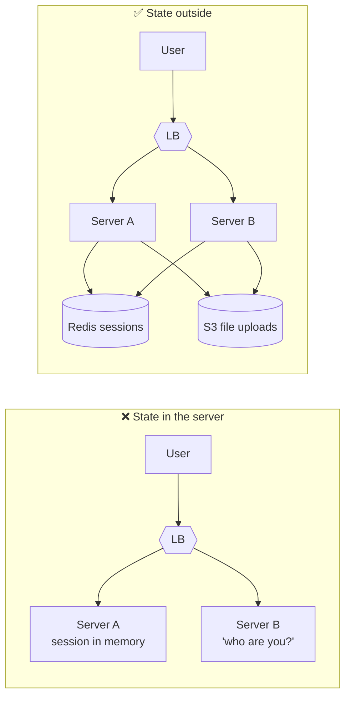
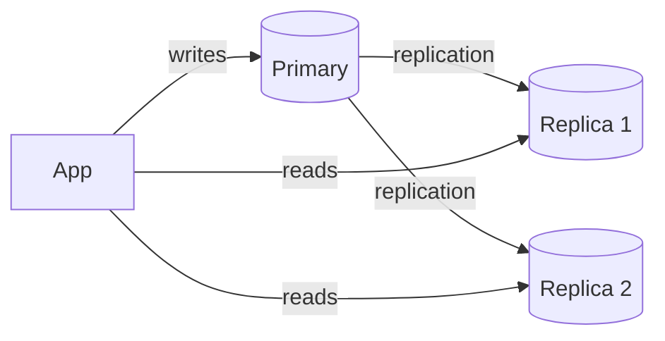
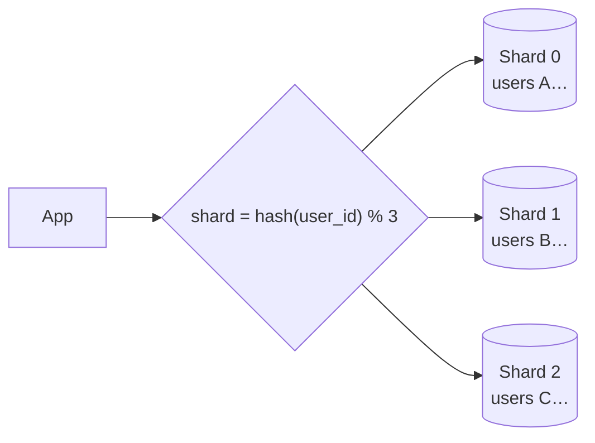
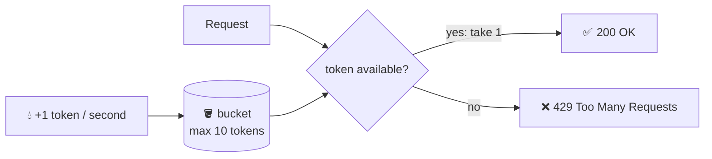

## The big idea

A small café with one barista is fine for 20 customers a day. At 2,000 customers you can either:

- Give the barista a **faster espresso machine** → **vertical scaling** (scale up).
- Hire **more baristas** and add a **host** who sends each customer to a free one → **horizontal scaling** (scale out) with a **load balancer**.

| | Vertical (up) | Horizontal (out) |
| --- | --- | --- |
| How | Bigger CPU / RAM | More servers |
| Simplicity | ✅ No code changes | Needs stateless design |
| Limit | Hardware ceiling, expensive at the top | Practically unlimited |
| Failure | One server = single point of failure | Survives losing a server |

## The scaling journey

Don't jump to step 7 on day one (remember **KISS** and **YAGNI**). Each step solves a real, measured bottleneck.

## Load balancers

A load balancer spreads requests across healthy servers and stops sending traffic to broken ones.

### Algorithms

| Algorithm | How it picks | Good when |
| --- | --- | --- |
| **Round robin** | A, B, C, A, B, C… | Servers are identical |
| **Weighted round robin** | Bigger servers get more | Mixed server sizes |
| **Least connections** | Server with the fewest active requests | Requests vary in duration |
| **IP hash / consistent hashing** | Same client → same server | Need stickiness or cache locality |

### Layer 4 vs Layer 7

- **L4 (transport):** routes by IP and port. Very fast, doesn't read HTTP.
- **L7 (application):** reads HTTP, so it can route `/api/*` to API servers and `/images/*` to storage, terminate TLS, add headers. Examples: NGINX, HAProxy, AWS ALB, Envoy.

## Stateless servers: the key to scaling out

If a server keeps user sessions **in its own memory**, the next request might land on a different server that doesn't know the user.

**Rule:** any server should be able to handle any request. Keep sessions in Redis or in tokens, files in object storage (S3), and state in the database.

## Scaling the database

The database is usually the hardest part to scale.

### Read replicas

Most apps read far more than they write. Copy the data to replicas and send reads there.

⚠️ **Replication lag:** a replica may be a few milliseconds behind. After a user updates their profile, read *their* profile from the primary ("read your own writes").

### Sharding (partitioning)

When one primary can't handle the writes or the data size, split the data across several databases by a **shard key**.

| Challenge | Why |
| --- | --- |
| Choosing the shard key | A bad key creates "hot" shards (all celebrities on one) |
| Cross-shard queries and JOINs | Must query every shard and combine the results |
| Re-sharding | Adding shards moves data. **Consistent hashing** minimises that |
| Transactions across shards | Hard; avoid them by design |

## Rate limiting

Protect your API from abuse, bugs and traffic spikes by limiting requests per user, IP or API key. Over the limit → **429 Too Many Requests** with a `Retry-After` header.

### Token bucket (most popular)

> 🪣 A bucket holds up to 10 tokens and refills at 1 token per second. Each request takes a token. Empty bucket → request rejected. Allows short bursts but enforces an average rate.

| Algorithm | Idea | Trade-off |
| --- | --- | --- |
| **Fixed window** | Count per minute (resets at :00) | Simple; allows 2× bursts at window edges |
| **Sliding window** | Count over the last 60 s | Smoother, slightly more work |
| **Token bucket** | Tokens refill steadily | Allows bursts, smooth average ✅ |
| **Leaky bucket** | Queue drains at a fixed rate | Very smooth output, adds latency |

In a multi-server setup, keep counters in **Redis** so all servers share the same limits (see *Caching & Redis* for code).

## Resilience basics

At scale, something is *always* failing. Design for it:

| Pattern | Purpose |
| --- | --- |
| **Timeouts** | Never wait forever on a dependency |
| **Retries with exponential backoff + jitter** | Survive brief glitches without hammering the service |
| **Circuit breaker** | Stop calling a service that keeps failing; fail fast and give it time to recover |
| **Bulkhead** | Separate resource pools, so one slow dependency can't consume every thread |
| **Graceful degradation** | Show cached or partial results instead of an error page |
| **Health checks** | Let load balancers route around sick servers |

These are covered in depth in *Microservices → Resilience Patterns*.

## Back-of-the-envelope numbers

| Metric | Rough figure |
| --- | --- |
| 1 million requests/day | ≈ 12 requests/second average (peak maybe 5–10×) |
| One Node.js / Go server | Hundreds to thousands of simple requests/second |
| One Postgres primary | Thousands of simple writes/second, many more reads |
| One Redis node | ~100,000 operations/second |

## Key takeaways

- Scale vertically first (simple), horizontally when needed (resilient, unlimited).
- Load balancers spread traffic and route around failures; L7 can route by path.
- Stateless app servers are the foundation of horizontal scaling.
- Databases scale with caching, read replicas, then sharding.
- Rate limit with a token bucket in Redis; return 429 with `Retry-After`.
- Assume failure: timeouts, retries with backoff, circuit breakers.
