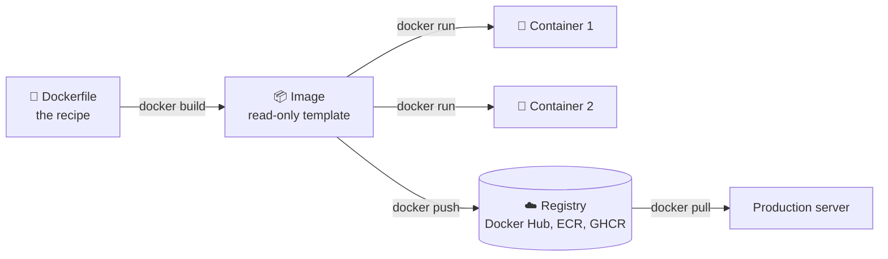
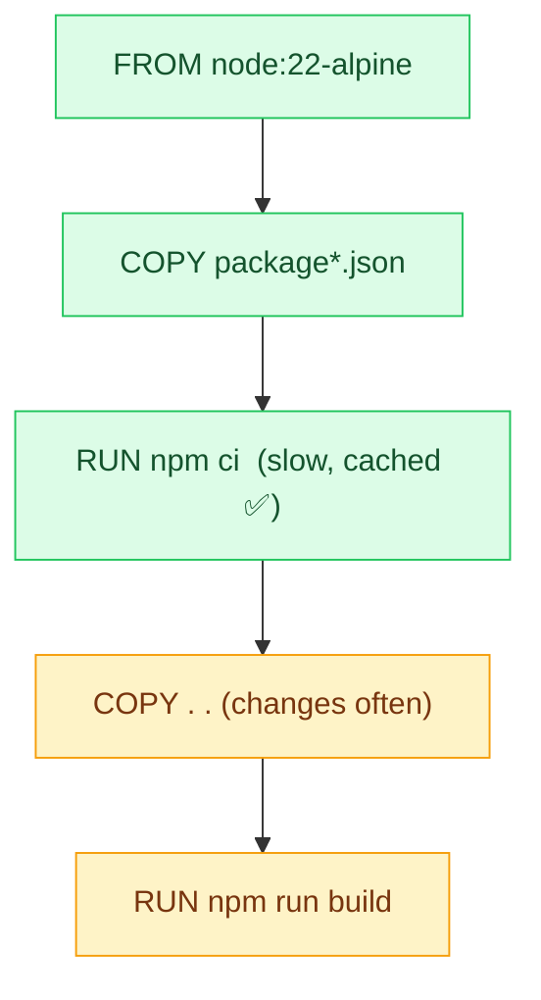
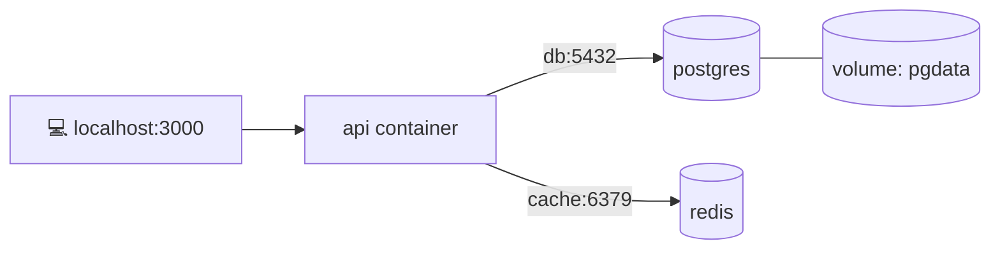

## The big idea

Before shipping containers existed, loading a cargo ship meant handling sacks, barrels and crates of every shape: slow and chaotic. The **standard shipping container** changed everything: any cargo, same box, fits every ship, train and truck.

**Docker containers** do the same for software. Your app, its runtime (Node 22), libraries and config go into one standard box that runs identically on your laptop, a CI server and production.

> 😩 *"But it works on my machine!"* → 🐳 *"Then we'll ship your machine."*


| | Virtual machine | Container |
| --- | --- | --- |
| Contains | Full guest OS + app | Just the app + its dependencies |
| Size | GBs | MBs |
| Starts in | Minutes | Seconds or less |
| Isolation | Strong (separate kernel) | Good (shared kernel, namespaces) |
| Density | ~10s per host | ~100s per host |

## Key vocabulary



- **Dockerfile:** a text recipe describing how to build the image.
- **Image:** the built, read-only package (like a class).
- **Container:** a running instance of an image (like an object). You can run many from one image.
- **Registry:** where images are stored and shared.

## A Dockerfile for a Node.js app

```dockerfile
# ---- 1. build stage ----
FROM node:22-alpine AS build
WORKDIR /app

# Copy dependency files first to make good use of the layer cache
COPY package.json package-lock.json ./
RUN npm ci

COPY . .
RUN npm run build

# ---- 2. runtime stage: small and secure ----
FROM node:22-alpine
WORKDIR /app
ENV NODE_ENV=production

COPY package.json package-lock.json ./
RUN npm ci --omit=dev

COPY --from=build /app/dist ./dist

# Don't run as root
USER node
EXPOSE 3000
HEALTHCHECK CMD wget -qO- http://localhost:3000/health || exit 1
CMD ["node", "dist/server.js"]
```

```bash
docker build -t shop-api:1.0 .
docker run -d -p 3000:3000 --name api -e DATABASE_URL=postgres://… shop-api:1.0
docker logs -f api
docker exec -it api sh     # open a shell inside the running container
docker stop api && docker rm api
```

## Layers and caching

Each instruction in a Dockerfile creates a **layer**. Docker reuses unchanged layers, so **order matters**: put things that change rarely first.



If you `COPY . .` *before* `npm ci`, every code change re-installs all dependencies. Minutes wasted on every build.

**Multi-stage builds** (above) keep compilers and dev dependencies out of the final image: often **1 GB → 150 MB**.

Add a `.dockerignore` so junk doesn't end up in the image:

```text
node_modules
.git
.env
dist
*.log
```

## Data and networking

**Containers are disposable.** Anything written inside a container disappears when it's removed. Use **volumes** for data that must survive.

```bash
docker volume create pgdata
docker run -d -v pgdata:/var/lib/postgresql/data -e POSTGRES_PASSWORD=secret postgres:17
```

| Storage | Use for |
| --- | --- |
| **Named volume** | Database files, anything persistent |
| **Bind mount** (`-v ./src:/app/src`) | Live-reloading code in development |
| **tmpfs** | Temporary secrets or scratch files in memory |

Containers on the same **Docker network** can reach each other **by name**: the API connects to `postgres:5432`, not an IP address.

## Docker Compose: many containers, one file

Real apps need several services. Compose describes them all in YAML and starts them with one command.

```yaml
# compose.yaml
services:
  api:
    build: .
    ports: ["3000:3000"]
    environment:
      DATABASE_URL: postgres://app:secret@db:5432/shop
      REDIS_URL: redis://cache:6379
    depends_on:
      db: { condition: service_healthy }
      cache: { condition: service_started }

  db:
    image: postgres:17
    environment: { POSTGRES_USER: app, POSTGRES_PASSWORD: secret, POSTGRES_DB: shop }
    volumes: [pgdata:/var/lib/postgresql/data]
    healthcheck:
      test: ["CMD-SHELL", "pg_isready -U app"]
      interval: 5s

  cache:
    image: redis:7-alpine

volumes:
  pgdata:
```

```bash
docker compose up -d        # start everything
docker compose logs -f api  # follow one service
docker compose down         # stop (add -v to delete volumes too)
```



## Best practices

- ✅ Use small, official base images (`-alpine`, `-slim`, distroless) and **pin versions** (`node:22.9-alpine`, not `latest`).
- ✅ Multi-stage builds; copy dependency manifests before source code.
- ✅ Run as a **non-root** user.
- ✅ One main process per container.
- ✅ Configure through **environment variables**; never bake secrets into images.
- ✅ Add health checks, and log to stdout/stderr (let the platform collect logs).
- ✅ Scan images for vulnerabilities (`docker scout`, Trivy).

## From Docker to Kubernetes

Docker runs containers on **one machine**. When you have dozens of containers across many machines and need auto-restarts, scaling and zero-downtime deploys, you need an **orchestrator**, and that's **Kubernetes** (see the Kubernetes lessons).

## Key takeaways

- A container packages an app with everything it needs; it runs the same everywhere.
- Dockerfile → image → container. Images live in registries.
- Order Dockerfile instructions for layer caching; use multi-stage builds for small images.
- Containers are disposable: persist data in volumes.
- Docker Compose runs multi-container apps locally with one command.
