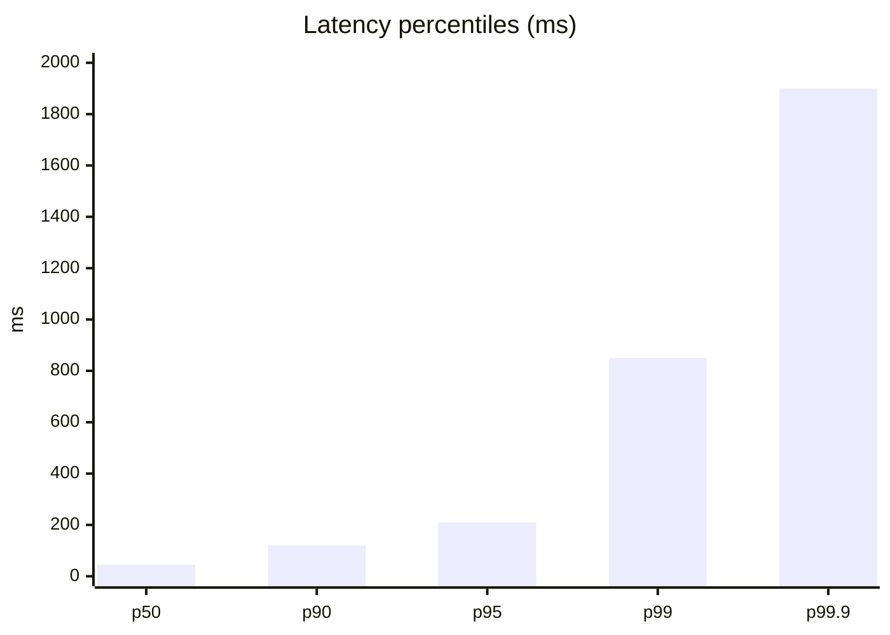
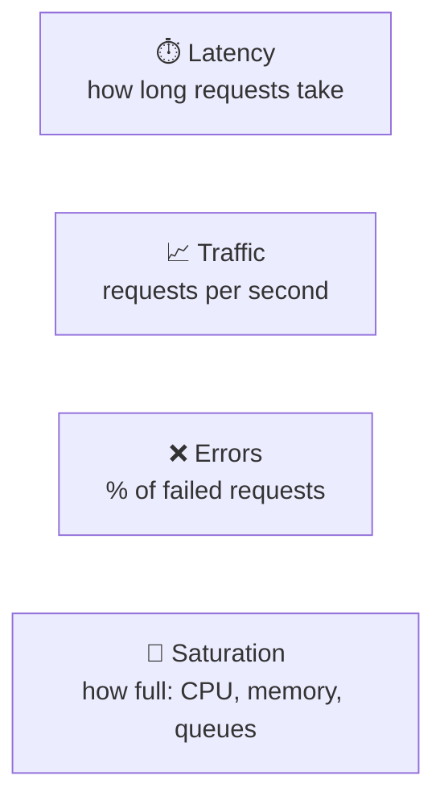
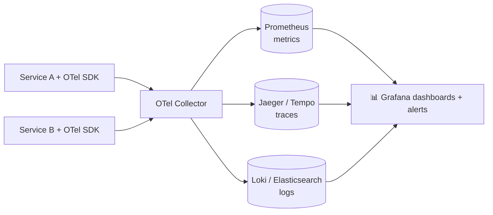

## The big idea

A car dashboard shows your speed, fuel and engine temperature (**metrics**). The car's black box records every event (**logs**). And if you tracked one trip across the city, street by street, you'd have a **trace**.

**Observability** is how well you can understand what's happening inside your system from the outside, especially problems you didn't predict.


## Pillar 1: Logs, the "why"

A log is a timestamped record of an event. Write **structured** logs (JSON), not free text, so machines can search and filter them.

```js
// ❌ Unstructured: hard to search, no context
console.log("Payment failed for user 42");

// ✅ Structured (pino): every field is searchable
logger.error(
  { event: "payment_failed", userId: 42, orderId: "ord_9", amountCents: 4999, provider: "stripe", traceId, err },
  "Payment failed",
);
```

```json
{"level":"error","time":"2026-09-28T03:12:45.120Z","event":"payment_failed","userId":42,"orderId":"ord_9","provider":"stripe","traceId":"4bf92f35","msg":"Payment failed"}
```

### Log levels

| Level | Use for | In production? |
| --- | --- | --- |
| `debug` | Detailed developer info | Usually off |
| `info` | Normal business events (order placed) | ✅ |
| `warn` | Something odd but handled (retrying) | ✅ |
| `error` | A request failed | ✅ + alert on spikes |
| `fatal` | The process is crashing | ✅ + page someone |

> ⚠️ **Never log** passwords, tokens, full credit-card numbers or other personal data you don't need.

## Pillar 2: Metrics, the "what"

Metrics are **numbers over time**, cheap to store and perfect for dashboards and alerts.

| Type | Example | Question it answers |
| --- | --- | --- |
| **Counter** (only goes up) | `http_requests_total` | How many requests per second? |
| **Gauge** (up and down) | `memory_used_bytes`, `queue_depth` | How full is it right now? |
| **Histogram** | `http_request_duration_seconds` | What are p50, p95, p99 latencies? |

```js
import client from "prom-client";

const httpDuration = new client.Histogram({
  name: "http_request_duration_seconds",
  help: "HTTP request latency",
  labelNames: ["method", "route", "status"],
  buckets: [0.01, 0.05, 0.1, 0.3, 1, 3],
});

app.use((req, res, next) => {
  const end = httpDuration.startTimer();
  res.on("finish", () => end({ method: req.method, route: req.route?.path ?? "unknown", status: res.statusCode }));
  next();
});

app.get("/metrics", async (req, res) => res.type("text/plain").send(await client.register.metrics()));
```

### Why percentiles, not averages?

If 99 requests take 10 ms and 1 takes 5 seconds, the **average** is 60 ms: looks fine! But 1 in 100 users waits 5 seconds. **p99** (the 99th percentile) shows that pain.



### The four golden signals (Google SRE)



If you only build one dashboard, build this one, per service.

## Pillar 3: Traces, the "where"

In a microservice system, one click might touch 8 services. A **distributed trace** follows that one request everywhere and shows how long each step took.

```mermaid
gantt
    title Trace 4bf92f35: GET /checkout (total 820 ms)
    dateFormat x
    axisFormat %L
    section api-gateway
    gateway            :0, 820
    section orders-svc
    create order       :20, 300
    section inventory-svc
    reserve stock      :40, 120
    section payments-svc
    charge card 🐢     :310, 780
    section email-svc
    queue receipt      :790, 810
```



Immediately visible: **payments takes 470 ms** of the 820. That's where to look.

- **Trace:** the whole journey, with one `traceId`.
- **Span:** one step (a service call, a DB query) with start, duration and attributes.
- **Context propagation:** the `traceparent` HTTP header carries the trace ID from service to service.

```http
traceparent: 00-4bf92f3577b34da6a3ce929d0e0e4736-00f067aa0ba902b7-01
```

> 💡 Put the `traceId` in **every log line**. Then from a slow trace you can jump straight to the logs of exactly that request.

## OpenTelemetry: one standard for all three

**OpenTelemetry (OTel)** is the vendor-neutral standard for collecting logs, metrics and traces. Instrument once, send the data anywhere.



```js
// tracing.js — load before your app starts (node --import ./tracing.js server.js)
import { NodeSDK } from "@opentelemetry/sdk-node";
import { getNodeAutoInstrumentations } from "@opentelemetry/auto-instrumentations-node";

new NodeSDK({ instrumentations: [getNodeAutoInstrumentations()] }).start();
// HTTP, Express, pg, redis, fetch… are now traced automatically
```

## SLIs, SLOs and error budgets

| Term | Meaning | Example |
| --- | --- | --- |
| **SLI** (indicator) | What you measure | % of requests under 300 ms and not 5xx |
| **SLO** (objective) | Your target | 99.9% over 30 days |
| **SLA** (agreement) | A contract with customers, with penalties | 99.5% or refunds |
| **Error budget** | 100% − SLO | 0.1% ≈ **43 minutes** of failure per month |

| Availability | Downtime per year | Per month |
| --- | --- | --- |
| 99% | 3.65 days | 7.3 hours |
| 99.9% ("three nines") | 8.8 hours | 43.8 minutes |
| 99.99% | 52.6 minutes | 4.4 minutes |
| 99.999% | 5.3 minutes | 26 seconds |

Error budget left → ship features fast. Budget burned → focus on reliability.

## Alerting that doesn't ruin your sleep

- ✅ Alert on **symptoms users feel** (error rate, latency SLO burn), not on every CPU spike.
- ✅ Every alert must be **actionable** and link to a **runbook**.
- ✅ Page for urgent issues, open a ticket for the rest.
- ❌ Avoid alert fatigue: noisy alerts get ignored, and then the real one is missed.

## Key takeaways

- **Metrics** say *what* is wrong, **traces** say *where*, **logs** say *why*.
- Use structured JSON logs with a `traceId` on every line.
- Watch the four golden signals: latency, traffic, errors, saturation. Use percentiles, not averages.
- Distributed tracing follows one request across all services.
- OpenTelemetry is the standard way to instrument; Grafana and friends visualise the data.
- Define SLOs, spend error budgets, and alert on user-facing symptoms.
