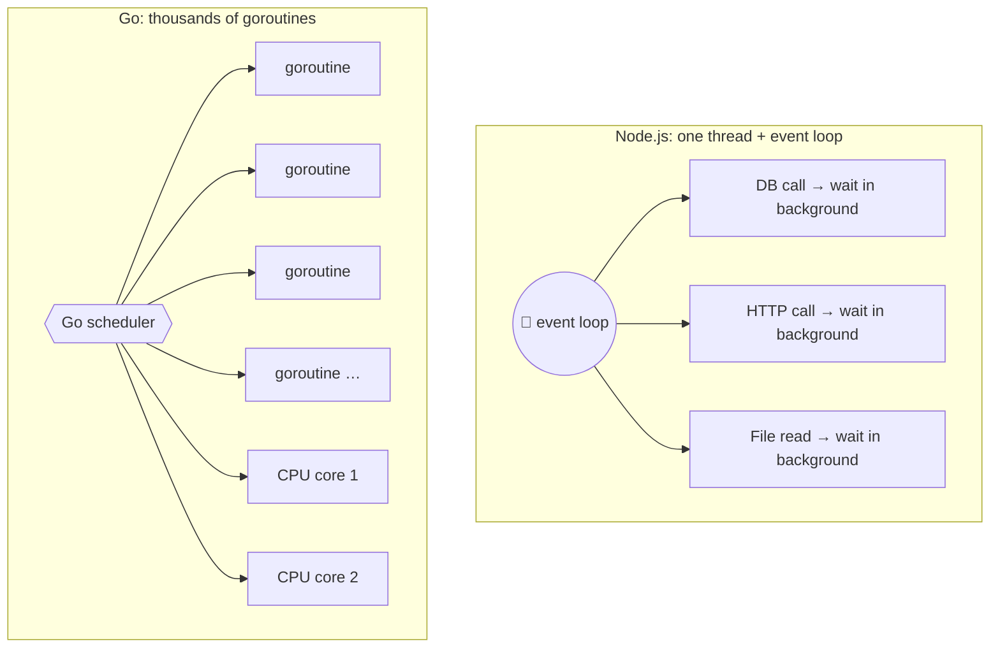
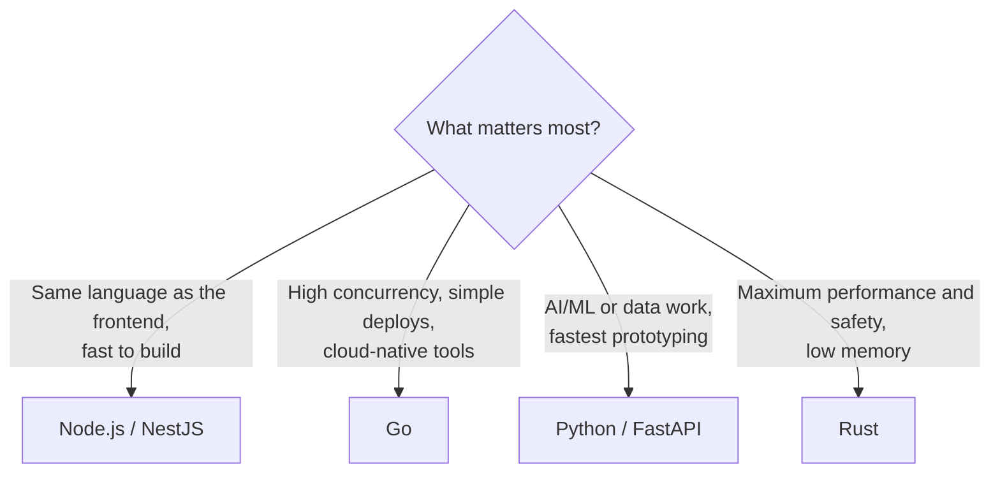

## The big idea

Choosing a backend language is like choosing a vehicle:

- **Node.js** 🛵 = a nimble scooter: quick to start, great in city traffic (lots of small I/O trips), same fuel (JavaScript) as the frontend.
- **Go** 🚚 = a reliable delivery van: simple to drive, very efficient, built for many deliveries at once.
- **Python** 🚙 = a comfortable SUV: easy for everyone, fits every accessory (data science, AI), not the fastest.
- **Rust** 🏎️ = a race car: top speed and safety, but you need training to drive it.


## How each handles many requests at once

This is the most important difference for backend work.



| Language | Concurrency model | Great at | Watch out for |
| --- | --- | --- | --- |
| **Node.js** | Single-threaded **event loop**, async/await | I/O-heavy APIs, real-time apps, full-stack JS | CPU-heavy work blocks the loop (use worker threads) |
| **Go** | **Goroutines** + channels, multi-core | High-concurrency services, cloud tools (Docker and Kubernetes are written in Go) | Verbose error handling, a smaller ecosystem than JS/Python |
| **Python** | async (asyncio) or threads/processes (GIL limits CPU threads) | AI/ML, data, scripting, fast prototyping | Slower raw speed |
| **Rust** | async (Tokio) + threads, **no data races** guaranteed by the compiler | Performance-critical systems, low latency, low memory | Steep learning curve, slower compile times |

## The same API in all four

**Goal:** `GET /users/:id` returns a user as JSON, or 404.

### Node.js: Express

```js
import express from "express";
const app = express();

app.get("/users/:id", async (req, res) => {
  const user = await db.users.findById(req.params.id);
  if (!user) return res.status(404).json({ error: "Not found" });
  res.json(user);
});

app.listen(3000);
```

### Node.js: NestJS (structured, TypeScript-first)

NestJS adds modules, dependency injection and decorators on top of Express/Fastify, similar to Angular or Spring. It's great for larger teams.

```ts
@Controller("users")
export class UsersController {
  constructor(private readonly users: UsersService) {} // injected (Dependency Inversion!)

  @Get(":id")
  async findOne(@Param("id") id: string) {
    const user = await this.users.findById(id);
    if (!user) throw new NotFoundException();
    return user;
  }
}
```

### Go: Gin

```go
package main

import (
	"net/http"

	"github.com/gin-gonic/gin"
)

func main() {
	r := gin.Default()
	r.GET("/users/:id", func(c *gin.Context) {
		user, err := findUser(c.Request.Context(), c.Param("id"))
		if err != nil {
			c.JSON(http.StatusNotFound, gin.H{"error": "Not found"})
			return
		}
		c.JSON(http.StatusOK, user)
	})
	r.Run(":3000")
}
```

Go's concurrency in two lines: `go doWork()` starts a goroutine, and **channels** pass data between them safely.

```go
results := make(chan string)
for _, url := range urls {
	go func(u string) { results <- fetch(u) }(url) // all fetches run concurrently
}
for range urls {
	fmt.Println(<-results)
}
```

### Python: FastAPI

```python
from fastapi import FastAPI, HTTPException
from pydantic import BaseModel

app = FastAPI()

class User(BaseModel):
    id: int
    name: str
    email: str

@app.get("/users/{user_id}", response_model=User)
async def get_user(user_id: int):
    user = await db.find_user(user_id)
    if user is None:
        raise HTTPException(status_code=404, detail="Not found")
    return user
```

FastAPI generates **OpenAPI docs automatically** from type hints (visit `/docs`). **Django** is the "batteries included" alternative, with an ORM, admin panel and auth built in.

### Rust: Axum

```rust
use axum::{extract::Path, http::StatusCode, routing::get, Json, Router};

async fn get_user(Path(id): Path<u64>) -> Result<Json<User>, StatusCode> {
    find_user(id).await.map(Json).ok_or(StatusCode::NOT_FOUND)
}

#[tokio::main]
async fn main() {
    let app = Router::new().route("/users/{id}", get(get_user));
    let listener = tokio::net::TcpListener::bind("0.0.0.0:3000").await.unwrap();
    axum::serve(listener, app).await.unwrap();
}
```

Rust's **ownership** system catches memory bugs and data races **at compile time**: no garbage collector, no null pointer crashes.

## Popular frameworks

| Language | Minimal | Batteries included |
| --- | --- | --- |
| Node.js | Express, Fastify, Hono | NestJS |
| Go | net/http, Gin, Echo, Fiber | (Go prefers small libraries) |
| Python | FastAPI, Flask | Django |
| Rust | Axum, Actix Web | Loco |

## How to choose



> 💡 **Team skills beat benchmarks.** A language your team knows well will beat a "faster" one they're learning, for almost every business app. Performance bottlenecks are usually the database and the network, not the language.

## Key takeaways

- **Node.js:** event loop, perfect for I/O-heavy APIs and full-stack JavaScript. NestJS adds structure.
- **Go:** goroutines and channels, simple and fast, the language of cloud infrastructure.
- **Python:** the king of AI/data; FastAPI for modern APIs, Django for full-featured apps.
- **Rust:** top performance with compile-time safety, at the cost of a learning curve.
- Choose by team skills and problem type; the database is usually the real bottleneck.
