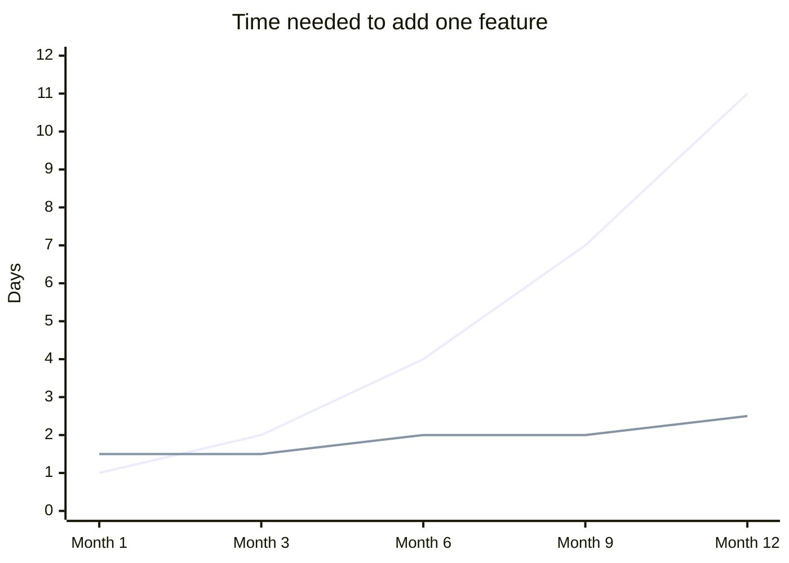
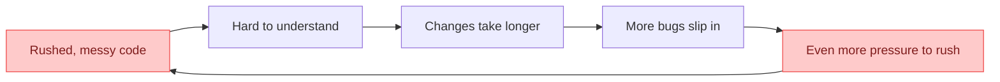
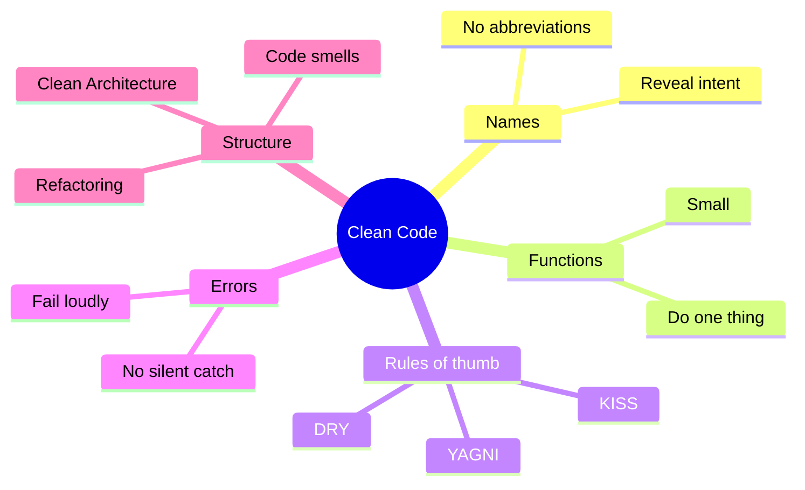

## The big idea

Imagine two kitchens. Both can cook dinner. In the first, pans, spices and knives are thrown everywhere. In the second, every item has a labelled place.


Code is the same. **Working code is the minimum. Clean code is working code that is easy to read and easy to change.**

> 💡 **Remember:** Developers spend about **10× more time reading code than writing it**. Every minute you spend making code clearer saves many minutes later, for you and for your teammates.

## A definition you can remember

Clean code is code that:

| Quality | Question to ask yourself |
| --- | --- |
| **Readable** | Can a new teammate understand it without asking me? |
| **Simple** | Is this the simplest thing that solves the problem? |
| **Focused** | Does each function or class do *one* thing? |
| **Tested** | Can I change it and quickly know if I broke something? |
| **Honest** | Do the names tell the truth about what the code does? |

## Why messy code becomes expensive

Messy code feels fast on day 1. By month 6, every change takes longer because nobody dares to touch anything.



*The rising line is a messy codebase. The flat line is a clean one: a little slower at the start, much faster later.*

This hidden cost is called **technical debt**. Like a loan, it has to be paid back with interest.



## Same logic, two styles

Both functions below do exactly the same thing. Which one would you rather debug at 2 a.m.?

**❌ Hard to read**

```js
function calc(a, b) {
  let t = 0;
  for (let i = 0; i < a.length; i++) {
    if (a[i].s === 1) t += a[i].p * a[i].q;
  }
  return b ? t - t * 0.1 : t;
}
```

**✅ Clean**

```js
const MEMBER_DISCOUNT = 0.1;

function orderTotal(items, isMember) {
  const subtotal = items
    .filter((item) => item.inStock)
    .reduce((sum, item) => sum + item.price * item.quantity, 0);

  return isMember ? subtotal * (1 - MEMBER_DISCOUNT) : subtotal;
}
```

What changed?

1. **Names explain intent:** `calc` became `orderTotal`, and `a[i].s === 1` became `item.inStock`.
2. **No magic numbers:** `0.1` has a name, `MEMBER_DISCOUNT`.
3. **The steps read like a sentence:** *filter the items in stock, then add up price × quantity*.

## The clean code toolbox (this course)



## The Boy Scout Rule

> 🏕️ **“Always leave the campground cleaner than you found it.”**

You don't need to rewrite everything. Each time you touch a file, make one small improvement: rename a confusing variable, extract a function, delete dead code. Small steps add up.

## Key takeaways

- Clean code is written **for humans first**, computers second.
- Messy code creates **technical debt** that slows every future change.
- Good names, small functions and simple logic are the main tools.
- Improve code a little every time you touch it.

## Try it yourself

Open a project you wrote a few months ago. Find one function you struggle to understand now. Rename one variable so it explains itself. That is your first clean code refactor.
