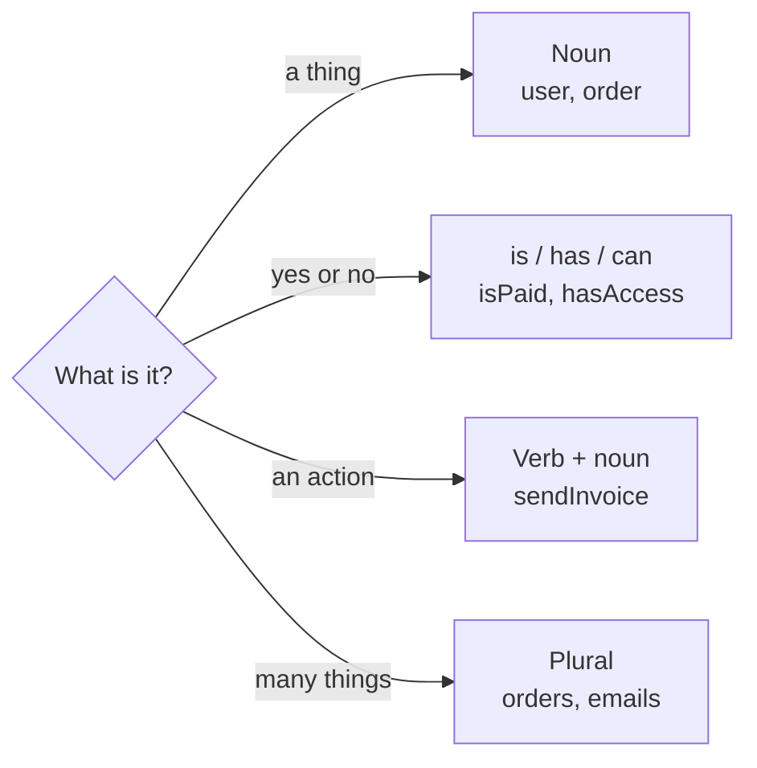
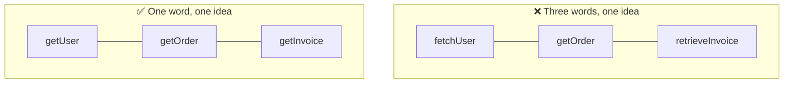
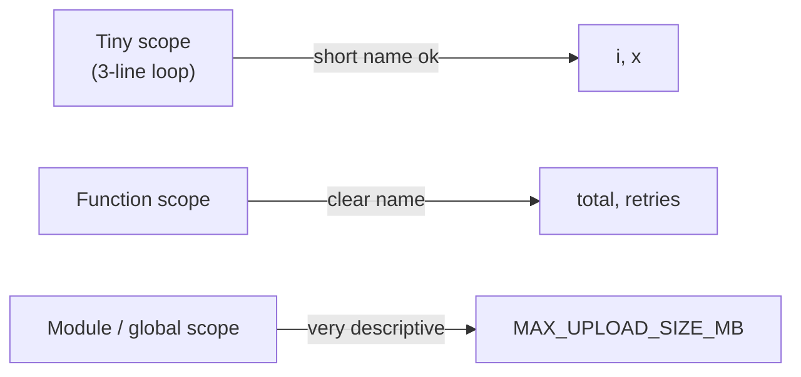

## The big idea

A name is a label on a box. If the label says `stuff`, you must open the box to know what's inside. If it says `winter-jackets`, you don't.


> 💡 **Rule of thumb:** If you need a comment to explain a name, the name is wrong. Rename it.

## Rule 1: Reveal intent

The name should answer three questions: **why does it exist, what does it do, how is it used?**

```js
// ❌ What is d? Days? Distance? Data?
const d = 7;

// ✅ The name answers the question
const daysUntilTrialEnds = 7;
```

```js
// ❌ What does this return?
function getThem(list) {
  return list.filter((x) => x[0] === 4);
}

// ✅ Reads like a sentence
const FLAGGED = 4;
function getFlaggedCells(gameBoard) {
  return gameBoard.filter((cell) => cell.status === FLAGGED);
}
```

## Rule 2: Use the right kind of word

Different things need different grammar. Once you follow this, code reads like English.

| Thing | Grammar | Good examples | Bad examples |
| --- | --- | --- | --- |
| Variable / object | noun | `user`, `invoice`, `cartTotal` | `doUser`, `data2` |
| Boolean | question: `is/has/can/should` | `isActive`, `hasPermission`, `canEdit` | `active`, `flag`, `check` |
| Function | verb + noun | `sendEmail()`, `calculateTax()` | `email()`, `taxStuff()` |
| Class | noun (thing) | `PaymentProcessor`, `Order` | `ProcessPayment`, `Manager` |
| Collection | plural | `users`, `orderItems` | `userList2`, `arr` |
| Constant | UPPER_SNAKE | `MAX_RETRIES`, `TAX_RATE` | `n`, `x` |



## Rule 3: Avoid mental mapping

Readers should not have to translate names in their head.

```js
// ❌ The reader must remember that u = user, r = role, p = permissions
for (const u of us) {
  const r = getR(u);
  const p = r.p;
}

// ✅ Nothing to decode
for (const user of users) {
  const role = getRole(user);
  const permissions = role.permissions;
}
```

Single letters are fine only in tiny scopes where the meaning is universal, like `i` in a short loop or `(a, b)` in a sort comparator.

## Rule 4: One word per concept

Pick one word for one idea and stick to it across the codebase.



If `fetch` means "call the network" and `get` means "read from memory", great. Just be consistent, and write it down for the team.

## Rule 5: Make names searchable and pronounceable

```js
// ❌ Try searching for "5" or saying "genymdhms" in a meeting
if (status === 5) {}
const genymdhms = new Date();

// ✅
const ORDER_STATUS_SHIPPED = 5;
if (status === ORDER_STATUS_SHIPPED) {}
const generatedAt = new Date();
```

## Rule 6: Length should match scope



The wider a name travels, the more context it needs to carry.

## Before and after: a full example

```js
// ❌ Before
function proc(d) {
  const r = [];
  for (const x of d) {
    if (x.a > 18 && x.v) r.push(x.n);
  }
  return r;
}
```

```js
// ✅ After
const ADULT_AGE = 18;

function getNamesOfVerifiedAdults(people) {
  return people
    .filter((person) => person.age > ADULT_AGE && person.isVerified)
    .map((person) => person.name);
}
```

No comments were added, and yet the second version is completely self-explaining.

## Common mistakes

- **Type prefixes** like `strName` or `arrUsers`. Your editor already knows the type.
- **Noise words** like `data`, `info`, `object`, `manager`. `UserData` and `UserInfo` mean nothing extra over `User`.
- **Lying names.** `getUser()` that also *creates* a user when none exists should be `getOrCreateUser()`.
- **Cute names.** `nukeEverything()` is fun today and confusing tomorrow. Use `deleteAllRecords()`.

## Key takeaways

- A good name removes the need for a comment.
- Nouns for things, verbs for actions, `is/has/can` for booleans.
- Be consistent: one word per concept.
- The wider the scope, the longer and clearer the name.

## Try it yourself

Rename these: `let flag = true` (tracks whether an email was sent), `function handle(x)` (validates a signup form), `const list = []` (holds unpaid invoices).

<details>
<summary>Possible answers</summary>

`let isEmailSent = true`, `function validateSignupForm(form)`, `const unpaidInvoices = []`

</details>
