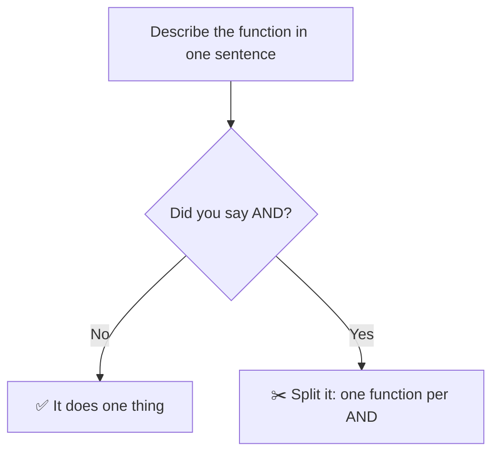
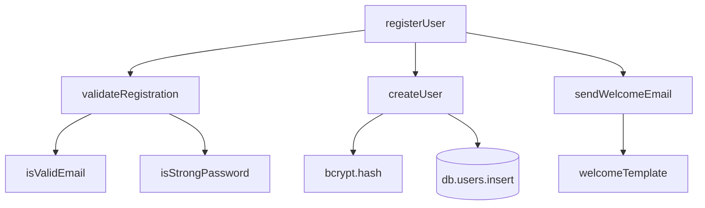

## The big idea

A Swiss Army knife is handy on a camping trip. In a professional kitchen, chefs use separate tools, and each one is excellent at a single job.


A function should work the same way: **do one thing, do it well, do only that.**

## How do I know it does "one thing"?

Try to describe the function in one sentence **without using "and"**.



- `registerUser()` "validates input **and** saves the user **and** sends a welcome email" → three functions.
- `validateEmail()` "checks that an email has a valid format" → one thing. ✅

## Before: one function doing everything

```js
async function registerUser(req) {
  // validate
  if (!req.body.email || !req.body.email.includes("@")) throw new Error("Bad email");
  if (!req.body.password || req.body.password.length < 8) throw new Error("Weak password");

  // hash + save
  const hash = await bcrypt.hash(req.body.password, 10);
  const user = await db.users.insert({ email: req.body.email, password: hash });

  // email
  await mailer.send({
    to: user.email,
    subject: "Welcome!",
    html: `<h1>Hi ${user.email}</h1><p>Thanks for joining.</p>`,
  });

  return user;
}
```

## After: small functions with clear names

```js
async function registerUser(input) {
  validateRegistration(input);
  const user = await createUser(input.email, input.password);
  await sendWelcomeEmail(user);
  return user;
}

function validateRegistration({ email, password }) {
  if (!isValidEmail(email)) throw new ValidationError("Invalid email");
  if (!isStrongPassword(password)) throw new ValidationError("Password must be 8+ characters");
}

const isValidEmail = (email) => typeof email === "string" && email.includes("@");
const isStrongPassword = (password) => typeof password === "string" && password.length >= 8;

async function createUser(email, password) {
  const passwordHash = await bcrypt.hash(password, 10);
  return db.users.insert({ email, password: passwordHash });
}

function sendWelcomeEmail(user) {
  return mailer.send({ to: user.email, subject: "Welcome!", html: welcomeTemplate(user) });
}
```

Now `registerUser` reads like a **table of contents**. If you want the details, you jump into the function you care about.



## One level of abstraction per function

Don't mix "big picture" steps with tiny details in the same function. It's like a recipe that says *"Make the sauce, then turn the knob on the stove 30 degrees clockwise"*.

```js
// ❌ High level and low level mixed together
function checkout(cart) {
  applyDiscounts(cart);
  let total = 0;
  for (const item of cart.items) total += item.price * item.qty; // low-level detail
  chargeCard(cart.user, total);
}

// ✅ Every line is at the same level
function checkout(cart) {
  applyDiscounts(cart);
  const total = calculateTotal(cart);
  chargeCard(cart.user, total);
}
```

## Keep arguments few

| Arguments | Verdict |
| --- | --- |
| 0 | 🌟 ideal |
| 1-2 | ✅ great |
| 3 | ⚠️ think twice |
| 4+ | ❌ pass an object instead |

```js
// ❌ What is true? What is 3?
createUser("Ana", "ana@mail.com", true, false, 3);

// ✅ Named options are self-documenting
createUser({ name: "Ana", email: "ana@mail.com", isAdmin: true, sendWelcome: false, retries: 3 });
```

> ⚠️ **Boolean flag arguments** are a smell. `render(true)` usually means the function does two things. Split it into `renderForPrint()` and `renderForScreen()`.

## Avoid hidden side effects

A function called `checkPassword()` should only *check*. If it also logs the user in or resets a counter, it is lying.

```js
// ❌ Surprise: this also starts a session
function checkPassword(user, password) {
  const ok = bcrypt.compareSync(password, user.hash);
  if (ok) session.start(user);
  return ok;
}
```

Either rename it (`loginIfPasswordMatches`) or split it.

## Common mistakes

- Splitting *too* much: a 2-line function used once whose name says less than its body.
- Functions with names like `handle()`, `process()`, `doStuff()`. If you can't name it, it probably does too many things.
- Returning different types depending on a flag.

## Key takeaways

- One function = one job. No "and" in its description.
- The top-level function should read like a table of contents.
- Keep one level of abstraction per function.
- Prefer 0-2 arguments; use an options object for more.
- No hidden side effects: names must tell the whole truth.

## Try it yourself

Take a function over 30 lines in your project. Write down in plain English each step it performs. Each step is a candidate for its own function.
