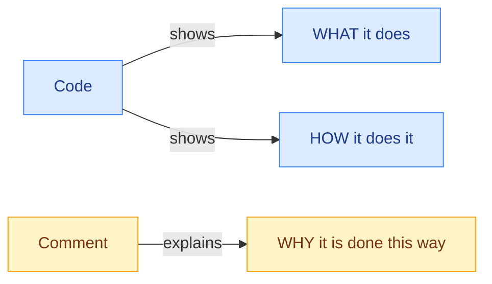
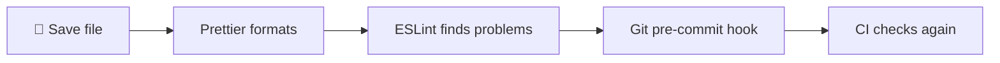

## The big idea

Think of comments as **road signs**. A sign that says "Sharp bend ahead, icy in winter" is priceless. A sign every 10 metres that says "This is a road" is noise, and people stop reading signs at all.



> 💡 **The golden rule:** Before writing a comment, try to make the code say it. Only comment what code *cannot* express.

## Comments that hurt

### 1. Redundant comments

```js
// ❌ The comment repeats the code
let i = 0; // set i to zero
i++; // increment i

// Get the user
function getUser() {}
```

### 2. Comments that replace a good name

```js
// ❌
// check if the user can get a discount
if (user.orders > 10 && user.age > 60 && !user.isBanned) {}

// ✅ The name IS the comment
const isEligibleForDiscount = user.orders > 10 && user.age > 60 && !user.isBanned;
if (isEligibleForDiscount) {}
```

### 3. Commented-out code

```js
// ❌ Nobody knows if this is still needed, so nobody deletes it
// const oldTotal = calcOld(cart);
// if (oldTotal > 100) sendCoupon();
```

Delete it. **Git remembers** everything you delete.

### 4. Lying (outdated) comments

```js
// Returns the price in dollars   ← written 2 years ago
function getPrice(item) {
  return item.priceInCents;        // ← the code changed, the comment didn't
}
```

A wrong comment is worse than no comment. Code is executed and tested; comments are not.

## Comments that help

| Type | Example |
| --- | --- |
| **Why** (a decision) | `// Use insertion sort: lists here are always < 10 items and it's stable` |
| **Warning** | `// Not thread-safe. Call only from the main worker.` |
| **Legal / licence** | `// Copyright 2026 …` |
| **TODO with owner** | `// TODO(ana): remove after v2 migration, see TICKET-481` |
| **Public API docs** | JSDoc on exported functions |
| **Clarify a regex or formula** | `// Luhn checksum, see https://…` |

```js
/**
 * Converts an amount between currencies using the daily rate.
 * @param {number} amount - The amount in the source currency.
 * @param {string} from - ISO code, for example "USD".
 * @param {string} to - ISO code, for example "EUR".
 * @returns {number} The amount rounded to 2 decimals.
 */
export function convertCurrency(amount, from, to) { /* … */ }
```

```js
// We retry 3 times because the payment provider returns
// random 503s during their nightly maintenance (02:00-02:15 UTC).
const PAYMENT_MAX_RETRIES = 3;
```

That second comment is gold: no amount of good naming could tell you *why* it's 3.

## Formatting: make code scannable

People scan code the way they scan a newspaper: headline first, details later.


### Vertical order: top-down, like a story

Put the high-level function first and its helpers below it, in the order they are called.

```js
export function publishArticle(article) {   // headline
  validate(article);
  const html = render(article);
  return save(html);
}

function validate(article) { /* … */ }        // details, in call order
function render(article) { /* … */ }
function save(html) { /* … */ }
```

### Blank lines separate ideas

```js
// ❌ A wall of text
function checkout(cart){const total=sum(cart);if(total>100){applyDiscount(cart)}const receipt=charge(cart);email(receipt);return receipt}

// ✅ Paragraphs
function checkout(cart) {
  const total = sum(cart);
  if (total > 100) applyDiscount(cart);

  const receipt = charge(cart);
  email(receipt);

  return receipt;
}
```

### Let tools do it

Don't argue about tabs vs spaces in code reviews. Automate it:



```json
// .prettierrc
{ "singleQuote": false, "semi": true, "printWidth": 100 }
```

## Key takeaways

- Code explains **what** and **how**; comments explain **why**.
- Delete redundant, outdated and commented-out code. Git has your back.
- Write comments for decisions, warnings and public APIs.
- Format like a newspaper: headline at the top, details below, blank lines between ideas.
- Automate formatting with Prettier and ESLint.

## Try it yourself

Search your project for `//`. For each comment ask: *Could a better name replace this?* If yes, rename and delete the comment.
