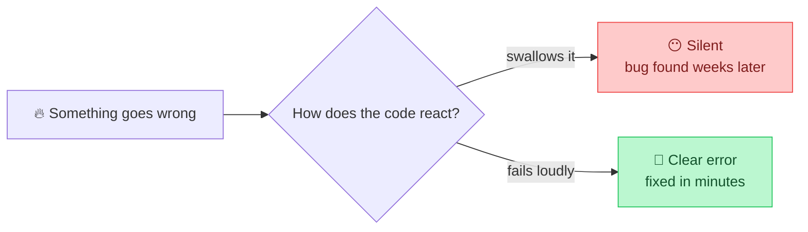
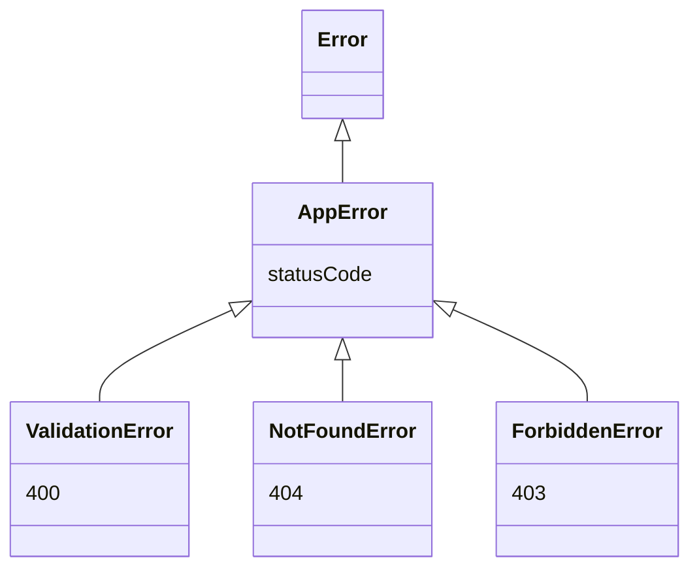
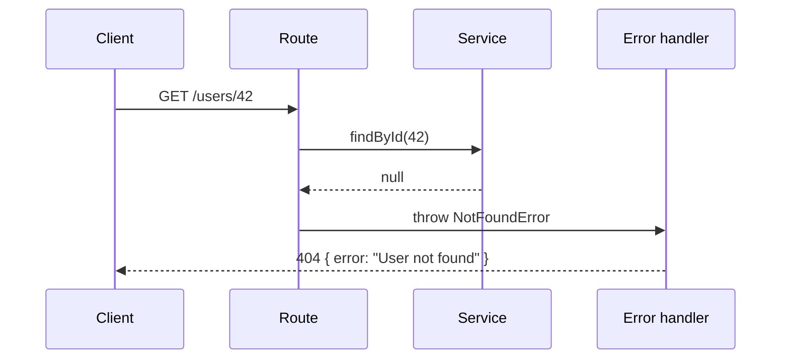

## The big idea

A smoke alarm that stays silent during a fire is worse than no alarm, because it makes you *feel* safe. Code that hides errors does the same thing.



## Rule 1: Never swallow errors

```js
// ❌ The worst line in programming
try {
  await saveOrder(order);
} catch (e) {}

// ❌ Almost as bad: logged, then forgotten; the caller thinks it worked
try {
  await saveOrder(order);
} catch (e) {
  console.log(e);
}
```

```js
// ✅ Handle it if you can do something useful…
try {
  await saveOrder(order);
} catch (error) {
  if (error instanceof ConnectionError) return queueForRetry(order);
  throw error; // …otherwise let it travel up
}
```

> 💡 Only catch an error **where you can do something about it**: retry, use a fallback, or show a message. Everywhere else, let it bubble up.

## Rule 2: Fail fast with guard clauses

Check bad input at the **top** of the function and exit immediately. This removes deep nesting.

```js
// ❌ The "arrow" of nested ifs
function withdraw(account, amount) {
  if (account) {
    if (account.isActive) {
      if (amount > 0) {
        if (account.balance >= amount) {
          account.balance -= amount;
          return account.balance;
        } else throw new Error("Insufficient funds");
      } else throw new Error("Invalid amount");
    } else throw new Error("Account inactive");
  } else throw new Error("No account");
}
```

```js
// ✅ Guard clauses: problems first, happy path last
function withdraw(account, amount) {
  if (!account) throw new NotFoundError("Account not found");
  if (!account.isActive) throw new ForbiddenError("Account is inactive");
  if (amount <= 0) throw new ValidationError("Amount must be positive");
  if (account.balance < amount) throw new InsufficientFundsError(account.balance, amount);

  account.balance -= amount;
  return account.balance;
}
```


## Rule 3: Use specific error types

Generic `Error("something failed")` forces callers to parse strings. Custom error classes let them react precisely.

```js
class AppError extends Error {
  constructor(message, statusCode) {
    super(message);
    this.name = this.constructor.name;
    this.statusCode = statusCode;
  }
}

class ValidationError extends AppError {
  constructor(message) { super(message, 400); }
}

class NotFoundError extends AppError {
  constructor(message) { super(message, 404); }
}
```



## Rule 4: Handle errors in one central place

In a web API, don't write `try/catch` in every route. Throw specific errors, and let **one** middleware turn them into HTTP responses.

```js
// routes just throw
app.get("/users/:id", async (req, res) => {
  const user = await users.findById(req.params.id);
  if (!user) throw new NotFoundError("User not found");
  res.json(user);
});

// one central handler (Express 5 forwards async errors automatically)
app.use((error, req, res, next) => {
  const status = error.statusCode ?? 500;
  if (status === 500) logger.error(error); // unexpected: log the full stack
  res.status(status).json({
    error: status === 500 ? "Something went wrong" : error.message, // never leak internals
  });
});
```



## Rule 5: Don't return null to signal failure

`null` forces every caller to remember to check, and one forgotten check crashes later, far from the cause.

```js
// ❌ Every caller must remember the null check
const user = findUser(id);
user.name; // 💥 TypeError: Cannot read properties of null

// ✅ Options: throw, return an empty collection, or use a clear result object
function findUsers(filter) { return []; }                 // empty list, not null
function getUser(id) { throw new NotFoundError(); }       // or throw
function parseAge(text) {                                  // or a result object
  const age = Number(text);
  return Number.isInteger(age) ? { ok: true, value: age } : { ok: false, error: "Not a number" };
}
```

## Common mistakes

- Using exceptions for normal control flow (for example, throwing to exit a loop).
- Showing stack traces or SQL errors to end users. That is a security leak.
- Catching `Error` and re-throwing a new one **without** the original cause. Use `new Error("msg", { cause: error })`.

## Key takeaways

- Never swallow errors. Catch only where you can act.
- Guard clauses: validate first, happy path last.
- Custom error classes make handling precise.
- One central error handler per app.
- Prefer throwing or empty collections over returning `null`.
