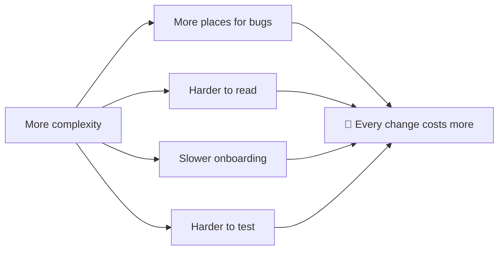
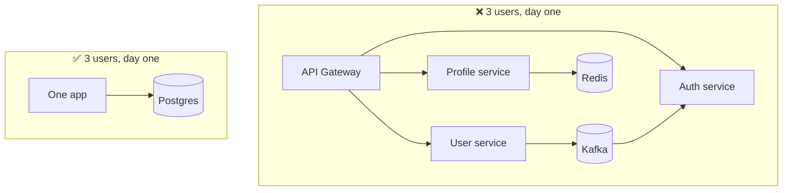

## The big idea

A **Rube Goldberg machine** uses 40 steps (balls, dominoes, pulleys) to switch on a light. It's fun to watch, and it breaks if one domino is off by a millimetre. A light switch does the same job in one step.


**KISS = Keep It Simple, Stupid.** The US Navy coined it in the 1960s: most systems work best when they are kept simple, not made complicated.

> 💡 **Simple ≠ easy.** Simple code often takes *more* thinking to write, because you have to understand the problem well enough to remove everything that isn't needed.

## Why complexity hurts



Every extra layer, abstraction or clever trick is something the *next* developer has to learn before they can change anything.

## Example 1: Clever vs clear

```js
// ❌ Clever: a one-liner puzzle
const isEven = (n) => !(n & 1);

// ✅ Clear: anyone understands it instantly
const isEven = (n) => n % 2 === 0;
```

```js
// ❌ Showing off
const result = arr.reduce((a, c) => ({ ...a, [c.id]: [...(a[c.id] || []), c] }), {});

// ✅ Boring and obvious (and faster: no copying on every step)
const ordersByCustomer = Object.groupBy(orders, (order) => order.customerId);
```

## Example 2: Over-engineering a simple need

**The task:** "Send a welcome email when a user signs up."

```js
// ❌ Over-engineered for ONE email type
class NotificationStrategyFactory {
  create(type) { return new (this.registry.get(type))(); }
}
class AbstractNotificationStrategy { send() { throw new Error("abstract"); } }
class EmailNotificationStrategy extends AbstractNotificationStrategy { /* … */ }
const strategy = new NotificationStrategyFactory().create("email");
strategy.send(new NotificationContext(user, TemplateRegistry.get("welcome")));
```

```js
// ✅ KISS
async function sendWelcomeEmail(user) {
  await mailer.send({ to: user.email, subject: "Welcome!", html: welcomeTemplate(user) });
}
```

When you have **five** notification channels, a strategy pattern may earn its place. With one, it's just noise. (See the lesson on **YAGNI**.)

## Example 3: Simplify conditions

```js
// ❌
function getShippingCost(country) {
  if (country === "US") { return 5; }
  else if (country === "CA") { return 8; }
  else if (country === "UK") { return 10; }
  else if (country === "DE") { return 10; }
  else { return 20; }
}

// ✅ Data instead of logic
const SHIPPING_COST = { US: 5, CA: 8, UK: 10, DE: 10 };
const DEFAULT_SHIPPING_COST = 20;

const getShippingCost = (country) => SHIPPING_COST[country] ?? DEFAULT_SHIPPING_COST;
```

## KISS in architecture



Start with the simplest architecture that works, like a **modular monolith** and one database. Add microservices, queues and caches when real problems show up, not before.

## How to practise KISS

| Ask yourself | If yes… |
| --- | --- |
| Could a junior dev understand this in 5 minutes? | ✅ good |
| Am I adding this "just in case"? | ❌ remove it |
| Is there a built-in / standard library function for this? | ✅ use it |
| Would a plain function work instead of a class hierarchy? | ✅ use the function |
| Am I proud of how clever this is? | ⚠️ warning sign |

## Common mistakes

- **Confusing short with simple.** A dense one-liner can be much harder to read than five clear lines.
- **Premature optimisation.** Making code "fast" before measuring usually just makes it complicated.
- **Too simple.** KISS doesn't mean skipping validation, error handling or tests.

## Key takeaways

- The simplest solution that fully solves the problem wins.
- Clear beats clever, every time.
- Replace branching logic with data (lookup tables) where you can.
- Start with simple architecture and add complexity only for real, measured needs.

## Try it yourself

Find an `if / else if` chain with more than 3 branches in your code. Can a lookup object replace it?
