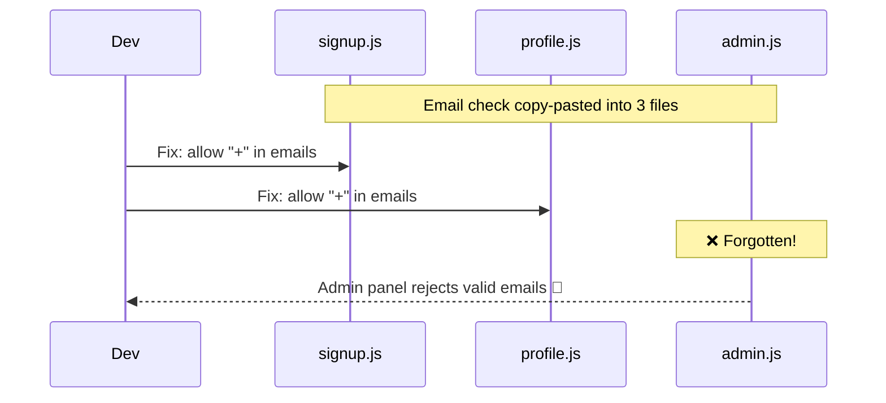
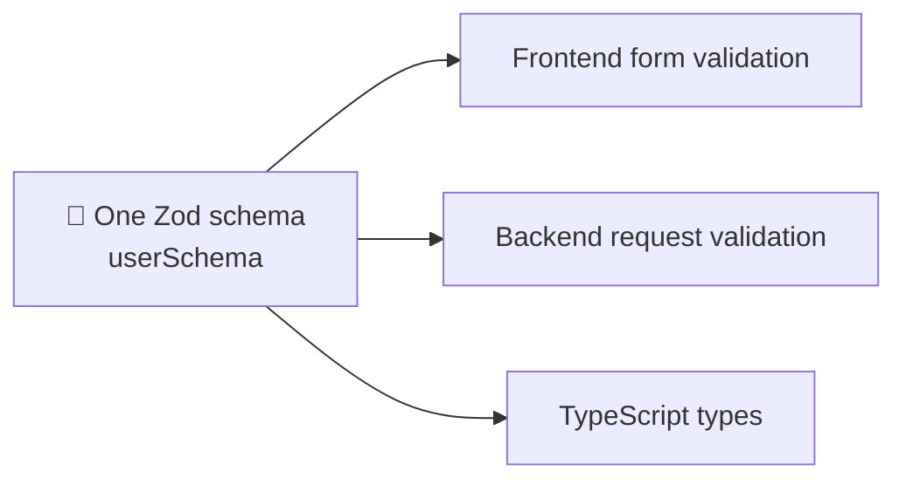
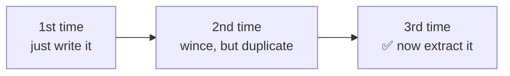

## The big idea

Imagine your phone number is written on 12 sticky notes around the house. You change your number. How many notes will you forget to update?


**DRY = Don't Repeat Yourself.** From *The Pragmatic Programmer*:

> 📘 *"Every piece of knowledge must have a single, unambiguous, authoritative representation within a system."*

Note the word **knowledge**. DRY is about *rules and facts*, not about lines of text that happen to look the same.

## The copy-paste bug



```js
// ❌ The same rule in three places
// signup.js
if (!/^[^@\s]+@[^@\s]+\.[^@\s]+$/.test(email)) throw new Error("Invalid email");
// profile.js
if (!/^[^@\s]+@[^@\s]+\.[^@\s]+$/.test(email)) throw new Error("Invalid email");
// admin.js
if (!/^[^@\s]+@[^@\s]+$/.test(email)) throw new Error("Bad email"); // already drifted!
```

```js
// ✅ One source of truth
// validation/email.js
const EMAIL_PATTERN = /^[^@\s]+@[^@\s]+\.[^@\s]+$/;
export const isValidEmail = (email) => EMAIL_PATTERN.test(email);

// everywhere else
import { isValidEmail } from "./validation/email.js";
if (!isValidEmail(email)) throw new ValidationError("Invalid email");
```

## DRY is more than functions

| Duplicated knowledge | DRY fix |
| --- | --- |
| Magic numbers (`0.2` tax everywhere) | A named constant: `TAX_RATE` |
| The same validation in frontend and backend | A shared schema (for example, Zod) used by both |
| API types written by hand in the client | Generate types from OpenAPI / GraphQL schema |
| Config values copied between files | One `.env` / config module |
| The same SQL in many places | A repository function |
| Repeated UI markup | A reusable component |



```ts
// schemas/user.ts — used by the React form AND the API route
import { z } from "zod";

export const userSchema = z.object({
  email: z.string().email(),
  age: z.number().int().min(18),
});
export type User = z.infer<typeof userSchema>;
```

## ⚠️ The trap: wrong abstraction

Two pieces of code can **look** the same today but represent **different knowledge**. Merging them couples things that should change independently.

```js
// These look identical…
const validateProductName = (name) => name.length > 0 && name.length <= 50;
const validateUsername = (name) => name.length > 0 && name.length <= 50;
```

Should you merge them into `validateName()`? **No.** Product names and usernames are different business rules. Next month usernames will need "no spaces" and product names will allow 100 characters. If merged, you will add flags:

```js
// ❌ The wrong abstraction grows ugly
function validateName(name, isUser, allowLong, allowSpaces) { /* … */ }
```

> 💡 **"Duplication is far cheaper than the wrong abstraction."** (Sandi Metz)

## The Rule of Three

A practical guide for when to extract shared code:



By the third time you can see what is truly common and what varies.

## DRY vs WET

- **DRY:** Don't Repeat Yourself.
- **WET:** "Write Everything Twice" or "We Enjoy Typing". Copy-paste culture.
- **AHA:** "Avoid Hasty Abstractions". The balanced middle ground: prefer duplication until the right abstraction is obvious.

## Key takeaways

- DRY is about **knowledge**, not identical-looking text.
- Business rules, constants, schemas and config should each live in one place.
- Don't merge code that only *looks* alike but changes for different reasons.
- Use the Rule of Three before extracting.

## Try it yourself

Search your project for a number like `0.2`, `100`, or `86400`. Is it repeated? Give it a name and a single home.
